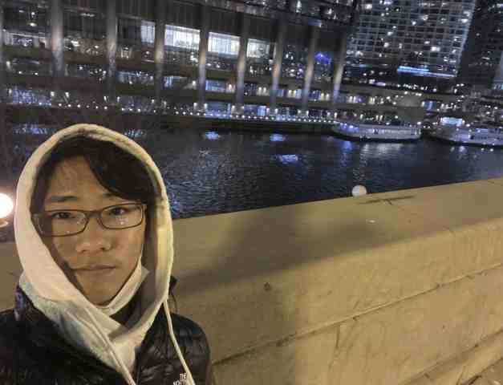

# About me

Hi! My name is Ryan Kim, and I am a current sophomore at Charlotte Latin School. I have been a part of the engineering program since seventh grade, and I am excited to take my engineering knowledge to the next step with Fab Academy. I was born in Gainsville, Florida and moved to Charlotte when I was around 4. 

My parents were born in South Korea, so I have travelled the world many times. Due to this, travelling has become a big part of my life, and I wish to visit many countries some day, including Japan, Germany, and Thailand. 

I am interested in sports. I watch football and basketball in my freetime, my favorite team being the Florida Gators, Carolina Panthers, and the San Antonio Spurs. I myself have played soccer, swam, and ran track for my school. In my freetime, I like to go to the park and ride bikes through bumpy roads or fish. 

Engineering is a big interest for me. I was never really able to make and plan out ideas on my own, but when I saw other people learning about complex tools and machines and making stuff that I could never have imagined, I had to try it out. I have learned a lot in my journey, but my interest in using certain machines that can make intricate designs encouraged me to join Fab Academy. I am excited to take engineering to the next level.

## Previous Work

Some previous work of mine include

* baby mobile: using a variety of tools, I made a mini baby mobile with acrylic animals dangling off with fiber-optic string that were lighted by neopixels

* word clock: It's a clock, but words! I was able to make neopixels go under a laser cut acrylic word clock so that if I pressed certain buttons, the time would go up or down
