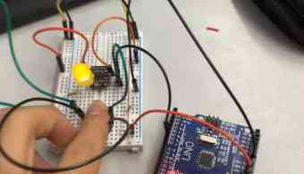
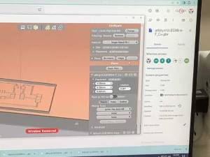
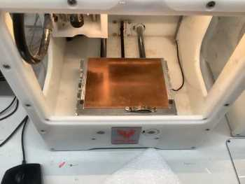

# Prefab Work

Prefab Documentation

## Surface Mount Soldering

We began our journey by practicing some surface mount soldering. This was a new form of soldering where you put on the pieces on a board and connect it with solder. We took a big 555 chip for suface mount soldering practice, where we soldered on a bunch of transistors, resistors, and more. I first applied solder to the pads, and used a tweezer to place the tiny components and melted the solder so it would stay on the surface. 

## ATTiny 412

Through this project, I was able to learn the basics of uploading a programmer to an Arduino, and using a microcontroller to set certain pins to do certian things. 
### jtag2updi

I was able to use the `jtag2updi` tool to bring code to the ATTiny412 while using the Arduino Uno as a programmer. First, I brought in the jtag program into the Arduino IDE, and I had to set the board to Arduino, not the 412! I was setting the Arduino as a programmer, so I first uploaded the jtag code to the Arduino once I had my com port selected and my arduino connected to the computer. 

### Blinking The LED
Once I had jtag2updi uploaded, I opened a new folder where I would code a blinking LED. This time however, I would have to change the board to the ATTiny, because that is what is running code to the LED. I set programmer as `jtag2updi`, and then opened the blink example from the IDE. Using the pinout sheet for the 412, I connected pin 6 of the ATTiny to pin 6 of the Arduino, which is how it would communicate. I then connected power and ground of the Ardunio to the Attiny. I connected the LED to one of the pins, then a resistor going to ground. I would code the OUTPUT pin of the LED with the correponding pin it shows on the [sheet](http://sheekgeek.org/2020/adamsheekgeek/attiny412-general-purpose-blinky-board-and-updi-programming). 

```
void setup() {
  pinMode(2, OUTPUT);
}

void loop() {
  digitalWrite(2, HIGH);   
  delay(100);              
  digitalWrite(2, LOW);    
  delay(75);                    
}
```
## Button as an Input
My next step was to create an input button to control the LED. It was pretty simple, I just ketp the same blinking circuit but added a button that linked to another pin, which I would set as `input`. 
Here is the code for that. 

```
pinMode(pinnumber, OUTPUT); 
pinMode(pinnumber, INPUT);
```

I then coded it so that if a signal from the input button is recieved(the button is being pressed) then set output pin as high(turn LED on). I used a pull down resistor so that if the button was not pressed, the power going into the button went to ground through a load. 

## ATTiny412 Summary

It was cool to learn about microcontrollers and learn how to sue them so they can do more rather than to just connect an LED to a resistor and turn it on. With the knowledge I had gained, I was able to do more, such as two buttons and two LEDS(just connect them to more pins and code it as such). I even included a photoresistor into an analog pin(use pinout sheet) so that if it was a certain brightness, the LED would turn on and off. 



## Milling

I learned the basics of using the Bantam Tools milling machine. This was a bit more complicated then the 3d printer of laser cutter to me, for there were a few more steps. I followed a [workflow](https://docs.google.com/document/d/1pwsUEieccP0-XUH6dimsxmaqbtL3xWnFEtp2s3y3GQ8/edit) to figure out how to get a cut going. One mistake I made was not knowing to use metal holding piece when calibrating, which is how it knows where to position the calibration. I used differnt bits for the traces/holes and the outline. 





I then soldered on a 412 along with headers, an LED, a resistor, and a capacitor. (Surface Mount Soldering)

I connected it to the Arduino Uno the same way as before, using the Arduino as a programmer. The milled circuit was the same, pin 6 to 6, ground to ground, and power to power, so I just got three wires and conencted it. 

### Positive Ground
The circuit used a positive ground. `Vcc` is connected to LED at all times, and the ATtiny controlled the other side and changed it to high or low. Because it turns on in a difference of voltage, in the code, we had to se the out put as low in order to turn the LED on. 

```
void setup() {
  pinMode(2, OUTPUT);
}

void loop() {
  digitalWrite(2, LOW);
  delay(1000);
  digitalWrite(2, HIGH);
  delay(1000);
}
```

digitalWrite(2, HIGH);


## Fusion 360

Fusion 360 is a high-performance software with so many great tools that it would take more than a year to master all of them, such as designing, animating, creating electronics through a built in software called Eagle, CAM, and much more. It is a great software that would help me significantly in my high school engineering experience. To prepare for using this software, I followed Product Design Onlines, [Fusion 360 in 30 days](https://www.youtube.com/watch?v=d3qGQ2utl2A&list=RDCMUCooViVfi0DaWk_eqxIXXiOQ&start_radio=1&rv=d3qGQ2utl2A&t=458) tutorials to familiarize with some of the tools, which helped me significantly when trying to make my own Fusion projects. 