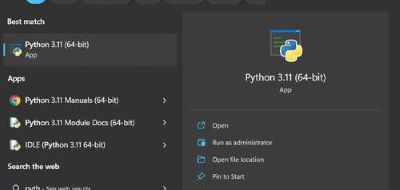
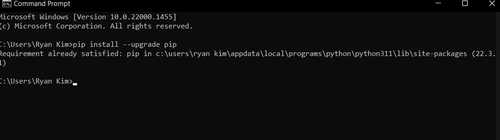
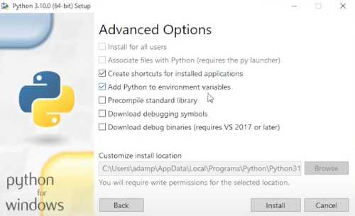
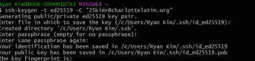
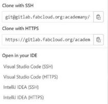
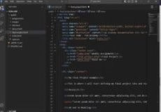
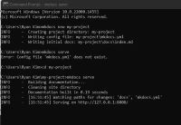
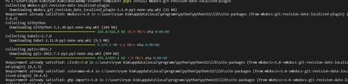
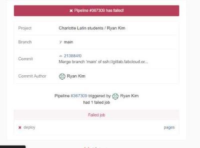
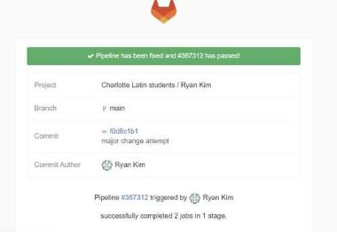

# 1. Project management/ Principles and Practices

This week I worked on defining my final project idea and started to getting used to the documentation process.

## Getting Started
I have not had much previous experience with softwares such as vscode, python, git, or mkdocs. In fact, I didn't even conside myself remotely good at using the computer at all other than for school work or playing games. Therefore, as this week went on, you will be able to see that I learned through trial and error, research, and referring off of classmates or former graduates.

## Downloading Python

I first installed python through a web browser. (You can also use Microsoft Store, but I heard that this might be a different version) I also learned through fellow classmates that the whole reason we needed python was for the language and also for package manager, Pip, which is what MKDocs would use later on. Pip in my computer came automatically with Python, which was a relief. 




### Environment Variables
One mistake I made at first was not selecting the "Add Python to envionrment variables" option when downloaing Python. Therefore, I uninstalled it and reinstalled it into my computer again, this time selecting the option. I researched and learnbed that Environmental Variables is simply what allows my computer to be able to read the python or pip package I'd installed without me having to refer back to it everytime with a command. 



## git
I went to [git](https://git-scm.com/) in order to donwload git. Git is ultinately what allows me to command that I have made changes and would like to upload it (or commit and push it) to my site. Along with the windows package came gitbash, which is what I would use to set up my SSH key. 

### SSH Key
 I first used [Teddy Warner's Documentation Site](http://fabacademy.org/2021/labs/charlotte/students/theodore-warner/Assignments/week01/#ssh-setup) as a workflow for downloading my SSH Key. In GitBash, I ran the following commands
 
```
ssh-keygen -t ed25519 -C "<Your-SSH-Name-Here>"  \\ generates a new SSH key on your computer

\\ continue to click enter when prompted with
Generating public/private ed25519 key pair.
Enter file in which to save the key (/home/user/.ssh/id_ed25519):

\\ then when prompted with 
Enter passphrase (empty for no passphrase):
Enter the same passphrase again:
\\ enter a passphrase for your SSH key that you can remember, as you will need this password whenever you attempt to pus your site back to the GitLab

Get-Content ~/.ssh/id_filename.pub | Set-Clipboard  \\ copys your new SSH key to clipboard
```


To upload the SSH key, I went to my profile on the top right, clicked preferences, then SSH keys at the right of the screen. 

Ultimately, the SSH key is needed before you clone any repo into your local computer, which is why I made my SSH key. When I edited my local repo and tried to push it using the VSCode terminal, I got an error stating that I did not have rights or access to the repository. This is because I had set up my SSH key wrong. I had just copied what the GitBash had given me into the preferences Instead, what that final code does is copy your key into your clipboard, so all I had to do was just paste using ctrl-v into my SSH key preference in GitLab. Below is an image of how I cloned my repo into VSCode. 




## VSCode
Visual Studio Code is a text-based code editor that has many many feautres that I will soon come to learn that can help me perform many tasks. This app is what I would be using to code along with MKDocs to create my documentation site. I downloaded the installer and was able to pull it up with no problem. This is where I cloned my repos to edit, and push to my site. I tested out editing my site that GitLab had provided me, and I changed the color of my background using the html files. In order to push it I used these commnads in the terminal of VSCode 
```
git add .
git commit -m "DESCRIBE CHANGES HERE"
git push origin main
```

## MKDocs
I followed this [tutorial](https://www.mkdocs.org/getting-started/) to get down the basics and learn how to start up a website using MKDocs. It was extremely helpful, especially because I was a person learning from knowing absolutely nothing about anything! It helped me get down the basics of the different uses of commands and terminals being used to create a custom site. 
### Install MKDocs
I had pip downloaded from the beginning of the week, so all I had to do was run this command
```
pip install mkdocs
```
### Making the Site
The tutorial also helped me understand how to make a new site in a certain directory using this code
```
mkdocs new site
```
Keep in mind I know nothing about code, so all these new codes were extremely intimating at first. The tutorial along with seeing the commands used in other peoples' documentation sites is eventually what allowed me to slowly learn the commands.
For example, I learned that this code is what allowed me to go to and form files
```
cd site(or whatever file you want to go to)
```
or
```
cd ..(to go back one file)
```
And perhaps one of the most interesting ones that allowed me to see my site simultaneously as I upload things to my repo:
```
mkdocs serve
```
Using the serve command I would edit my Markdown files in VSCode then go the link that the serve command would give me. This way, I could see if my edits were working. I could keep doing this until the mkdocs serve command was stopped using the ctrl-c command. Again, I am just following the tutorial here. The tutorial told me how to make my first changes. I went into the mkdocs.yml page in VSCode, which is the configuration file used to configure the parameters and initial settings of my site. I wrote the following command in the yml file:


```
site_name: MKLorum
nav:
    - Home: index.md
    - About: about.md
theme: readthedocs
```
Basically, I was able to change the site name from MKDOCS to MKLorum. I created two pages that referenced md files which are the subpages you are able to code in your site's directory in VSCode. readthedocs is the theme I made it, which I learned from the tutorial. 

This video from [Adam Harris](https://www.google.com/search?q=how+to+add+your+mkdoc+website+to+gitlab+project&rlz=1C1CHBD_enUS1033US1033&oq=how+to+add+your+mkdoc+website+to+gitlab&aqs=chrome.1.69i57j33i160.14662j0j7&sourceid=chrome&ie=UTF-8#fpstate=ive&vld=cid:19bdb3d3,vid:s0d39k-IqN4) also helped me understand what was going on with MKDocs a little better

## Making Another Site(My Actual Documentation)
I could just make my own MKDocs site from scratch, but why do that when [Dr David Taylor](http://archive.fabacademy.org/fabacademy2016/charlottelatin/students/87/index.html) taught me about an already made MKDocs template that already has all my pages organized. Excited about this, I went to the repo that contatined the template and made a huge mistake. I cloned it into VSCode. This is wrong because the repo came from Dr Taylor's remote repository. For a couple of hours, I edited my site adding a little bit of documetnation to the Markdown template, but whenever I tried to push it to the remote repo, it said I did not have rights. I recognized this error from the beginning of the week when I had my SSH key setup wrong. This gave me a clue to what the problen could be. As it turned out, I didn't realize that cloning from Dr. Taylor's repository and pushing it after makibg edits would push it to his remote repo. Luckily, the SSH key did not let me do that. Learning from my mistake, I simpple copied and pasted the files in the template and pasted it into my own local repo. Then, I could make changes and push it up to my remote repo. This is another example of me learning more about the overall gerneal topic through trying things out. 
### Issues with My Site
At first, I struggled a lot with getting to upload my site. I had used the `mkdocs build` command to build the html format of my MKDocs template that Dr Taylor had provided. This created a new directory callaed "site" under my MKDocs Template folder which I named "Fab Academy". BEcause the file called "public" was the one that would define what showed up on my actual site(hence the name public), I figured I had to copy my site html files that I had created with the build command and paste it under the public folder while deleting the original html files that were already there. I then got my Mkdocs site to become my actual documentation site, and I was happy, but I ran into one issue. The way I was currently doing it would mean I would have to copy and paste the files in my site folder into my public folder everytime I made a change, which could cause some real issues especailly when I'm working late at night on other things and I accidentally miss a file or make an error. I had to figure out how to make the changes on VSCode go straight to my actual site. I struggled a lot with this, for I couldn't figure out how this could possibly work. 
### Material Issue
When I was using my `mkdocs build` site format to upload to my `public` file, I got a material error, where it sait that git could not recognize my material. Though it didn't end up mattering once I started using Dr Taylor's template, it was still a notable problem I went through. I learned that I had to enter a certain code online to download material with git. Here is the error I got and my terminal once I entered the code.




### Pipeline Error
I was continuouslly struggling so I came to the conclusion that I would have to see if others were having this problem. I again went to [Adam Stone's](https://fabacademy.org/2023/labs/charlotte/students/adam-stone/lessons/week1/gitlab/) and I saw that he was having this problem and had documented about it too. I went through to see what he did, and it looked like he was playing around with the `.gitlab-ci.yml` file. Up until this point, I had no idea what this file was. I researched this and I learned that yaml files are mostly configuration files that store data. They also have a tool where I can code them so they control what happens with my files. For example, I can code the yml file to build my docs directory everytime automcatically and set the path to public so that my site directs automatically to my actual MKDOcs one that I edit. I started playing around with my yml file, which was a huge mistake because I did something inside the file that caused my pipeline to crash. I learned that a pipeline error occurs when the files in my local repo do not match the files that are in my remote repo, or some error with my files occurs. I spent lots of time trying to fix this, but I couldn't figure it out. I tried reverting my commits, rerunning them, but none of it seemed to work. However, I soon learned that the yml file I had accidentally changed whad been preset so that I don't have to change anything. All I had to do was bring my `docs` directory into my main overall directory and get rid of the `public` that hade been there. This fixed all my major problems for me. I was able to edit my site in VSCode and push it straight to my actual site, and it fixed my pipeline error, for the remote repo could finally read and deploy the files my yml configuration file was telling it to read. 

This is an email for my broken pipeline that I received. 


And here is the email when I fixed it bi fixing my cl.yml file. 



## Student Agreement Signature
Now that I was able to edit and push to my remote repo to edit my site directly, I copied and pasted the student agreement Neil Gershenfeld had sent me over gmail and put it into my agreement.md file. 

## Workflow For Pushing
Here is my workflow for pushing the changes made in my local repo to my global repo through git. 
1. Make the changes and save the changes(or press "Save all")
2. Enter the terminal by pressing `ctrl + ` 
3. If it is a group project, make sure to do `git pull`  to sync any changes that were made in the global repo to avoid conflicts when it comes to mergin later. Also, make sure you are in the right branch by running `Git switch Branch Name` If that is not a worry, simply run

```
git add .
git commit -m "changes message"
git push
```
4. Go check out the global website/repo!
Extra note: You could just use the Source Control button in VSCode at the left of the UI when it comes to pushing, then press the `sync changes` button that pops up, but make sure when you do this, your local repo is configured with your name and email, and make sure you are in the right branch or repo when pushing. 

## Learning Markdown
This [website](https://www.markdownguide.org/basic-syntax/#overview) helped me learn some of the basics of Markdown, such as lists, code, headers, hyperlinks, and more. I was able to get the first bit of my documentation done. Now that I have my website set up, it was time to document everything, which is what you are reading!

## Image Resizing
Now that I had everything set up, I had to figure out an easy to way to document my images. Adam Stone shared to the class an easy to use method of resizing our images. I used his directory for image-reiszing he had and put it into my repo. His [process](https://fabacademy.org/2023/labs/charlotte/students/adam-stone/lessons/prefab/image-resizer/#how-to-use-it-in-your-project) made it quite simple, where I could upload the files I wanted to resize and run a code to make it resize, and I just had to copy those into my `Week 2` directory under `images`. I will be creating a file for each week under `images` to organize all my images that I have to refer to in the coming weeks. 

## Final Project First Idea
I wanted to make something that could be somewhat cool and memorable to me. At first I thought about cool looking things such as a foosball table, vending machine, or a color pencil sorter. Then I thought, what could be useful to me? I then thought of what I attempt to go with, an automatic page turner. Lots of times when I'm reading textbooks, I want to sit back, but then I would have to hold the textbook in my lap in an awkward way. Also, when people play instruments, they always need someone to flip their pages mid performance. But what if they could automatically turn them from a remote distance? I wanted to play with this idea. Here is my first rough sketch of my idea. 
