# 2. Computer Aided design

My files for this week are here - [files](../files/Week%203%20Files/Week3zip.zip)

UPDATE(3/03/2023)- I had a project idea change around week 7, so the designs I created below will not be of use

### 2D

## Cuttle(Vector)
 I started off with a vector software, cuttle, which is an easy to access online software. I followed this [tutorial](https://www.youtube.com/watch?v=bwr6Bp4HXMU) since it was my first time. Most of it was straight forward, and I learned the basics of navigating through the tools. 

 I started off by dragging in a polygon and changing its sides to 5. All of the edits could be made on the right of the screen, where it showed the history of my moves. When you choose what you are trying to edit, there are many edit options that come up. I then created a rectangle on the outside of one of the sides. I could drag the corener of the rectangle to snap with the corner of one side of the pentagon. I then used the rotational pattern. This created 5 rectanlges on each side, and using the "boolean union" modify option, I combined them. This was found in the modify dropdown. 

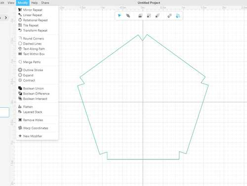

Then, I used the pen tool to create an irregular circular shape. I learned about how I could edit the curvatures, and eventually got a shape that I liked. I used the rotational pattern for this too. 

I created a circle next to the irregular shape. This action showed up to the files on the right, and I learned that when I dragged the action into the previous shape with the rotational pattern, this would execute the pattern to both. This was what I got. 

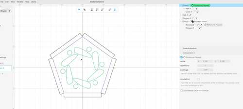

I tried out different shapes and patterns, and I ended up adding a few more shpaes under the rotational pattern feature to create an intricate design. You can see this in the svg file in the files for this week. 

Here is a design I made with all the tools I learned in Cuttle. 

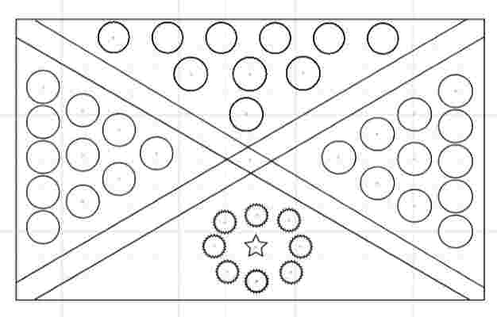

## Corel Draw(Vector)
I have used Corel Draw in the past to make logos of certain images I found online. However this time, I wanted to attempt to create my own pattern. This was just based on how creative I could get. I first created a triangle and mirrored it, putting them side by side. 

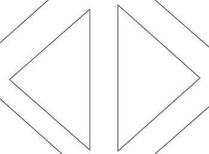

### Creating Pattern(Clone Tool)
I then learned about a tool I had never used before, the clone tool. I was originally planning on copying and pasting the two triangles many times, but I realized I could just clone them, and any edits I made to the original would edit the clones as well. I put the original at the top of the design to make sure I could differenetiate between the original and the clones, since editing a clone does not change anything else but what I edited. I then imported in an image of a twirl, and I used the trace bitmap to get an outline of it. I cloned this four times, and I put it around the pattern of triangles. 

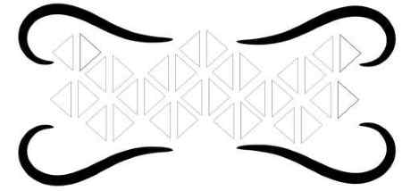

I then added my name and imported a book clipart, which I used the trace bitmap tool as well. I put a box around all of it, which would be where I could set down books on my automatic page turner. I set the thickness of the outside box and the patterns to hairline, for that would allow them to be cut all the way through when I cut out my design. I left the books on 0.5 pt, so that it wouldn't be cut out but just engraved. 

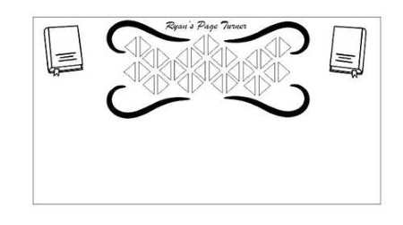

It is most likely that as I go through the weeks, my design idea would change and I would have to add certain parts to my laser cut design for my final project, but for now, I was able to learn and use a variety of tools that gave me a basic shape of my laser cut section of my final project. 

## GIMP(Raster)
 I had never used Gimp before, but I heard many people talking about it, so I attempted to learn a bit about it. I again had to use a tutorial for this. I learned the basics of the main interface and tools, along with navigating between layers, certain tools that could combine layers, or making certain layers interact with each other. First I edited the foreground and background colors. I set it to white and black so that my text would show up. I then used the text tool to write my name, which showed up as white since I set the foreground to white. Gimp shows menus for each tool you use so you can adjust it, so I could change the font, size, etc. I then create a New Visible Layer, which in simple terms showed a merged layer of the text and the background, which were separate layers. I used the Gaussian Blur tool to blur it a bit. 

 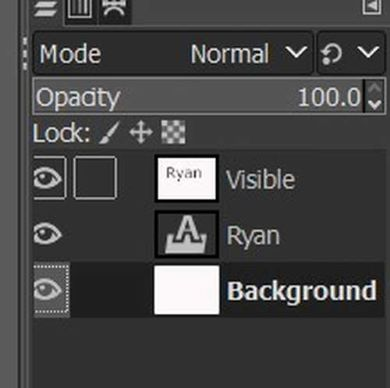
 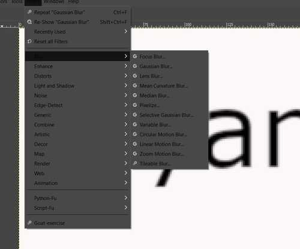

### Bump Mapping/Layer Mask
 This is where I took some time to understand what was going on. The tutorial taught me to create a new plasma-type layer on top of the visible layer. It then taught me to use the "Bump Map". I was confused because my image didn;t do anything except show the background. I then learend that I had to choose the Visible layer so that the two layers interacted and you could see the text in plasma. 

 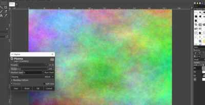

 I then learned to use the Layer Mask. This created another layer next to my plasma, layer, and I had to then copy and paste my "visible" layer into the plasma layer. I then used the "Anchor Layer" tool settle the top layer onto the layers below it. It worked, but I had a hard time understanding what the Anchor and Mask tool did, and how the layer behind my letters turned black even though I set it as white.

 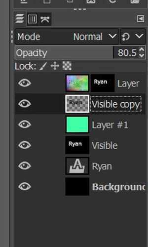 

 My goal was to make it seem like the letters were floating. Therefore, I dupliocated my visible letter layer and inverted the color to black. I moved it a little bit to the right, so it seemed like a shadow. Gimp applied tools I could use to spread it out and make it look more shadow. This included the blur tool. The shadow appeared under my letters because I moved it beneath the plasma layer. I was able to create an image of pixels!

### Thoughts
 Looking at what I created, I figured that Gimp was a great tool I could use to make fun images, but it would take a while to fully understand how the tools there were could make certain layers do certain things under other layers. If I am ever motivated to make a fun image design, I might look more into the complex tools of Gimp, but overall I learned the basic use of it and was able to gain some insight on its complexity. 

## 3D Free Cad

 I attempted to utilize Free Cad, a parametric 3d modeling software. I followed this [tutorial](https://www.youtube.com/watch?v=uf32NAq-Rsk) to try tpo learn the basics. One interesting thing I learned from the tutorial is Free Cad has a variety of workspaces that you can work in to get a design. I used the "sketcher" and "part design" workspaces to create a simple 3d model. The tutorial led me not just through how to make something 3d, but described a planning strategy where you choose an axis and make a shape in "sketcher", then go to "part design" and add aspects that can change the shape around, ultimately making a 3D customizable design. 

### Model and Tasks
I navigated to the model and tasks area, which is where you can see your actions and which sketches or bodies they are under, and select them to do certain things or edit what you have already done, which is what the "tasks" are is for. 

### Creation and Constraints

 I first selected the XY plane to start with. I created a rectangle with circles in the four corners. The video emphasized the use of constraints, which would allow me to expect what would happen to the sketch once I made it into 3D, and it didn't make any sudden changes I didn't expect. 

 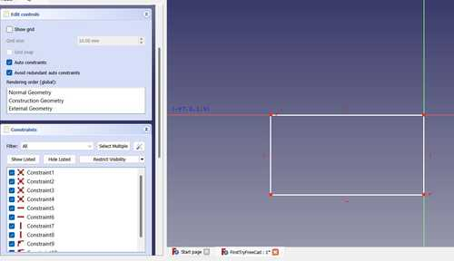

 I extruded the rectangle first. This was done in the "part design" worksace. I had navigated from the sketch to the part design in order to create an object ou of a sketch. I set constratins to the circles so they were all eqaully placed on the four corners. FreeCad shows the Degrees of Freedom, which shows the amount of movements that can be done to change the shape. I wanted to get this down to zero. I set a distance and orizontal and vertical constraints, so the circles forever stayed in one position. I could change the size, but their distance from the sides along with their horizontal and vertical status would never change. 

 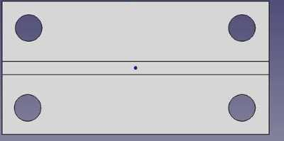
 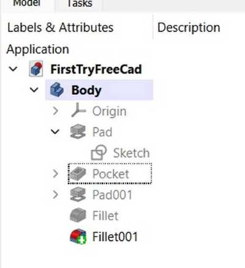

 Next I created another recatngle. Starting it from the sides constrained it to stay on those sides. I extruded this out as well. I used the fillet tool to curve everything, and got a final product. 

  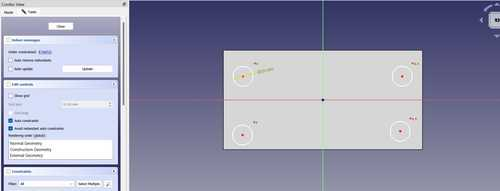

### Final Project Model

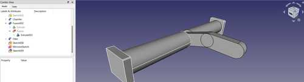

At the end of the week, I had a little free time on Tuesday so I decided to try and learn more about FreeCad. I decided to try and build a model of my page holder, which is one 3d printed portion of my design. Though I will most likely be using Fusion 360, learning about different softwares can increase my knowledge of ways to go about 3D designing. I started off by navigating to the sketcher workspace, and creating a circle. I learned that the "part" workspace was for designing all parts while "part design" allows you to play with one body. I navigated to the "parts" workspace, and I extruded the circle out 130 mm. At the end of the circle, I tried selecting the face and creating a sketch, but I got an error saying that I needed to select a space. It turned out I needed to select a face on the models section of the UI, where I could see the history of all the tools I used and which bodies they were under. At the end of the tube, I created a rectangle and extruded it out. 

I then created the shape of the page holder using two ovals, and extruded it out 10 mm. (This was on the other side of the original tube I created). I then searched for a mirror tool, which I found I could mirror bodies in the "part" workspace. I selected the XZ axis as the mirror axis, and I mirrored the tube and rectangle on both sides of the page holder. 

Wanting to use a variety of tools, I filleted the edges on one side and chamfered the other side. One intersting thing about FreeCad I learned was that you can edit everything about your tools in the "tasks" section to the left. For example, I could chosse which edges or sketches I wanted to fillet, and could set each to a certain radius of fillet. This is a lot less work than having to fillet each one separately to get different sizes. 

Another interesting tool I used was the boolean tool, which essentially allowed me to join two bodies. I simply had to navigate to the "model" section and choose bodies I wanted to combine, and I could combine different bodies or sketches I had. This led to the "model" section creating a new action called "fusion", where it contained all of the prevcious actions made to get that body, combined into one. Though I am not a master at FreeCad, this allowed me to learn that FreeCad was well made in terms of organizing actions you have done, and allowing the user to navigate to certain places so they can change or edit that specific spot. 

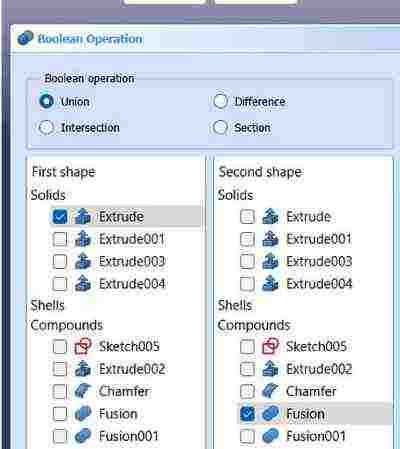

## Fusion 360(3D)

### Sketch
I have had some previous experience in Fusion 360, so I am able to navigate it well. Following Kevin Kennedy's 30 days tutorials, I was able to learn the basics of navigating and planning desings, along with using a variety of tools to help put a design together. I decided to to create a prototype of the page holder of my final project. First, I created the sketch of what it would look like. I used the rectangle and the arc tool to create the base sketch. I added constraints so that the top and bottom were parallel. I extruded this out to around 5 mm. 

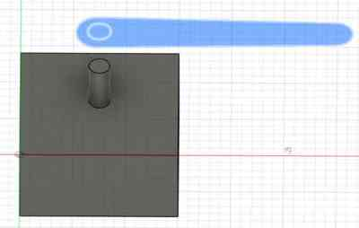

### Tube for Rotation
Fusion 360 is great when it comes to designing things in certain parts. At first like the image above, I created a rectangle with a tube on top, but I realized in my final project the page holder would be going across, and therefore required a long tube. I used an off sketch plane tool to create a plane to the side of my page turner, and used the offset plane to create the tube it would be rotating around. 

### Joint Movement Testing
Once I created a tube, I tried using the joint tool, which will allow me to add movements to the pieces I had created. However, I got an error stating that the joint could only connect two componenets. Therefore, I went back through the history and made my two bodies into new components, which is an organization of bodies and sketches. There, I could change the motion of the joint into revolution, and I selected the hollow hole of the page turner to fit the tube where it would spin around. I learned that I could move the joint around where I wanted it, and edit how it goes around. 

### Components
One problem I ran into was that when I first did it, the tube was spinning inside the page turner rather than the page turner spinning around the tube. I struggled with this but it turned out to be an easy fix with a little research, I just had to reverse which component I selected first, which would be the one moving around a certain object or axes. I edited the appearance and learned about the render plane, where I could see a realistic version of it. 

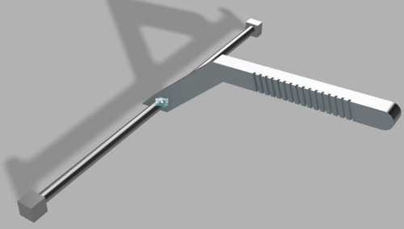

Prior to this, I had simply used Fusion for making simple fun objects to 3D print. I did a deeper dive into certain tools that Fusion had, and I learned that it can also be a really helpful tool to model projects and render how it would turn out, which can help with planning later on. For example, I will only be printing the page turner and holder for my project, but I was able to use Fusion to model how it would turn, with appearance and render, which makes it look more realistic. 

I also decided to make the page turner(not the page holder!) I used the sketch I had before and I did the same thing as the page holder, but I just had to set the revolution joint correctly. I was able to add a wooden appearance for aesthetic purposes. 

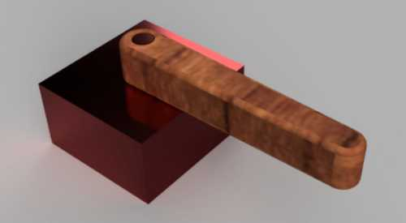

## Ancient Roman Building

Here is a project I made with Fusion 360. I used many of the tools I needed to create an organized and visually appealing design. 

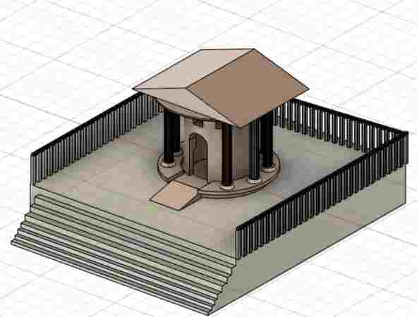

## Image Resizing

My classmate [Adam Stone](https://fabacademy.org/2023/labs/charlotte/students/adam-stone/) introduced me to an image resizer that I can easily access through the terminal on VSCode. I went to his repo and copied the image resizer directory into my own local repository. I renamed it "Image Resizer for Me". To access it, first I had to import my images into the `image` directory in my repo. The code in the image resizer only resized jpgs, so I had to have all of the images converted to jpg or jpeg before I used the command. After my images were in there, I navigate to the image resizer directory by typing `cd Image Resizer For Me`, which is a command I learned in week one, and then all I have to do is type `python main.pyw` once I'm in the resizer directory. This opens up a tab wehre I can select images I want to resize, and the code automatically resizes it for me. I can change how much it resizes my images in the code. 

