# 3. Computer controlled cutting

## Parametric Designing

My design file for this week can be found here- [files](../files/Week%204%20Files/week4zip.zip)

### Research
I had a decent idea on how parameters worked, but I wanted to make sure before I dived in, so I skimmed through this [video](https://www.youtube.com/watch?v=iUUFrkdgCLI) on User Parameters in Fusion 360. I was originally planning on using Cuttle for this part of the assignment, but [Dylan](https://fabacademy.org/2023/labs/charlotte/students/dylan-ferro/) told me that I could design 2D on Fusion 360, then import the file into Corel Draw and print it on the laser cutter from there. Though Cuttle is greatly set up for parameters, I could easily navigate through Fusion 360, so I loaded it up. 

### Design/ Thought Process

I wanted to try making a simple put-together pkane for my construction kit(parametric). I knew I would want to cut this on 1/8 inch cardboard, so I new the tabs I would be using would have to have a length of 0.13(1/8) inches. For the height of my tab, I wondered what I should do, so I looked bac at previous gradute [Aaron Logan](https://fabacademy.org/2022/labs/charlotte/students/aaron-logan/assignments/week04/) to see what his tab height was, and he had used 0.3 in, so that is what I made mine. 

My thought process was simple. I would have the basic airplane shape which I traced from an imported canvas, and I would create two tabs, one on the top and the other on the bottom. In these two tabs, I would put a connector on each, so I could attatch wings. This can be seen in my final product if you scroll down. For the back wings, I would just create a tab on the back of the plane and insert an oval with a tab. 

### Parameters

Before I started anything, I created the parameters for my tabs. I navigated to the modify>change parameter section and I created two user parameters for the width and the height of the tabs, which were 0.13 and 0.3 inches.

### Sketches and Constraints

I first traced the airplane body shape. I then created another sketch to create the two connectors. I made a rectangle then used  the two lengths I hgad to create tabs on two sides. (One would connect to the body and the other to the wing). I then created a parameter for the height of the connector. 

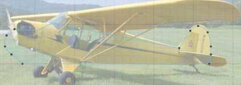
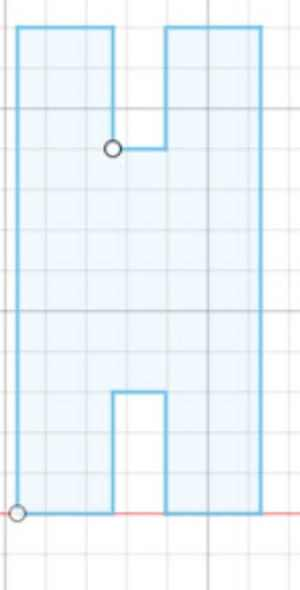

After I did all this, I changed the connector height parameter to see if I could correctly edit my sketch, but it accidentally elongated one of my tabs. I learned that this was because I had simply connected the line, not set it to a set parameter. Once I fixed this and changed the paramter, I could change the height and everything else would stay the same. 

I learned that it is good to constrain my sketches and set distances to set parameters so that if I wated to edit it in the future I could change the size without effecting the shape. 

Following this idea, I created the wings with rectangles where I could slide the edges of the tabs in, and the back oval wing. 

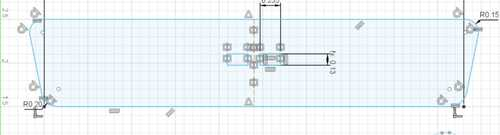

The reason there are two rows od recantgles on the front wing is because I wanted to be able to assmble the plane in two different ways. One way was if I conncted a wing on the top and bottom. The other was if I connected two on top of eachother. Then, the second wing would have to go on top of the first wing, and I would need another set of holes where I could fit the edges of the tabs in. All the designs were constrained due to the set distance they had from the parameters I created. 

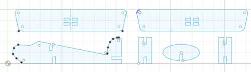

This design took me a while, for I kept restarting due to incorecct distances or constant accidental changes due to underconstraints. I was able to learn about how to fully used parameters correctly so that if I want to edit the size or shape of something, the other measurements can stay the same. This is the benefit of parametric designing. 

### Kerf

I had not currently implemented kerf yet. Through the lecture and research, I learned that kerf was basically the thickenss that the laser burns off when it is cutting. Therefore, the size of the cut is always the tiniest bit smaller than what the design is made of. I was able to figure out the average kerf of our laser through our group assignment, which was to find the kerf. That can be found [here](https://fabacademy.org/2023/labs/charlotte/assignments/week04a/)

I couldn't really wrap my head around where I was supposed to implement kerf in the beginning. At first, I was about to subtract the amount of kerf twice, for I though that it should be implemented on both sides, but then I realized that this would just double the amount that I added, for the kerf we measured was the total amount taken away from what we set it to be. Therefore, I just had to add it once. 

I navigated to my parameters, and I created one called kerf. I could just add the kerf amount (0.014 inches for us) to my original parameters, but then if I ever wanted to go back and change the kerf amount in the future because my joints didn't fit, I would have to go through changing all the paramters that I implemetned kerf with. Part of the benefits of parametric designing is the ability to change one setting, and it automatically applying itself to parts of the design where it might be located. I set the paramter then went to the `joint thickness` parameter and added `+ kerf`. This way, if the laser took off slightly more than what I set it to, the joints would still fit for the parametric construction kit. 

One problem I ran into was that when I did this, my big wing ran into some constraint issues. Two of the boxes in the middle that I had made did not change, while two did, so it was off balanced. This was because when I was setting the dimensions for these, I got lazy and just typed 0.13 inches rather than referring to the paramter I had created. Therefore, when I changed the parameter, the size for two of the boxes did not update. All I had to do was use the sketch dimension tool to set the dimesnion and refer to the `joint length` parameter, and it updated to the correct size. I then had to match it up with the other size so it was symmetric. I used the sketch dimension tool again to set the distance bwteen the two columns of boxes to the length that it needed to be so that it would fit the connector piece. After I set this, it constrained it to that distancem, so I could adjust the position without adjusting the distance of it from one column to the other. 

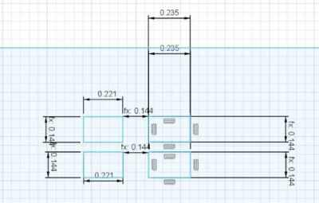

## Laser Cutting

We used the Epilog Laser in our lab. The job manager is super easy to navigate and custmize, so the process is quite fast. First, I downloaded the file into CorelDraw on the local computer from Corel Draw. Luckily, there is a camera, so I can just drag and drop the location of the cut, then focus it using the auto focus tool on the job manager. I was using 1/8 inch cardboard to cut out my kit. Normally, the process contains setting the speed, power, and frequency of the vector job to a certain amount, but the Epilog Software has preset settings for certain materials, including cutting through cardboard.

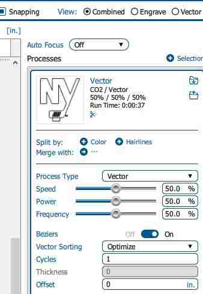

*Here is a snapshot of the setup menu*

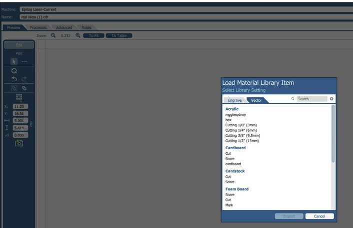
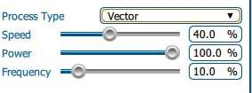

*Here I imported the settings for cardboard, and it set it to those presets*

Here are my final products

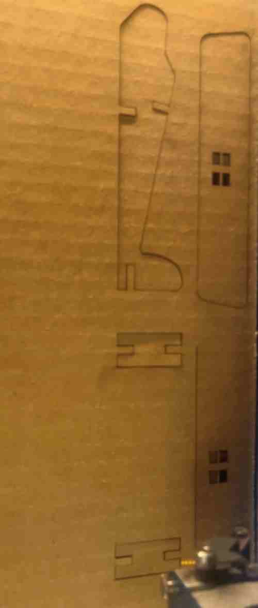

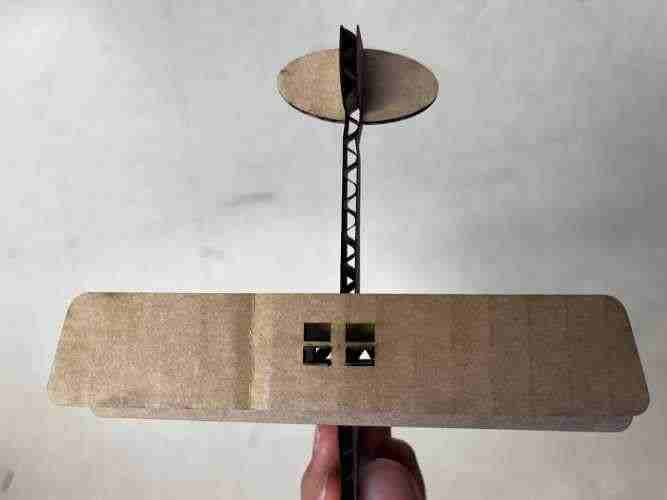

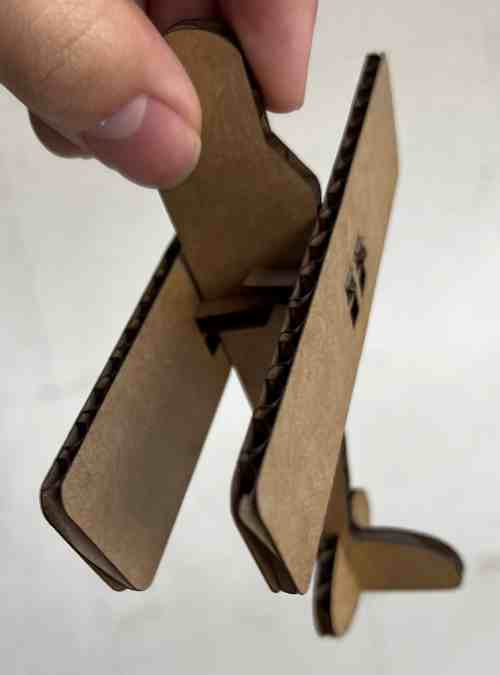

*two wings separate*

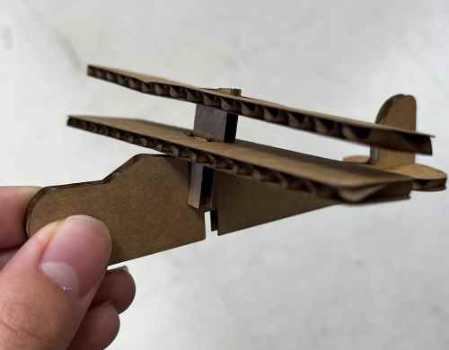

*two wings together on stacked*

## Vinyl Cutting

I haven't used the vinyl cutter much in the past, so cutting multiple colors was new to me. I learned from looking at other people's designs on [Silhouette Studio](https://www.silhouetteamerica.com/software), and I found that they were doing each color by layerm, cutting each color separately with the color mats they needed, I went online and searched for a multicolored logo I found appealing, and found this [playstation logo](https://commons.wikimedia.org/wiki/File:Playstation_logo_colour.svg). 

### Trace Outline

I imported the logo into Silhouette Studio, and went to the Design workspace. I used the `trace outline` tool to get the outline, but I only got the outer edge. To cut all four colors, I needed to separate each section. I played around with the trace logo, but the bitmap would remain one outer trace logo. I then learned about the `trace by color` tool in Silhouette, which was so useful in my situation. When I clicked on this tool, all I had to do was press on a certain area, and it would trace that color. I also had to press the `All Areas` option instead of the single, so it selected and traced all ares with the color I chose. Once I did this, the software traced all the colors separately. I could now cut using differnt color mats. 

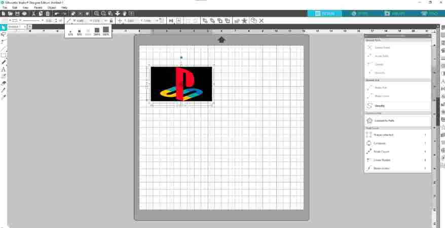

*Import of logo, which I can reference the outline shapes and cuts off of using Silhouette's tools*

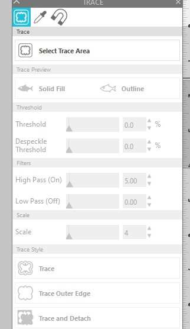

*I then navigated to the trace logo after selecting the image in the software. I had many options on how to trace, such as by area, or by color*

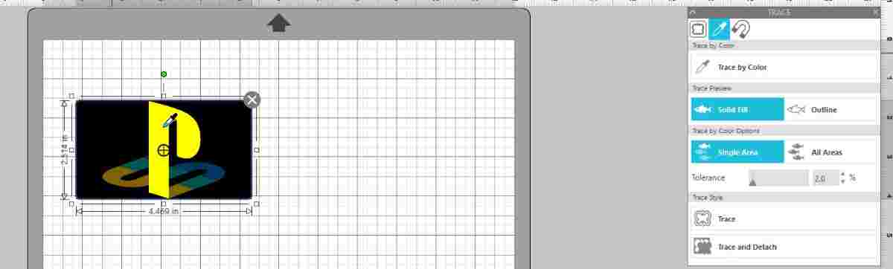

*I selected by color and cut the outlines separately*

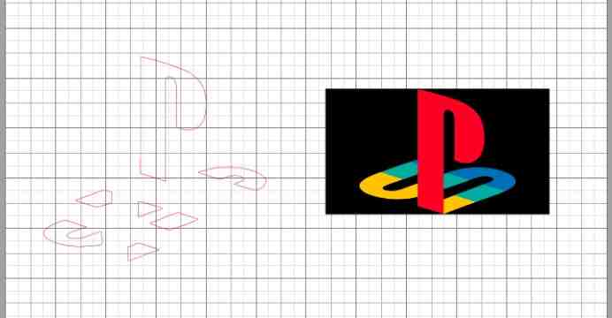

In the final image, you can see the different colors separated after I traced them. Though my sticker didn't require multiple layers on top of each other, one tip I learned that would have been helpful even in my situation is to create a refernce point such as a dot at the top or an outline shape, so I can match all of the separate cuts together more easily in the end. 

### Using the Machine

I navigated to the "Send" section. I made sure the material was "Vinyl, Glossy" since that was what I was using to cut. The material blade was 1 mm, and I set the job to cut. Before I pressed send, I put the red vinyl on the loading mat, which is adhesive so the vinyl sticks to it. I put it in the machine and pressed "load mat" which prepares the mat by rolling it in. I then started the job, and it started cutting. 

Each time I cut a color, I had to unload the mat, put the next color I wanted, navigate to the outline that was using that color, then send it to eh vinyl cutter. Since I had four colors, I did this four times. 

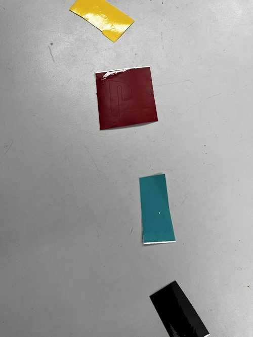

### Weaving and Transfer Tape

I used a sharp tool to get the vinyl around the cut off. I had to be careful, for some of my shapes were very small. Moving it would mess up the shape, since all four colors need to be in the exact spot so that it can make the logo. 

I then used our lab's transfer tape to move all of the colors onto one. I put the transfer tape on three of the cuts, one of them would be the one that would have all of them on it. Once I put the transfer tape over the weaved cut, I smoothed it out and pressed hard so that the vinyl would stick to the transfer tape. This way when I lift it up, they all come up while maintaining the shape. I transfered the black, green, and yellow vinyl to the paper with the red cut on it. I matched it up and placed the trasnfer tape down, ultimately transferring the cuts one from place to another, hence the word "transfer tape". I peeled off the tape gently once the vinyl was on the paper. This part required you to be gentle. I had extremely small cuts, so I had to pay extra attention Still, one of the small green traingles moved, so I had to fiddle with it to get it back intp place. However, I was happy overall with my multi-colored vinyl sticker! 

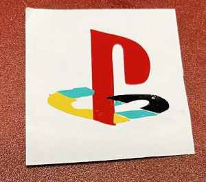

My lab has a tradition where we put our stickers for this week on the office's front window, so that's where this will be going for a bit. In my free time, I decided to also create an Xbox logo to go alongside my playstation logo. 

## Group Work

Our group was able to learns skills on customizing the laser settings, implement kerf for more accurate cutting, and learning about dithering. Our dithering was done under a constant setting, around 50% power and 50% speed. Below you may view the options there are under the engrave settings under the job manual. 

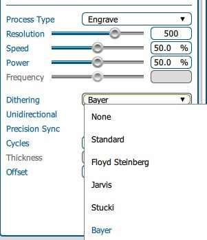

## Reflection

This was a fun week, and I learned a lot of things about cutting that I did not know before. Previously, I had just followed certain instructions on certain materials, but this week I gained more insight on the setup of the laser cutter and how wer can customize it. I also finally made my first multi-cut sticker. I enjoy making those, and plan to make more in the future. 