# 4. Embedded Programming

If you go to my PreFab work, you can see that I was able to use the ATTiny 412 as a programmer for the Arduino, in which I did a few things, such as blink an LED, and use a button as an input. However, at this point in time, I was just starting to learn about microcontrollers and programmers, so even though I had followed instructions and gotten things to work, I did it without really knowing the background. For this week, I first committed to trying to learn more about microntrollers. 

## MicroControllers

I began with research. I learned the difference between micrcontrollers and microcontroller chips. THe chips are what contain the memory, I/O peripherals, etc. According to ChatGPT, it is the brain of the embedded system. Micrcontrollers are copmlete systems that include the chip along with other components such as power supply, sensors, and communication interfaces. It is a combinataion of hardware and software desgiend to perfrom specific functions using the "brain" or the chip. For example, the Arduino is an easy-to-use micocontroller  that uses the Atmel AVR chips. The one I use specificallt contains the ATmega328p. Chips vary depending on their memory storage, bits and bytes, number of I/O pins, and communication interfaces. 


## ATTiny 412

Since I had used this before, I started off with using an ATTiny 412. Before I got into the datasheet, I wanted to program the chip to do a few things so I could go over how to use it. During Prefab, I learned that I could use the Pinout datasheet in order to understand the purpose of each leg and how I should reference them in my code. In that same week, you can also check out how I was able to code certain things as inputs and outputs. 

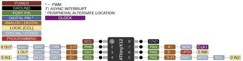

Taking this knowledge, I wanted to code the ATTiny 412 to do something more complex than just one input and one output. I decided to make a traffic light where a green and yellow light flash but if a button is pressed, the red LED turns on, sort of like an emergency traffic light. 

This is where the implication of my knowledge of micrcontrollers came in. I would ultimately make the ATTiny 412, which is a chip, the programmer for the Arduino. In order to do this, I used the method that my teacher Tom Dubick taught me. I would have to use the firmware called `jtag2updi`, which is what allows the atmega328p chip on my Arduino to interface with the avrdude, the program which allowes the uploading of on-chip memories to the AVR microcontroller chips. How this all actually plays out within the memories and serial communication of the chips is much out of area of expertise, but that is the general idea of what must happen. In order to do this, I used the method I did in the PreFab week. I uploaded the jtag2updi code to my Arduino, allowing it to interface with the avrdude, which would allow my ATTiny412 chip to be programmed via the Arduino. You can download jtag2updi and follow instructions [here](https://github.com/ElTangas/jtag2updi).

Once the Arduino was running as my programmer, I made the circuit using the pinout. My LEDS would be connected to outputs and the button would be connected as an input. I also would have to connect pin6 of the Arduino to the sixth leg of the ATtiny so that they communicated using the UPDI interface. 

Here is my final code:

```
int buttonState = 0;         // variable for reading the pushbutton status

void setup() {
  // initialize the LED pin as an output:
  pinMode(0, OUTPUT);
  pinMode(1, OUTPUT);
  pinMode(2, OUTPUT);
  // initialize the pushbutton pin as an input:
  pinMode(3, INPUT);
}

void loop() {
  // read the state of the pushbutton value:
  buttonState = digitalRead(3);

  // check if the pushbutton is pressed. If it is, the buttonState is HIGH:
  if (buttonState == HIGH) {
    // turn LED on:
    digitalWrite(0, HIGH);
  } else {
   
   digitalWrite(0, LOW);

    digitalWrite(2, HIGH);
    delay(1000);
    digitalWrite(2, LOW);
    digitalWrite(1, HIGH);
    delay(1000);
    digitalWrite(1, LOW);
  }
}
```

<video src="../../images/Week 5/BUTTONvideo.mp4" controls="controls" style="max-width: 500px;">
</video>

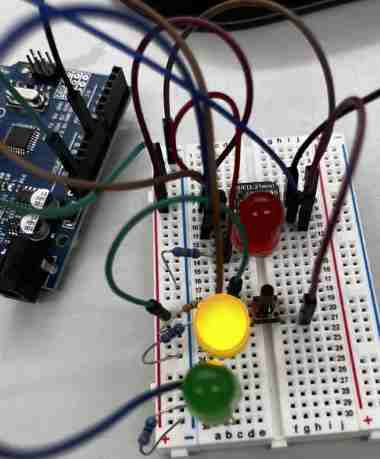

*when nothing is happening, flash green and yellow with 1 second delay*

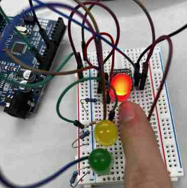

*when button is pressed, red turn on*

## IR Remote with Arduino (Communication Remotely)

Before moving on, I wanted to do one more thing with the Arduino. I wanted to learn about how to program the IR remote(I will not be using the ATTiny 412 as a programmer for this one). I used this [website](https://www.circuitbasics.com/arduino-ir-remote-receiver-tutorial/) to get a basic understanding of IR and how I should go about programming and making it.

I had never programmed this before so I first watched this [tutorial](https://www.youtube.com/watch?v=3jeSfsnQOWk). I didn't completely follow this, but it gave me a basic understanding of what the code was doing and how I needed to build the circuit. 

### Serial Monitor and IR Code

One issue I ran into was the serial monitor. I followed the tutorial just like it told me to, but for some reason, rather than the serial monitor outputting the values that the tutorial was giving, mine just kept outputting `FFFFFFFF` for every button. I was confused, and I did lots of research. I went to differnt tutorials and websites and used code that they provided, but my buttons would always just return the same thing. Eventually in the end, I figured out that this is because all IR remotes are different, and their buttons reutrn different  codes. I was using an ELEGOO IR remote, so I had to follow the code for that IR remote. I used this code to see if it would output different values for each button, and it worked!(Also I made sure I had the IRremote library downloaded.)

```
#include <IRremote.hpp>// includes library
#define IR_RECEIVE_PIN 8 // defines IR_RECEIVE_PIN as 8

void setup() {
  Serial.begin(9600);
  IrReceiver.begin(IR_RECEIVE_PIN); // starts recieving pin 8

}

void loop() {
  if(IrReceiver.decode()){//if receives value from remote, then decode
   IrReceiver.resume(); //start receiving again
   Serial.println(IrReceiver.decodedIRData.command); //print the value decoded
  }

}
``` 
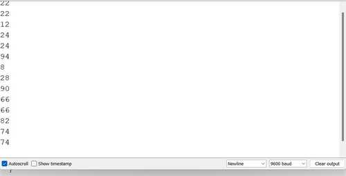

### Using Knowledge to Make the Remote Actually Do Something
Now that I knew I could code the buttons, it was time to acutally take it and code something via Arduino IDE. My friend [Stuart](https://fabacademy.org/2023/labs/charlotte/students/stuart-christhilf/weeks/week-4/#arduino) is pretty good with this stuff, so I went to his site and studied what he had. I saw he had defined his buttons with the code that the serial monitor returned when I pressed each button. Here is what it looked like

```
#define IR_BUTTON_0 22
#define IR_BUTTON_1 12
#define IR_BUTTON_2 24
#define IR_BUTTON_3 94
#define IR_BUTTON_4 8
#define IR_BUTTON_5 28
#define IR_BUTTON_6 90
#define IR_BUTTON_7 66
#define IR_BUTTON_8 82
#define IR_BUTTON_9 74
```

I decided I wanted to make two LEDS turn on and off. I then used the tutorial I mentioned above to write my own code using the commands and code that it taught me. Here is what it looked like:

```

int receiver = 11; //Sets the pin for IR module
uint32_t Previous;
IRrecv irrecv(receiver);
decode_results results; // Handles decoding of incoming IR signals


void setup() {
  // put your setup code here, to run once:
 Serial.begin(9600); // Sets up Serial
 irrecv.enableIRIn(); // Enables reciever to start listening for incoming IR signals

 pinMode(9, OUTPUT); // Sets pin to output for LED
 pinMode(8, OUTPUT); //Sets pin to ouput for LED
}

void loop() {
 
  if(IrReceiver.decode()){
   IrReceiver.resume();
   int command = IrReceiver.decodedIRData.command; // If IR signal present, decode and command stored in "command" variable

   switch (command) {
    case IR_BUTTON_1: {
      digitalWrite(9, HIGH); break;             
      break;
    }
    case IR_BUTTON_2: {
      digitalWrite(9, LOW); break;       
      break;
    }
     case IR_BUTTON_3: {
      digitalWrite(8, HIGH); break;             
      break;
     }
    case IR_BUTTON_4: {
       digitalWrite(8, LOW); break;
      break;
    }
 }
}
}
```
My code was put together through a variety of codes I learned from external sources, so I had a few variable errors, but luckily, the IDE's debugger tells me all this, which is why it so so convenient. After fixing all this and running it to the Arduino, I pressed the buttons, and it worked, turning on and off the two LEDs depending on the button I corresponded it to!


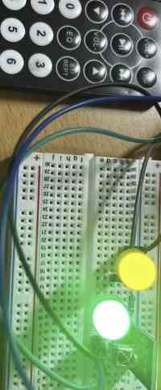

## Raspberry Pi Pico
The next microcontroller I tried out was the Raspberry Pi, which used the Pico chip.(Also known as rp2040) This is an acutal microcontroller supported by the Arduino software, so I didn't have to connect it to the Arduino. 

### Board Manager
When I first tried to run code to the Raspberry Pi, I completely forgot I had to set it as a board. I went through the board manager and saw it wasn't there. I reserached how to get it, and all I needed to do was go to `Board Manager` and download the RP2040 to the IDE. Once I did this, it became an option under my board options, and I set it to the rp2040. There, I could code things directly.

### Inputs/Outputs
Similar tp the ATTiny, the raspberry PI had certain legs which I needed to reference through the PINOUT sheet. This time however, the Raspberry Pi did it on it's own since it had the PICO chip, rather than using a chip to program through the Arduino. (ATTINY 412 had to do this) I simply checked the pinout sheet, connected an LED, set it as an output, and tested it the same way I had with the 412. This time they were referneced with GPIO pins, or "general purpose input/output". 

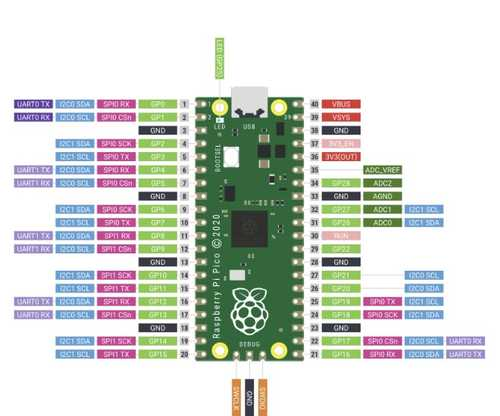

This time, I wanted to test out an analog input. I used the photoresistor. I quickly researched online how to code photoresistors. It was pretty simply, I just had to set an LDR variable to the command `analogRead(pin)` and reference it in an `if` statement, where I would say if LDR is less than a certain value, in this case if it is dark, than the LED flashes. In my scenario, I made it so if a button is pressed, then the LED turns on, and if not, it turns off. However, if the LDR detects a reading of less than 700(it goes dark), then it flashes, regardless of the button's state. The circuit build was simple, connect a button as an input, an LED as an output, and a photoresistor as in input. Then I wrote this code:

```
const int buttonPin = 16;  // the number of the pushbutton pin
const int ledPin = 15;    // the number of the LED pin

// variables will change:
int buttonState = 0;  // variable for reading the pushbutton status

void setup() {
  // initialize the LED pin as an output:
  pinMode(ledPin, OUTPUT);
  // initialize the pushbutton pin as an input:
  pinMode(buttonPin, INPUT);
}

void loop() {
  // read the state of the pushbutton value:
  buttonState = digitalRead(buttonPin);
  int LDR = analogRead (3);
  // check if the pushbutton is pressed. If it is, the buttonState is HIGH:
  if (buttonState == HIGH) {
    // turn LED on:
    digitalWrite(ledPin, HIGH);
  } else {
    // turn LED off:
    if (LDR < 700) {
    // turn LED on:
    digitalWrite(ledPin, HIGH);
    delay(1000);
    digitalWrite(ledPin, LOW);
    delay(1000);
  }
  }
}
```

I connected the Raspberry Pi, ran the code, and to my surprise it acutally worked!

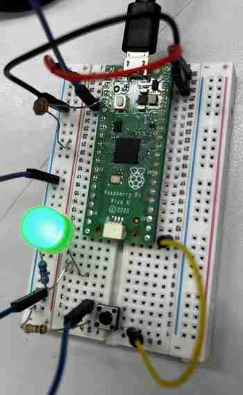

### Thonny/ MicroPython

I had never used python before, so this was a learning experience for me. I followed a set of presentations. I first started off by downloading the [Thonny IDE](https://thonny.org/). When I first tested Thonny out, I actually liked how it was set up. Everything was simple and plain, and it turned out to be quite easy to navigate. I also learned about MicroPython, a full implementation of the Python 3 programming language, which we are able to run directly on hardware such as the Raspberry Pi Pico. 

In order to connect the Pico, I went to the `Interpreter` option in te lower left corner when I first loaded up Thonny, and I chose the Pico option, which was set on COM 5 for my computer. I then did the typical `print("Hello World")` and ran it to see if it worked, and it did, printing "Hello World" in the shell. I learned that the shell is basically the area where we communicate and see what happens with our code. Here is a fun code to try and see what the Shell does. 

```
user_name = input ("What is your name?")
while user_name != "Clark":
    print("you are not superman- try again!")
    user_name = input("What is your name?")
print("you are superman")
```

I then tried to save the file into my raspberry pi, but I got this error:

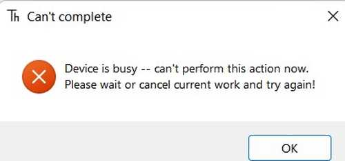

It turns out that I had set it to the wrong interpreter. I had not ran the MicroPython version. I went to the interpereter and chose `MicroPython(Raspberry Pi Pico)`, and I was able to save it to the controller. 

I learned a couple of basics for python, such as the `While True` loop, which is just an infinite loop. I also learned abot modules, which give us access to useful codes from other programs, kind of like a library. For basic code, I used the `machine` and `utime` modules. In python, I learned that I can also import part of a library to take up less memory. Here is a code for a simple blinking LED. 

```
from machine import Pin, Timer
led = Pin(25, Pin.OUT)
timer = Timer()

def blink(timer):
    led.toggle()
    
timer.init(freq=2.5, mode=Timer.PERIODIC, callback=blink)
```

I imported the Pin and Timer codes from the machine library. I then set pin 25, or the built-in LED of the pico to an output, and I set it the word `led`, then made `timer` eqaul to the Timer code from the library. When the timer is started, it repeatdly calls the blink function, which I defined to toggle on and off the LED at a certain frequency.

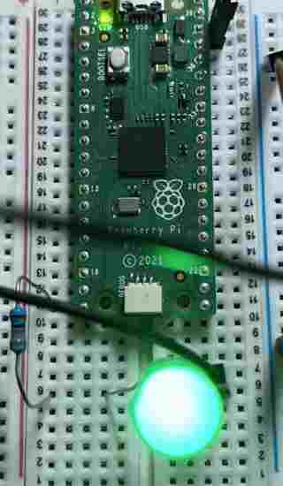

I then added an input. Here is the code for an external LED to be toggled by a pushbutton. 

```
import machine
import utime

led_external = machine.Pin(15, machine.Pin.OUT)
button = machine.Pin(14, machine.Pin.IN, machine.Pin.PULL_DOWN)

while True:
    
    if button.value() == 1:
        print("LED on")
        led_external.value(1)
        utime.sleep(1)
        led_external.value(0)
        print("LED off")

```

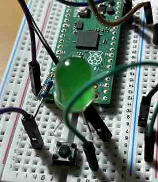
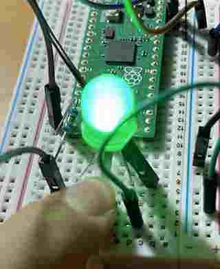

This code uses a pull-down resistor. There is a bvuilt in resistor to every GPIO pin, which can be programmed. A pull-down connects a pin to ground meaning that when it isn't pressed, the inpubt will be 0. This it the opposite of a pull-up resistor, which goes to power, meaning the input will be 1 when it isn't pressed. It was interesting how I could simply set the state via python code, seen in the parameters of the pin. Here is a chart provided by my instructors to clear it up. 


I learned a lot about MicroPython from cimply making an LED blink such as modules, the basic syntax, formatting, and more, but I wanted to do one thing that was not just an LED. I orgiinally tried to code an LCD, but I did not have the I2C data converter chip that would be able to make the Pico read my LCD, which is from an ELEGOO kit. I then worked to make a servo turn, since I knew I would be using some sort of motor or turning device in my final project. Through research and the presentation provided by [David Taylor](http://archive.fabacademy.org/fabacademy2016/charlottelatin/students/87/index.html), I learned how a servo worked, and how I would need to code the PWM, or pulse width modulation to modify the position of the servo the way I wanted. Here is the code that I used.

```
import machine
import utime

servo = machine.PWM(machine.Pin(15))
servo.freq(50)

def interval_mapping(x, in_min, in_max, out_min, out_max):
    return (x - in_min) * (out_max - out_min) / (in_max - in_min) + out_min

def servo_write(pin,angle):
    pulse_width=interval_mapping(angle, 0, 180, 0.5,2.5)
    duty=int(interval_mapping(pulse_width, 0, 20, 0,65535))
    pin.duty_u16(duty)
    
while True:
    for angle in range(180):
        servo_write(servo,angle)
        utime.sleep_ms(20)
    for angle in range(190, -1, -1):
        servo_write(servo, angle)
        utime.sleep_ms(20)
```

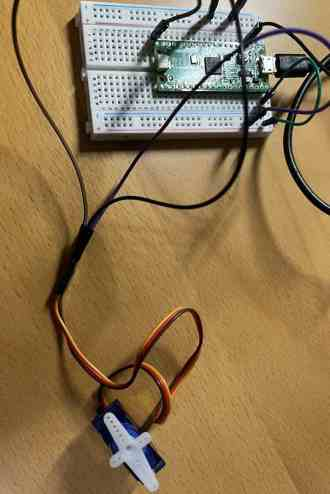
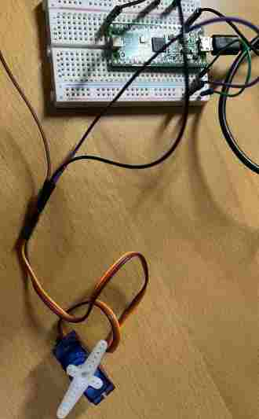

Taking my new knowledge of MicroPython, I had a basic understanding of what was going on, but I used ChatGPT to be fully sure, for I didn't really undestand the `interval_mapping` part. Here is what ChatGPT gave me. 

```
The code defines a function called "interval_mapping" that maps a value x from an input range (in_min, in_max) to an output range (out_min, out_max). This function is used to map an angle in the range of 0 to 180 degrees to a pulse width in the range of 0.5 to 2.5 milliseconds, which is the standard range of pulse widths used to control a servo motor.

The "servo_write" function takes a pin and an angle as input and sets the duty cycle of the PWM signal on the pin to correspond to the desired angle of the servo motor.
```

In my first try, I had forgot to put the 20 in the parameter for `utime.sleep`, so the servo ended up turning in irregular timing. After I fixed this, it was able to go back and forth. 

Having a basic understnding of Python, I tried to do one more thing. I simply added a button input and used a `if` statement to say that if the button was pressed, turn the servo, and to my surprise, it worked first try! Here is the code for the button and the servo:

```
import machine
import utime

servo = machine.PWM(machine.Pin(15))
servo.freq(50)
button = machine.Pin(14, machine.Pin.IN, machine.Pin.PULL_DOWN)

def interval_mapping(x, in_min, in_max, out_min, out_max):
    return (x - in_min) * (out_max - out_min) / (in_max - in_min) + out_min

def servo_write(pin,angle):
    pulse_width=interval_mapping(angle, 0, 180, 0.5,2.5)
    duty=int(interval_mapping(pulse_width, 0, 20, 0,65535))
    pin.duty_u16(duty)
    
while True:
  if button.value() == 1:
    for angle in range(180):
        servo_write(servo,angle)
        utime.sleep_ms(20)
    for angle in range(190, -1, -1):
        servo_write(servo, angle)
        utime.sleep_ms(20)
```

<video src="../../images/Week 5/SERVOvideo.mp4" controls="controls" style="max-width: 500px;">
</video>

Learning a new language may seem intimidating, but I learned that if I just try out simple code and see what it does, and I get exposed to more and more types, I can learn the basic format of that language quickly. I am not a master at python, but from this experience, I learned some of the basics and can not look at Python Code and not be completely lost in what I see. 

## Bare Metal Programming

I had never heard of Bare Metal prior to this week, so I started from scratch. I recieved a lecture from Tom Dubick about what it was. Bare metal Programming is a way of directly coding the hardware without using an external interface, or in my case, the Arduino IDE's great amounts of code. I would still use the IDE, but not the tools that it came with. I would instead directly reference the registers in the memory of the ATTiny 412, and change what it does via it's binary code. This may seem like a lot, so here is a break down of how I went about this.

I first went through videos from [Mitch Davis](https://www.youtube.com/@MitchDavis2), who explained what was happening quite well. 

### Registers

Through the lecture and the videos, I learned that registers are memory blocks containg data for controlling or setting up microcontrollers. The memory of micrcontrollers differ. Looking at the [datasheet](http://ww1.microchip.com/downloads/en/DeviceDoc/40001911A.pdf) for the ATTiny 412, I saw the memory map of it's chip. Underneath the map is an exaplanation for each memory's purpose, as well as their addres, which I will talk about more as you scroll down.  

Knowing this, I next moved on to the registers of port. In the Arduino, there are three ports, B, C, and D. Each port contains three registers. The DDR register determines I/O, the PORT register, determines if its HIGH or LOW, and the PIN reigster reads the state of the INPUT pins. In Bare Metal, we reference these registers to code something to happen. 

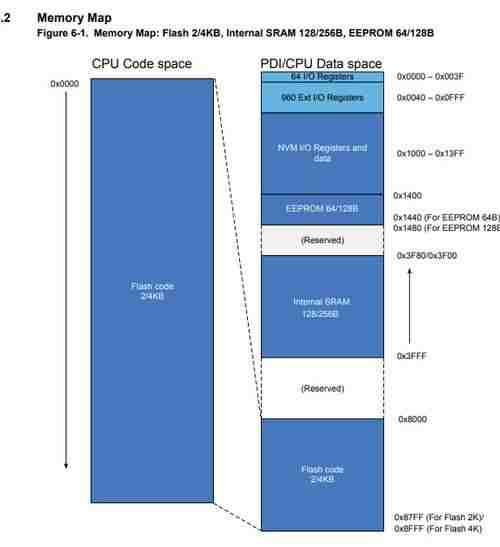

### Blinking an LED

The first step like always was to make an LED blink. Using the videos, I learned the commands necessary for Arduino Bare Metal. Here is the code to make and LED blink:
```
{
  DDRB = 2; // sets DDR register of pin 9 to OUTPUT
}

void loop()
{
  PORTB=2;// sets PORT register of pin 9 to HIGH
  delay(1000); 
  PORTB=0; // sets pin 9 to LOW
  delay(1000); 
}
```
If you look at Ardunio's PORT pinout, you can see which pins are part of which port. Using this, I coded `PORTB=2` because I had connected because this way, I referenced pin 9 using decimal value. Decimal goes up in twos, so it would be 1,2,4,8,16,32 for the pins of Port B(8-13), which has 8 bits(or 1 byte). The Binary equivalent for this would be `00000010`, for 1 is HIGH and 0 is LOW, and in this case bit 2 is toggled on(second from the right). If this is confusing, the video I referenced can help, or look up how bits and binary code work. 

### Incorporating ATTiny 412

I had blinked using bare metal code via Arduino, but how would I do it with the 412? I would have to use the datasheet along with the pinout again. I saw in the pinout that it was a port pin of PA, meaning I would have to reference Port A. So I took the blink code of the Arduino(above) and just switched the PORTBs to PORTAs, along with DDRB to DDRA. However, I got an error. After lots of reserached, I navigated back to the datasheet, where I figured out that the commands for referencing the registers in an ATTiny412 was different from that of an Arduino. I had conenected the LED the 3rd leg of the 412, which according to the pinout, was PA7. Using this I wrote this code:

```
void setup()
    {
    PORTA.DIRSET =128; // Sets PA7 as OUTPUT, for it goes up by factor of 2, and 2^7 is 128(decimal coding!) 
    }
void loop()
    {
  PORTA.OUTSET = 128;
  delay(500);
  PORTA.OUTCLR = 128;
  delay(500);      
    }
```

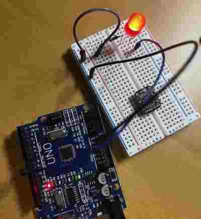

### Bit Shifting

Using the video, I used bitshifting to further extend my knowledge of Bare Metal. With bit shifintg, you can shift 1 over as many spaces as you like and compare it to your binary code with an `and` or an `or` statement to make something happen. Here is the code to make LED blink:
```
void setup()
    {
    PORTA_DIR = B10000000;  // Defines OUTPUT as PA7 
   
    PORTA.OUT = B10000000;
    }
void loop()
    {
  PORTA.OUTSET = 128;
  delay(500);
   PORTA.OUT &= ~(1 << 7); 
  delay(500);      
    }
``` 

One issues I ran into was when I first did it, I did the setup in decimal. However, I learned that if I want to bitshift, my setup must be in binary so that the 0s and 1s can match up and make something happen. Also, using the 412 datasheet, I learned that when referencing binary, I don't need the `SET` part of the code, as seen above. These seem like small and quick fixes, but learning it took an hour of studying the datasheet and understnadning the `and` and `or` bit shifting. 

### Traffic Light

I then decided to remake my traffic light but with bare metal. I decided that I wanted to make green, yellow, and red LEDs flash unless I held a button down, in which case all three would stay on. The hard part was breaking down how I would code it. I had learned through the datasheet that I could setup the initial value of the pins.

```
void setup()
    {
    PORTA_DIR = B11000010;  // Defines OUTPUT as PA7, PA1, and PA6. Defines INPUT as PA3
   
    PORTA.OUT = B11000010; // Configures state of output pins
    PORTA.IN = B00000100; configures state of input pins
    }

```

I then was able to code the loop, where I would say that if the button pin is high, then the output pins all stay as high. Else, They are all on then turn off one by one repeatedly. I did this by doing the bit shifting method. One mistake I made was not using the ~ symbol, which reverses all of the 0s and 1s, toggling the LEDs. It also took me a while to get the logic right. I kept looking back at the video for bitshifting to see which ones do which. At first, I was using the or statement and everything was backwards. It took me a while to find the right way. It will take practice for me to master bit shifting! 

```
void loop()
    {
  if (!(PORTA.IN &= (1 <<2))) {
    PORTA.OUT = B11000010;
  } else {
    PORTA.OUTSET = 194;
  delay(500);
   PORTA.OUT &= ~(1 << 1);
  delay(500);      
  PORTA.OUT &= ~(1 << 7);
  delay(500);    
  PORTA.OUT &= ~(1 << 6);
  delay(500);    
    }
    }
```

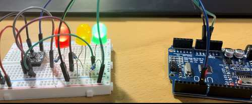

### Pointing to Memory Registers

The final way to go about this was to use poiters to memory addresses. In my case, I would be pointing to the PORTA configuration and setting the input and output registers. A tip that the video taught me was to use the `#define` to define the pointer as something of my own. In my case, I named it `input` and `output`, along with the `InputOutput_Set` for the setup. 

Once I had this set up, it was pretty straight forward. I used the datasheet to find the address for the PORTA memory register, which turned out to be 0x0400. I pointed to it, then referenced the input and output in my `void setup()` to set the register as the input and output I wanted it to be. Then, using the same traffic light code from before, I replaced the `PORTA.IN` and `PORTA.OUT` to just `input` and `output`, for I had pointed to that register and just needed to set it to a certain HIGH or LOW value. If that is confusing, compare the new code below to the code I showed above, and what is going on will make a little more sense. 

One thing to mention was the offset, which gave me quite a bit of trouble. I had my code, put I kept on getting and error, and my LEDs would not turn on. I did research after research, and after about an hour of scrolling through the datasheet, I found something that might correspond to my problem. After looking upon it and doing more research, I found that offsets are memories from certain memories, meaning I had to locate to the PORT memory block, then offset to the certain memory block I needed. This diagram shows the offsets of ports. 

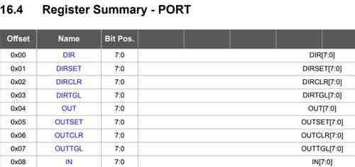


```
#define output *((volatile byte *)(0x0400 + 0x04))
#define input *((volatile byte*)(0x0400 + 0x08))
#define InputOutput_Set *((volatile byte*) (0x0400 + 0x00))

void setup()
    {
  InputOutput_Set = B11000010; 
  output = B11000010;
  input = B00000100;
    }
void loop()
    {
   
  if ((input &= (1 <<2))) {
    output = B11000010;
  } else {
    PORTA.OUTSET = 194;
  delay(500);
   output &= ~(1 << 1);
  delay(500);      
  output &= ~(1 << 7);
  delay(500);    
  output &= ~(1 << 6);
  delay(500);    
    }
}
```

## Group Work

This week, the groups in our lab were tasked with studying the architecure and features of a certain microcontroller. My group was assigned with the RP2040. which I used but didn't do too much of a deep dive in. The most important takeaways from testing and looking at these was how the bit-size, clock speed, and register size all played a role in choosing what the best microcontroller is for certain projects. Once we had data from the datasheet(We all soon figured out that ChatGPT is a great way of navigating through the long pages, and also the table of contents are extremely well organized), we were able to compare it to the other groups' chips, which were the ATTiny1614, and the ESP32-S2. [Here](https://fabacademy.org/2023/labs/charlotte/assignments/week05/) you can find a spreadsheet and the summarization of comparisons of the three chips, and [here](https://fabacademy.org/2023/labs/charlotte/assignments/week05a/) is our group work describing our research on our assigned chip.

## Reflection

What a week! I came into this week quite worried because I don't consider myself a good programmer. When I first looked at the 400 pages of the datasheet of the ATTiny 412, I thought to myself how in the world I was going to learn something form that and incorporate it into my own programming. However, I am proud of what I was able to do this week. Prior to this, I was simply using the Arduino and 412 as I was taught. I was making things work, but I wasn't really sure what I was doing. After this week, I learned tha basics and background of what happens behind the scene. I was also able to learn more about microcontrollers, languages, and bare metal programming. Also, I learned that the datasheet only seems long, it is actually very well organized and clear to understand. Using the datasheet, I learned quite more than I expected about memories, ports, registers, etc. 