# 5. 3D Scanning and printing

I started off by thinking of a design. I had never printed anything that isn't one body before, so I wanted to try that out. Looking at previous ideas, I came up with doing a keychain with a car key and a house key.

## CAD

I used Fusion 360 to create this design. I didn't want to make it to big, so I set the ring to a little bigger than 1 inch in diameter. I brought in a canvas of a simply key, and I traced it to get the shape. For the car key, I made a rectangle with fillets with three shapes on the surface to make it look like buttons. 

Here are my [designs](../files/Week%205%20Files/ACTUAL_Week05.zip) for this week 

## PrusaSlicer

Once I made my design in Fusion360, I exported it as an STL file(stereolithography), and save it onto my computer. This way, I could put it in Prusa Slicer and export it as layers as a g-code file, which is what the 3D printer reads. I was able to customize the quality and style of the print in this software. 

### Variable-Layer Height

I had used PrusaSlicer before, but I had only ever been in the `Simple` settings, and never really custmozied my 3D printing outcome. This week, I learned many tools that I could use to optimize my print both in time, efficiency, and small usage of material. 

The first tool I learned about was the variable-layer height, which allowed me to customize each layer of the print, instead of having the same layer height everywhere. It is good to use this feature when you need to custmozie certain parts of the print ith finer details, where ou may need smaller more detailed layers. This compares to when you might have large and lfat areas that aren't as defined, then you can increase the layer height in those areas to speed up the print while keeping good quality for other areas. Small layer height also helps when the print has smooth or sharp curves. I also learned from research that if I use smaller layers in places that need support, that can help make it a successful print, and it can also allow me at times to eliminate a few supports to save time. It is all about the geometry of the print. 

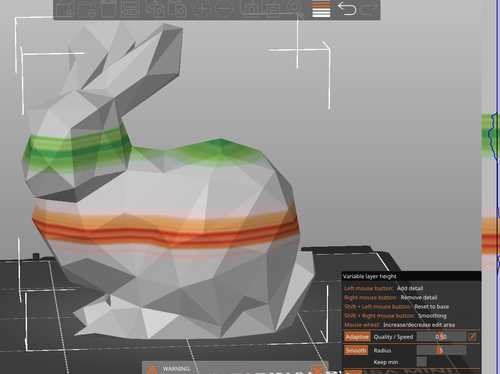

In this image, you can see the individula layers having green or red colors. Green means smaller and more defined layers while red means bigger layers. ON the right, I was able to hover my mouse over the tool, and it would highlight a certain layer on the print. From there, I could use certain commands to increase or decrease quality, smooth, and custmoize each layer.

Here is a detailed view on the processes I could use to edit the layer details and heights. 

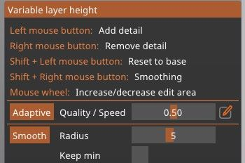

### Infill

Infill is the type of pattern that fills in the interior of the 3D pbject. I was able to use the [Prusa](https://help.prusa3d.com/article/infill-patterns_177130) website to learn aobut different kinds of infill patterns along with their benefits and weaknesses. The two that caught my attention were the `Gyroid` and `Cubic` infill.

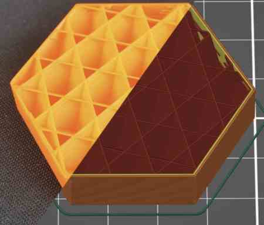
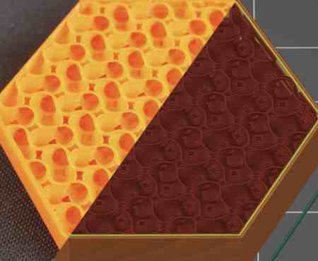

### Ironing

Ironing is the process of smoothing out surfaces by adding a second infill at the same layer. This can be found in the `Infill` print settings as well.  This has benefits such as filling in any holes, flattening any plastic that may have curled up, etc. I didn't use any ironing for this week, but I learned that I should probably use them in prints where I need two surfaces to have as little of a gap in them as possible. Also, it makes flat surfaces look better, such as logos, boxes, and lids. 

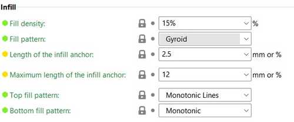


I also learned that you can add a modifier and mesh a shape with a 3D object, and the overlapping area will make only part of the area iron. You can use this method for other settings as well. 


I used the `monotonic` infill type for the top and bottom layers, which fills it in with lines. Here are a few options for the bottom infill. 

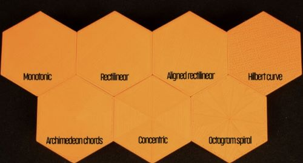

Here is an image for all of the different options in the print settings, 

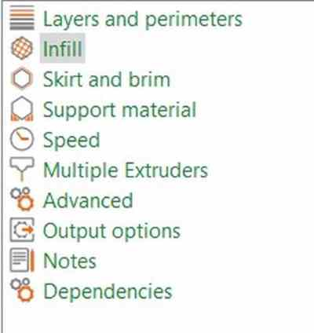


## Reducing Print Time

I imported my keychain into PrusaSlicer, and began trying to optimize the print. When I first imported it, the ring was standing up. 
When I added supports to `everywhere`, here was the outcome.

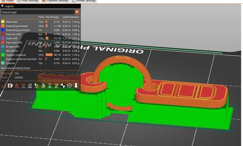

When you render the preview of the layers, PrusaSlicer tells you all the different sections of the print and how long it would take. The supports took up 57 minutes, almost half of the entire time! Knowing I wanted to fix this, I tried out different ways I could reduce the print time even by the slightest bit. 

I then had the idea to turn the keys to their sides. I did this, and the time went down a slight bit. Since I had not custmoized the supports, it still gave me lots of supports, even in areas I didn't need it such as the buttons on the car key. To remove this I had two options. First, I could go to the `Supports` section of the Print Settings, and change the threshold to make the angle smaller. This would remove all supports that had an overhang of a smaller degree than what I set it as. I also changed the support thickness to a little bit bigger, so that I could reduce time.

The second option, the one I took, was to use the `paint supports` tool, which allows me to highlight certain parts of the print to tell the slicer whether to add supports in that area or not. I used the `Block Supports` and painted over the small overhangs that I didn't think needed supports. After doing this, I previewed it again, and the print time had reduced by 14 minutes, which was an accomplishment. 

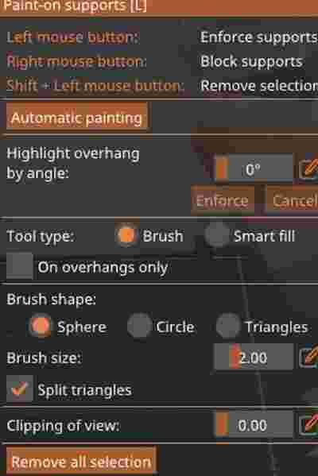
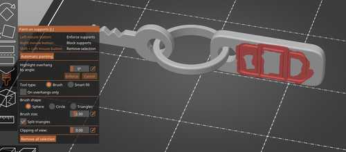

Final Output:

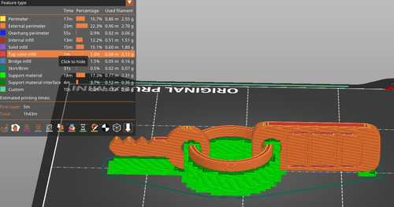

Through many tools and tests, I was able to custmozie how detailed, or undetailed I watned certain layers and areas. I also custmozied supports, infill, and positioning of the print to save as much material and time as possible. 

## Printing

Once I sliced the file in PrusaSlicer, I exported the file as a gcode, which is the code that the printer reads. For material, I would be using PLA. I asked ChatGPT to give me a few benefits of using PLA, and here is what it gave me.

1. Ease of use: PLA is easy to work with, as it requires lower printing temperatures and doesn't require a heated bed like some other materials. It also has minimal warping, so prints are less likely to fail due to warping issues.

2. Environmentally friendly: PLA is made from renewable resources, such as cornstarch, sugarcane, or cassava roots. It's biodegradable and compostable, which makes it an environmentally friendly option for 3D printing.

3. Safe: PLA is considered safe to use, as it's non-toxic and doesn't emit harmful fumes when printing.

4. Wide range of colors: PLA is available in a wide range of colors, including translucent and metallic finishes.

5. Cost-effective: PLA is generally a more affordable 3D printing material compared to other options, making it accessible to hobbyists and beginners.

6. Good quality prints: PLA can produce high-quality prints with a smooth finish and good detail. 

I also learned that PLA is not well-suitable for tempertaure applications as it has a low melting point, and it is not as strong as some others. However, it is strong enought to make some basic prints like my keychain. Also, like ChatGPT said, it is safe. 

Before Fab Academy started, the people in our lab built the Prusa Mini 3D printers, a small but extremely well-working printer. We all got to take it home and use it for projects like these. In our lab, I learned that the printers use [Octoprint](https://octoprint.org/), which is a web interface that allows the printer to be controlled through a web directly without a need of wired connection. It connects to the local network, which is how it is able to communicate with the web. I tried to set this up at home, not knowing I needed a Raspberry Pi to set this up, which I did not have at home. Because of this, I just used a flash drive to send the g-code files to the printer. 

Once I hit print on the printer, the printbed and nozzle automatically heated themselves and began the print. I ran into no troubles, which was a relief since I was worried I had taken off too much support. 

## Post Processing

Once the design printed, I used a scraper o gently get it off the bed, and began taking off the support. I learned soon after that the holes where the ring and kings were linked were kind of hard to remove supports. I was able to do it with tweezers, but I will take into considertaion the clearance of the holes next time I do something like this so that I don't run into support issues. Extra string that might have been on the print I was easily able to remove. Here is the final product, which I am happy to say had a good range of motion

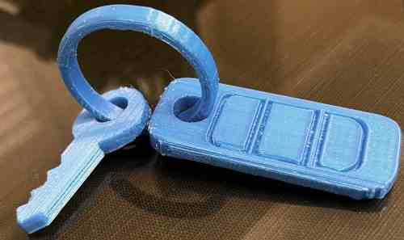

## 3D Scanning

For scanning, I learned about apps on my phone that could take photos and turn them into a 3D object on a software using a method involving identifying common features between images(points and sufaces), lighting, and other reference points to position an object in 3D space. It takes these features and corresponds them, placing them in a traingulate position of point in a 3D space. A method in doing this requires taking many photos, sometimes more than 100, in order to make the scan. However, the apps on our phones have been made really well in executing these tasks, where all I had to do was move around, and the phone would take a picture everytime the angle, height, or lighting changed. 

At first, I used Polycam. I decided to scan my school calculator using the method above, also known as `photogrammetry`. To gain a better understanding of this method, I went through this [article](https://www.sciencedirect.com/topics/agricultural-and-biological-sciences/photogrammetry). At first, I didn't know much about scanning, so I just moved around like the app told me to, and I got a result which had many errors and faults. 

After taking the scan again with slower speed and better lighting with more vary of angles, I was able to get this final product. 

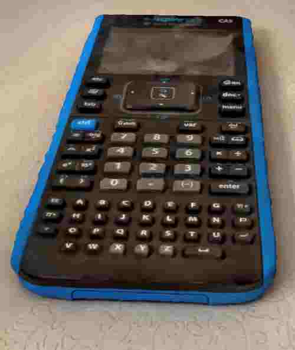

Unfortunately, Polycam did now allow free exporting of the file, so I found a new app called KIRI Engine, which my classmate [Merritt](https://fabacademy.org/2023/labs/charlotte/students/merritt-backerman/about/) introduced me to. This time, I scanne a toy plane that I had in my room. Using photogrammetry once more, I scanned it slowly from many angles, getting a final product that I liked. The amount of photos has pros and cons. THe mor images, the better the product, but the bigger the size and longer the upload. I was able to export this file as an STL for free, which I retreived in my gmail. 


### App Processes

Here are some images of the process I used while scanning using the two apps. 

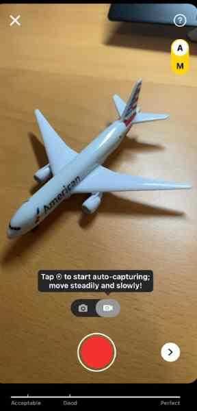


As seen in the images, before, I had an option to manually take photos or simply move around and it take photos for me. I chose to do the automatic, for I wasn't focusing on the detail. In the second image, you canb see as I move around, the bar on the bottom starts to fill up, as well as the images seen in the bottom left, where it took 4 / 70 possible images. 

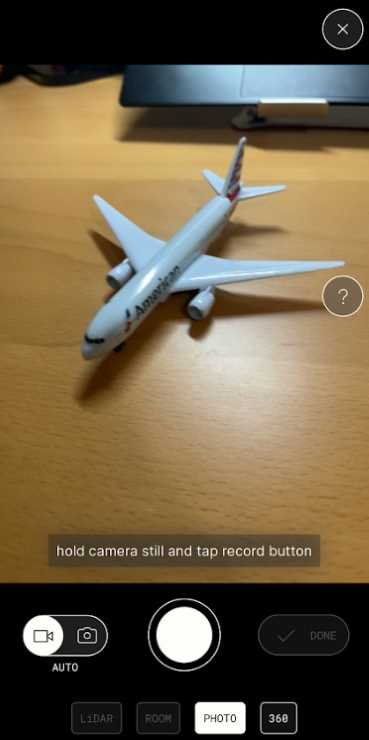
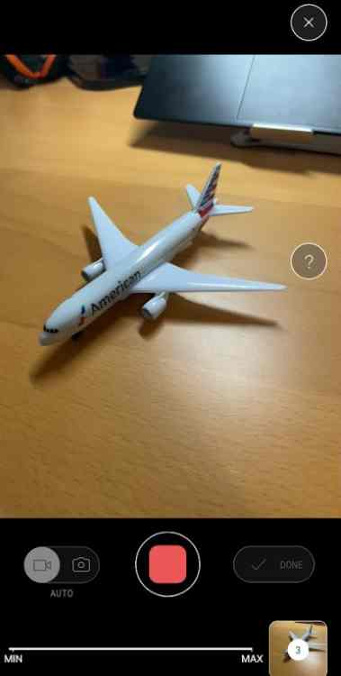

For PolyCam, the process was basically the same. As you can see, there were a couple of different options such as PHOTO and LIDAR along with others, as well as the same option to do manual or automatic photos. The second image shows the process while moving around, in which it takes a photo every time the angle changes. As I memntioned, the more images, the higher detail, so I moved around slowly. There is also a MIN and MAX bar of images as seen in the bottom. 

### Mesh
Using Fusion 360, I learned about the Mesh plane, which is designed for working with mesh models, which is what my scan file was. I used Chat GPT to find out what how Mesh planes were different the construction plane. Here is the response:

```
Mesh planes are different from traditional construction planes, which are used for creating solid or surface models. Mesh planes are designed specifically for working with mesh models and allow you to snap to the mesh vertices, edges, and faces when creating or modifying a mesh.
```

Using this plane, I was able to clean up the excess background. I mostly used the `Plane Cut Tool` to cut off the excess scan. There were a few tiny parts I missed, so I just used PrusaSlicer to cut everything else. To do this, I exported as an STL once more into Slicer, and used the tool on the right side to cut any body split from the plane. 

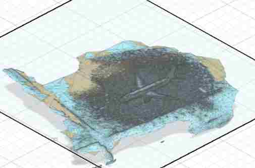
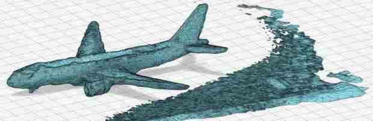

Here is my final product. 

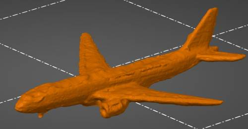

## Group Work

For this week's group work, my group was assigned with learning about the details of the Formlabs Resin printer. From this, I first learned how to use the Resin Printer through a workflow that my lab provided. The process involved, sending as STL(same as Prusa), following thorugh instructions on the touchpad screen on the Resin Printer, than taking the design off the bed and curing then drying it. We used a test file with all thpes of tests to see how well it would do with dimensional acuuracy, overhangs, bridges, and holes. You can check out our group's work [here](https://fabacademy.org/2023/labs/charlotte/assignments/week06a/)

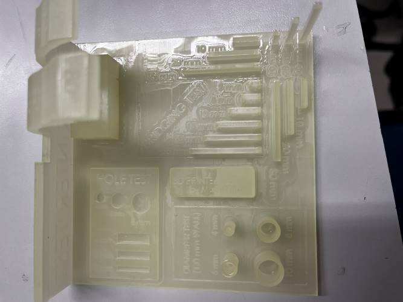


