# 6. Electronics design

Here are my design files for this week. [Files](../files/Week%206%20files/Week%206%20files.zip)

Here are the Fab libraries for Kicad and Eagle that I used this week: [Libraries](../files/Week%206%20files/LibrariesKicadEagle.zip)

I started this week off by revisiting surface mount soldering using [Adrian's](https://fabacademy.org/2020/labs/leon/students/adrian-torres/fabxiao.html) XIAO board. This board used the following components:

- XIAO RP2040 Dev. Board
- 1000 ohm resistor
- push button
- 499 ohm resistor
- 0 ohm jumper resistor
- LED
- Headers for I2C
- Gerneral Headers for 5V, 3v3, GND, and 7 I/O


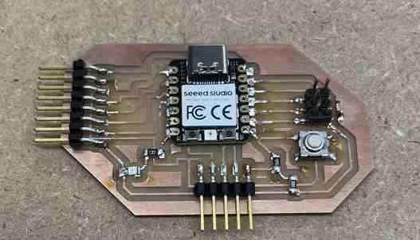

I tested if the board worked by plugging the microcontroller in, which provided 5 volts. I then went to the Arduino IDE because it supports the RP2040. To set up the board, I used [this link](https://wiki.seeedstudio.com/XIAO-RP2040-with-Arduino/). I tried to make the LED I soldered blink. I looked at the board, and I realized the LED was connected to the 7th pin on the left side of the XIAO. To code this, I looked at the pinout, and I saw it corresponded to P0. Therefore, I pulled up the basic blink code and changed the pin to 0. 

```
void setup() {
  // initialize digital pin LED_BUILTIN as an output.
  pinMode(0, OUTPUT);
}

// the loop function runs over and over again forever
void loop() {
  digitalWrite(0, HIGH);   // turn the LED on (HIGH is the voltage level)
  delay(1000);                       // wait for a second
  digitalWrite(0, LOW);    // turn the LED off by making the voltage LOW
  delay(1000);                       // wait for a second
}
```
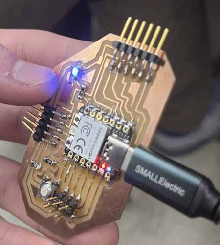

It worked! Once I knew the board was working and there were no solder bridges, me and my group(who had also soldered and made a working board) used these boards to complete our group work.

## Group Work
- *use the test equipment in your lab to observe the operation of a microcontroller circuit board*

My group decided to use the multimeter to check for aspects like voltage, resistance, and continuity, along with an oscilliscope. Our lab contains the Analog Discovery 2, a powerful device able to measure, generate, control, and observe mixed-signal circuits. It has an oscilliscope built in where we could simply plug it into a computer with a USB and use the WaveForms software to record or generate signals. First, we used the board we made to signal one pin to HIGH and LOW constantly, and measured the voltage signal for that with the Analog Discovery. We then generated a signal using the `WaveForm` tool in the software, where we set a pin to an Analog signal, and we connected it to an actual oscilliscope to see the wave. Finally, we observed PWM. More about our group work can be found [here](https://fabacademy.org/2023/labs/charlotte/assignments/week07a/)

## Research

I have never actually used stepper motors before, but it wasn't that difficult to figure out. After doing a bit of research and watching [this video](https://www.youtube.com/watch?v=_jTYygbOTuI&t=62s) to learn how to use them. I learned I needed a motor driver for each stepper motor, which sent the necessary electrical signals that would function the stepper motor. Also, it controlls the necessary current needed, since most stepper motors use more current than a microcontroller can typically provide. After getting the two stepper motors and motor drivers, I decided to hook it to an Arduino first. I first got each stepper motor to work to make sure there was no problem. I then tried to wire it with two buttons that each controlled two of them. AFter researching and finding the `stepper.h` library and a few example codes from ChatGPT along with this [Arduino website](https://docs.arduino.cc/learn/electronics/stepper-motors), I put together this code:

```
#include <Stepper.h>

const int stepsPerRevolution = 200;

Stepper stepper1(stepsPerRevolution, 5, 6, 7, 8);
Stepper stepper2(stepsPerRevolution, 1, 2, 3, 4);

const int buttonPin1 = 4;
const int buttonPin2 =5;

int buttonState1 = 0;
int buttonState2 = 0;

void setup() {

  pinMode(buttonPin1, INPUT);
  pinMode(buttonPin2, INPUT);

  stepper1.setSpeed(30);
  stepper2.setSpeed(30);
}

void loop() {
  buttonState1 = digitalRead(buttonPin1);
  buttonState2 = digitalRead(buttonPin2);

  if (buttonState1 == HIGH) {
    // Turn the first motor one revolution clockwise
    stepper1.step(stepsPerRevolution);
    delay(500); 
  }

  if (buttonState2 == HIGH) {
    stepper2.step(-stepsPerRevolution);
    delay(500); 
  }
}
```

This code turned out to be pretty simple once I looked at a coupld of example codes and explanations. From the library, the code connects the motor to four pins along with the amount of steps. If a certain button is pressed, then it turns that motor the amount set to `stepsPerRevolution`. 

Creating this did take a couple of tries, for I had a couple wiring issues. Some issues I ran into when creating the connections were:
- putting the pulldown resistors in the wrong place
- not connecting buttons to power
- wiring the motor driver correctly
- code errors, such as not creating two variables for each button and motor

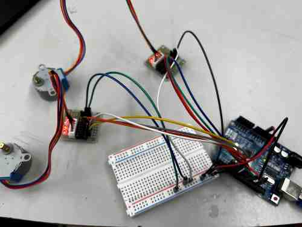

Once I got this to work after an hour of debugging, I replaced the Arduino Uno with a Seeed XIAO RP2040 board. I used the [pinout](https://wiki.seeedstudio.com/XIAO-RP2040/) to edit the pin numbers. I then connected the power and ground to a breadboard and wrote the same code as above but making this edit to the pins:

```
Stepper stepper1(stepsPerRevolution, 0, 7, 6, 29);
Stepper stepper2(stepsPerRevolution, 1, 2, 4, 3);
```

## KICAD Design

I designed a circuit in KiCad. 

### Symbol/Footprint Library
Once I got a working circuit, I decided to design it on KiCad first. One error I made in the beginning was accidentally downloading the 6.0 version rather than the 7.0 version. I realized this error when I went to add a library and it told me that it was not supported in that software. Once I downloaded 7.0, before making the design, I had to add the footprint and symbol libraries. I found the libraries on this [GitLab](https://gitlab.fabcloud.org/pub/libraries/electronics/kicad) folder. I downlaoded it as a zip, and I extracted the files inside do a new folder I created, which I called `Kicad Libraries`. This way, I could easily find it when I added it. 


To add the libraries, I opened Kicad amd went to Preferences> Manage Symbol Libraries > Project Specific Libraries. I added a new library, named it `Fab`, and linked it to the `fab.kicad_sym` file. Once I had the symbol, I went to Preferences> Manage Footprint Libraries > Project Specific Libraries, and added the `fab.pretty` folder. This took me a couple of tries, for when I opened the PCB tool and tried to upload footprints, it said there weren't any. I'm not quite sure what fixed the issue, but after a series of redownlaoding the library, reuploading it to KiCad, and copying and pasting of files into `fab.pretty`, I finally got it to work. 

### Editing the Schematic

I have slightly touched on how to use KiCad in the past, but my experience wasn't great. Before I began, I had to remind myself the difference of the schematic with symbols and the PCB editor with footprints.  The schematic was just a design with symbols, and you could pull this into the PCB editor, where each symbol was assigned a footprint and you can see the actual board design with traces. 

I opened the schematic editor, and I began bringing in components. I was making the board I made with the two stepper motors, so I needed:

- Seeed Board RP2040
- 2x 4-pin Surface-Mount horizontal headers
- 2x 2-pin Surface-Mount horizontal headers
- 2 buttons
- 2 resistors(for pulldown)

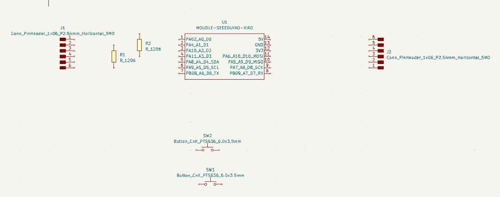

Using the pictures of the physical board I had made prior to this as a reference, I began wiring components to where they needed to go. Certain helpful tools I learned was editing each symbol to edit the names and pin-purpose, such as input, output, passive, bidirectional, etc. To do this, left-click on the component, click `properties` and `edit symbol`, make the edits in the window that shows up with the symbol, then press save on that window. This will edit the symbol on the schematic directly. Using this tool, I was able to label the pin headers, and set the pins connecting to the stepper motor as outputs, while setting the pins corresponding to the button as inputs. I wasn't familiar with the term `passive`, but using the schematic for Adrian's board as a reference, I saw that he had set the pins to passive, so I kept everything else as passive. I also saw that I had to set the PWR and GND pins of the XIAO as power inputs. 

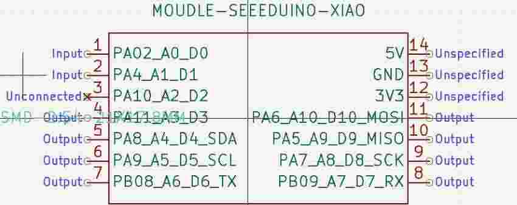

Adding the wires are really easy-to-use, for I was simply able to press the wire tool and connect parts with my mouse where they needed to go. To assign the footprints, click `properties` to the symbol and click the `Value` box next to the footprint option. 

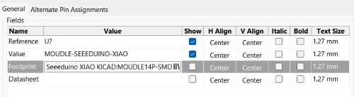

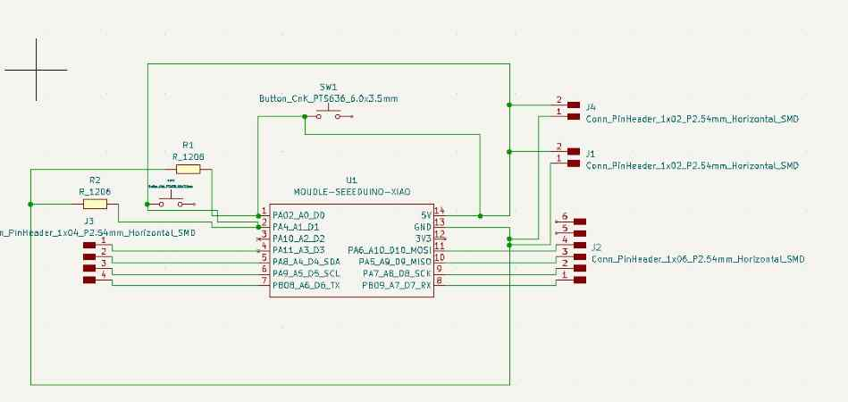

### Error/Debugging

KiCad has a great tool called the `ERC`, which chekcs for any possible errors in your schematic. When I ran `Run ERC` for the first time, I got a couple of errors. 

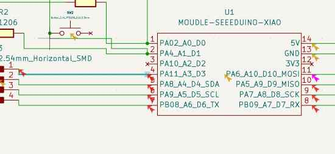

Double clicking on these errors makes the schematic point to where the error it located. I went through these errors, and most of them were errors regarding pins that weren't connected due to me not setting them as `unconnected` or setting the headers as the wrong type. I originally set the headers as `input`, but this caused an error with the circuit. Like I mentioned before, I ended up setting this as passive, which fixed the error. Since I wasn't connect one side of each button, it also gave me an error on this, but I didn't have to worry because I was not connecting anything to this side. Finally, after tracking and fixing each error, I ended up with an error saying that the "Input Power pin not driven by any Output power pin". I did some research on this, and after a long list of research, I finally came up on previous graduate [Barbara Morrow's Site](https://fabacademy.org/2022/labs/charlotte/students/barbara-morrow/assignments/week06a/), who had faced the same error as me. I came to the conclusion that KiCad tracks what happens in your circuit, and it couldn't sense where the power was going. I would be using the USB to provide 5 volts, but KiCad didn't know that. Therefore, I simply ignored this error. Once I got to no other errors, I navigated to the top and pressed the PCB editor symbol.

HUGE ERROR! Before bringing it to the PCB editor, I forgot to assign Net names and values to the connections. This is an essential part to the PCB that allows the software to know where to traces are supposed to be connected. When I first connected the traces in the PCB and ran the DRC of the footprints, I got 40 errors! I was shocked, but looking at the errors, I realized they were all the same thing- "No net connection". I thought adding the traces physcially would just be enough, but adding nets is important in letting the software know where the traces go and where they are connected. I had to go back to the schematic and assign the wires to the corresponding Net. Once I did this, I had to redesign my PCB. 

### PCB Editor

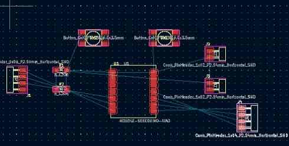

*Here is an image of the PCB layout when I first opened the tool*

Once I was in the PCB editor, I found that there was a button to import the assigned footprints of the schematic into the PCB editor. Once I clicked this, I brought the footprints in. I learned that wiring the schematic does not connect the footprints, the schematic is just a design and reference. To actually add the traces and connect the pins, I clicked on the wire/trace tool on the right and began to connect my footprints. I soon found that once you click somewhere, the software highlights where it goes due to the schematic design's connection. This was easy, for I could knew where everything connected to without thinking about it. 

The extremely hard part that I was not expecting was moving the pieces around and wiring the traces so that they didn't overlap. I didn't realize how complicated and frustrating this would get. After a long session of tracing, deleting, moving around, deleting again, and tracing again, I finally got to the point where everything was connected. I added a few 0 Ohm jumper resistors to one part where I couldn't get rid of an overlap. Here is an image of my first iteration: 

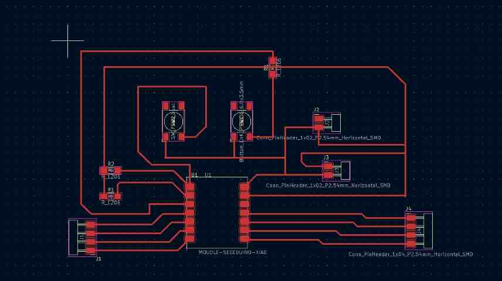

I then realized that this board was poorely made, for the I had put the bottom of the Seeed XIAO controller at the bottom. I wanted the USB connection to be hanging over the edge, so it was easy to connect and I didn't risk messing up any other traces. Therefore, frustrated but determined, I deleted all the traces and restarted, this time making sure I put the XIAO at the top of the board. After playing with it for another long session, I came up with this final board, where I was able to get rid of the 0 ohm resistor bridges. 

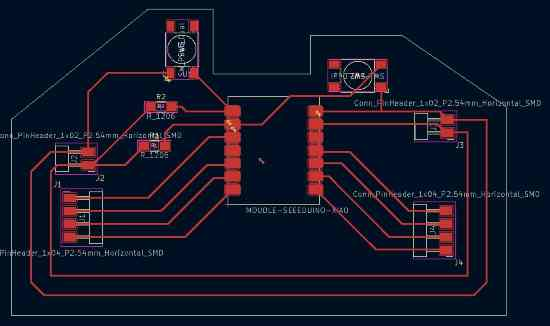

I set the traces to 0.4 mm. I am sure there are better ways to design this and I could have organized my design in a better more proffesional way, but in the end, I was satisfied with my final board. 

I learned about a tool where I could set a certain distance between traces, which would help traces be apart and not over run or become too close:
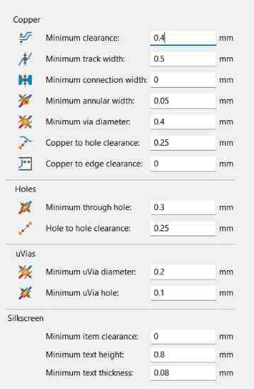

I switched to the `edge cuts` layer, and created a shape around my board. I learned that the layers help define where everything is, which can be more helpful when I make more complicated designs, maybe on both sides of the copper.

To export the file, I went to File > Plot(set the settings and layers to cut) > plot. Once I did this, it created the gerber files in my projecgt directory. 

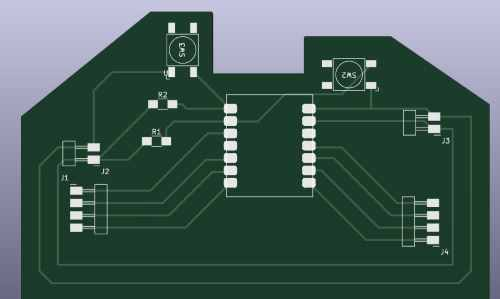
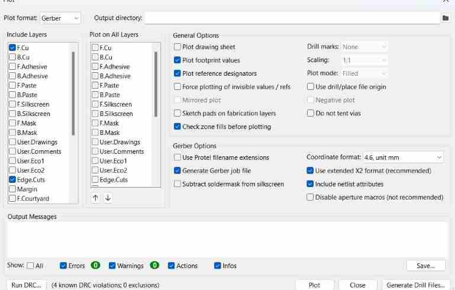

### KiCad Reflection

I greatly enjoyed learning about KiCad, and the more I went through the learning and making process, the more I realized how well it is made. It allows me to design a sketch and connect it with real components. Also, I could set pin properties, and I could run error checkers to see if there were flaws in any of my designs or electric connections. Also, prior to this, I was a bit intimidated by electronics, and I didn't think I would be able to design my own board. However, after learning through processes and studying other boards, I was able to learn more tips on designing boards. I plan to most likely use KiCad in the future for my final projects. 


## Fusion 360/Eagle

To use Eagle, I was originally planning on downloading the actual Eagle software, but I soon learend that the electronics design tool built in Fusion 360 has made significant improvements from the Autodesk company, and there was no need to download a separate Eagle software. Therefore, I opened FUsion 360 up, and clicked `New Electronics Design`. 

### Adding Libraries

Adding libraries is quite simple in Eagle. First, click the `Library` and go to the `Library Manager` tool found at the top in the row of tool. Once you are in the manager, import the library downloaded on your local disk or files. Make sure the `in use` option is selected, or else the items in the library won't appear. 

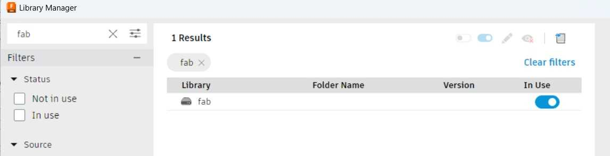

### Tutorials

Eagle was a completely new tool for me so I first looked into a couple of tutorials from the [Autodesk Fusion 360 youtube channel](https://www.youtube.com/watch?v=_jgUZeBiusw) to get down some of the basics so that I would be able to design and make my own custom board. Throughout doing the tutorials, I realized that my knowledge of KiCad was significantly helping me get through the Eagle tutorials, because the two softwares weren't too drastically different when it came to the design process. The biggest difference was the UI, navigation of tools, and a couple of other features I will mention below. Here is my first made schematic from the tutorials, which helped me understand how to import the symbols from the library, annotate, design, and sync my schematics and PCB layout.

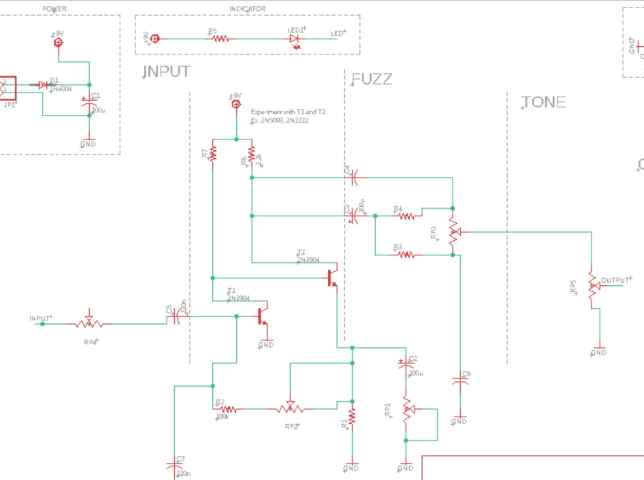

## Designing Final Project Prototype Board(Eagle)

Having the basics down and being familiar with the navigation, I decided to recreate my prototype board I hade made in KiCad. However, I decided to try and make the area of the cut a little smaller to save material when milling. First, I imported all the components I would be using. 

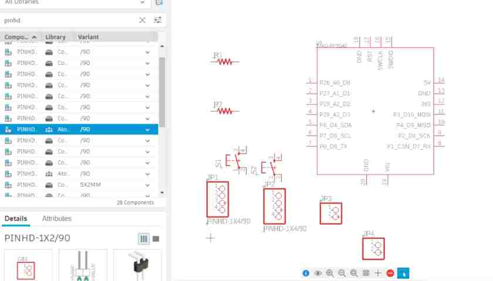

As you can see, I simply selected the library that the components were in, and I searched up the names in the filter, which pulled up all of the different varieties of the components I was looking for. For the Seeed XIAO RP2040 board, I simply went to the this [link](https://github.com/SeeedFusion/OPL_Eagle_Library) and followed the same process above to download the library. I then imported the XIAO as well. 

### Naming Nets/ERC

One method that I had not used in KiCad that could simplify my schematic was naming nets to make a connection between two points without physcially drawing a wire between them. This can help organize the schematic and simplify the visuals of the design, making it easier for other people to see where things are connected to and how the board is working. I simply used the method the tutorial had taught me, which was to create stubs, or short unconnected wires off of a component, then use the tool for naming nets to create a name for the stub. If two wires or stubs in the design have the same net name, they will autmoatically be connected without having to draw a physical wire. When you set a wire to a certain common name, this will pop up:


By clicking yes, you have properly made a connection between two parts. And as you can see, I have no long power and ground wires covering the entire schematic like the one I had created in KiCad. 

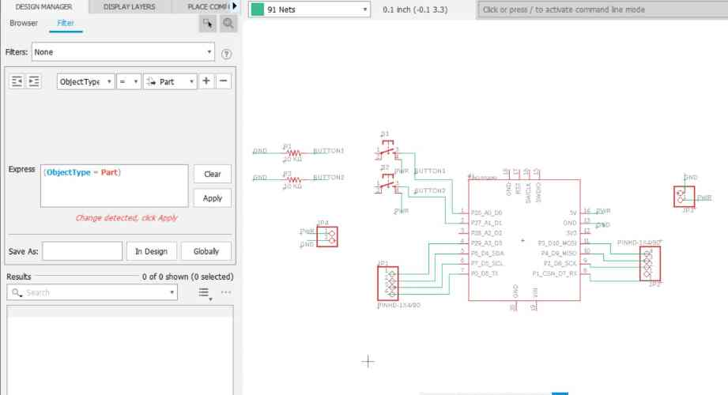

Before I started editing the PCB, I added values to the resistors. I could either use the tool that set a value and set everything you clicked to that value, or I could click on the component and edit the properties via the `Inspector` tool on the right side. Adding values can help identify certain components. 

Like KiCad, I could check for errors with the ERC tool. The first time I ran it, I got a few errors involving connections. Luckily, I easily navigated to the spot of the error, and I was able to fix them. 

### PCB

One great feature about Eagle was as long as I had the schematic and PCB editors both pulled up, the edits made in one of them immediately synchronized with the other. Therefore, all my components were found in the PCB and ready to go. THis was helpfup when I went back and changed things in my schematic, and the PCB automatically updated as well, reducing confusion or possible errors or differences bewteen the two workspaces. My pieces were all scrunched up in a corner, so I organized them into the spaces and started using the manual router to connect them. In the schematic, any connection made is notified in the PCB, so if I start a router in one place, the software highlights where it is supposed to be connected. This was great, and I was able to route the traces pretty quickly. Because I was trying to make the board a litle smaller, I ended up having to add one 0 ohm jumper resistor from one of the pins, because there was no way out of it. This was a pretty simply task, I simply went back to the schematic, added another resistor, and connected it by naming nets. Automatically therefore, the PCB editor was able to tell me the places the routes should go by highlighting the area.(KiCad also had this tool)

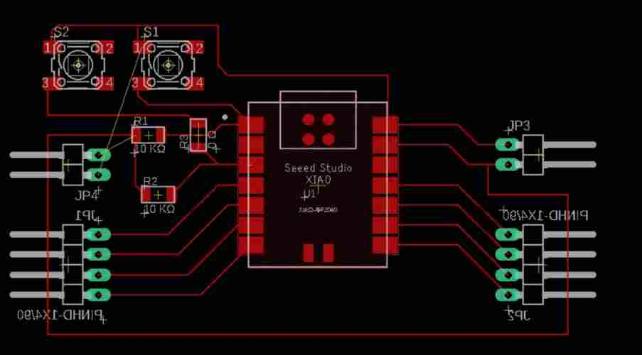

It had already created a box for the edge cuts, so I simply rezied that box to fit my board.

Halfway through, I had realized that in my schematic, I had wired the power and output pins going to the button on the wrong sides. Luckily, I could easily fix this by reassigning nets and names, without having to physcially rewire them. Also, it autmoatically synced with my PCB design.

### DRC Check

When I ran the DRC check, I got four errors. Two of them were a connection error regarding the buttons, which I easily fixed. One of them was a connection error with the I/O pins, for I had not properly connected them. The other was an issue with connectivity of the jumper wire I had created. No matter how many times I tried rewiring and naming nets, this issue wouldn't go away. 

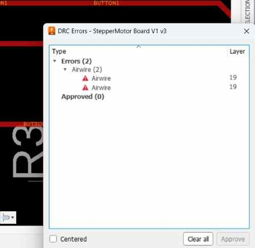

The error showed a white line between one pad of the resistor and the other, so I came to realize that there was no conneectivity issues with the wires that were connecged to it, but simply in the resistor itself. My guess is that KiCad realized that the resistor was jumping over a trace, so it cut off the connection. I consulted ChatGPT about this, asking if it was fine if I just left it as long as I soldered a 0 ohm resistor there, in which ChatGPT replied that as longas it is soldered properly, it should not be a problem. Therefore I was able to ignore this issue. With no other errors involved and after I double checked I had everything, I saved the design in Fusion 360. 

### Creating a Box

I decided to create a box for the layout. I opened the 3D version of the PCB, by pushing the PCB design to the 3D tool, and I saved the 3D model into my file. I then imported this into a design workplane on Fusion 360, where I could do the normal designing of 3D objects. I created a box around it with holes for the jumper wires. For the lid, I extruded a slit at the top where I would be able to slide in my case. After taking careful measurements, I came up with this box. 

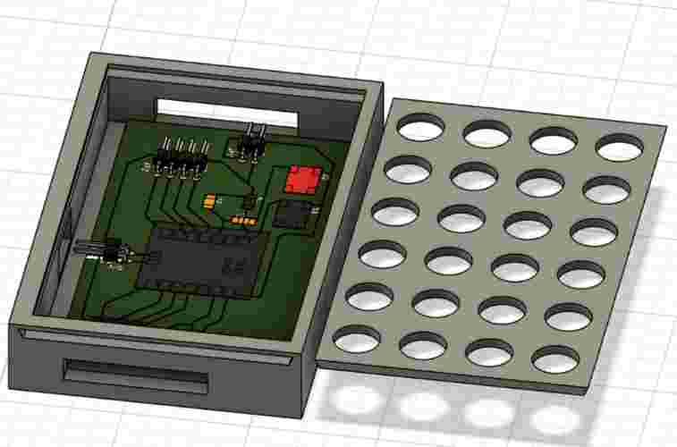

## Manufacturing with BantamTools and Soldering

This was not a required part of the week, but I was curious to whether my board would actually work or not, so I decided to make my board with copper boards using the BantamTools milling machine. I have used the milling machine once before this, but I never really got into it and used it  enough at the point that I was comfortable messing with the settings and cutting the boards on my own. Therefore, I got some tips from [Mr Budzichowski](https://fabacademy.org/2023/labs/charlotte/students/zack-budzichowski/) on properly going through the steps of the Bantam software that controlled the machine. I also milled together with my friend Dylan, who also was trying to mill his custom board. As I started learning the process and going through the steps in the software, I reazlied it was nothing intimidating and was quite easy to use. What made it better was that we were using a newer version of the Bantam software that had a very pleasing navigation and steps, and all I really had to do was follow those steps. 

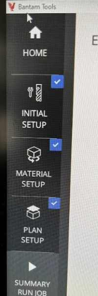
*You can see the set of instructions that Bantam gives you one by one*

### Steps Taken
Because these instructions were all we needed to follow, me and Dylan found it way more easier than the previous version of Bantam Software we used. All we had to figure out was the material, the bits we were using, and the location of our cuts. Here is the steps I took in milling out the board. 

1. Download the files from Eagle/KiCad/Any other software as GBR files. There are certain steps taken in this to export all the layers needed in the cuts, it is not just exporting the project as is. 
2. Store these files in Google Drive so you can download them in the computer running the Bantam Milling Machine. I downlaoded all of the layers as a ZIP file, and I extracted it on a file in the computer next to the machine. This way, I could choose the layers I wanted out of all the options, which can be helpful when you only need to run one layer.
3. Open the GBR files in the software, which is in the Initial Setup section in the left. I opened up the `Top Copper` and `Profile` layer, since those were the files with the traces and the outline. Since me and Dylan were both cutting, we both put in our own files. The great thing about this software is that you can run each file on the same cut but set the settings for each one. We were both using the "1/64" inch, "1/32" inch, and the "PCB engraving 0.005 inch" tools, but if we needed to use different bits, we could set that in the settings. 
4. Set the offset, which we set as 0.01, and create contact with the clip at the bottom of the machine with the copper. This is how the material probes the z-axis to know the depth of your material. Once you probe the z, remove the metal clip.(Make sure before you probe, you jog the tool to be over the copper, not anywhere else)
5. Error Check: The software tells you if theres any errors that might occur with your design and the bits you are using. For example, Dylan originall was only using the 1/64 and 1/32 inch bits, but he had one area in his cut that was too close together. Therefore, he added the 0.005 engraving bit, and the software didn't have any errors. However, I had one area in my design that was too close to cut even with the 0.005 inch bit. I had to go back to my design and fix this, then repeat the process above to get rid of the error. 
6. Once we had no errors, we double checked the settings, made sure we probed the z-axis, and then continued with the job. Another great piece of the Bantam Tools is that it tells you when to change bits. Once it was done cutting with the engraving bit 0.005, it stopped and told us to change bits to the 1/64, which we did. Following these, steps I was able to learn the workflow and setup of milling on the Bantam Tools. I also made sure to leave enough clearance in my design so I didn't have to redo the setup process!
7. Cleanup excess copper with vacuum cleaner/Be careful not to rip off traces

### Testing
Once I had my board, I was so happy that I had produced my first custom designed board, but I then had to test it to see if it worked. I used my surface-mount soldering skills that I had learned before Fab Academy had started, and soldered everything on. 

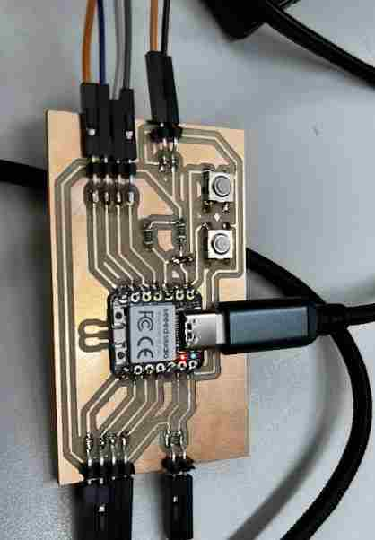

I was highly uncertain if the board would work, and unsurprisingly, when I connected it with the two motor drivers and uploaded the code to the RP2040, it didn't work. I was worried it might be an issue with the design and I would have to redesign and recut the board, but I then noticed a gap between my 5v pin of the microcontroller and the board. To test if I had connection, I used the multimeter to see if there was continuity betwween that pin and the output pins of the board. Sure enough, I did not have connection. I then got the soldering iron out and resoldered all the pins, double checking to see if they were connected. 

I then wired everything and reuploaded the code through the Arduino IDE, and to my surprise, my board worked! I put it in my 3D printed case to get the final product. 

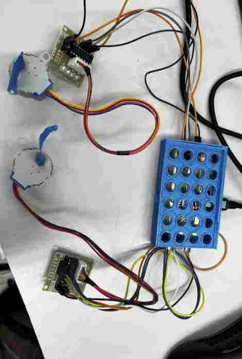

## Reflection
At the end, I realized that this was not the most useful case, for I had soldered on and used push buttons, and I could not push the buttons with the case on. However, I learned a lot about stepper motors and how to code them along with using and coding the Seeed XIAO RP2040, and most importantly, how to design and produce my own electronics. Using these lessons, I was able to get a better idea of how I might go upon my final project boards. 

