# 7. Computer controlled machining

Here are my files for this week - [files](../files/Week%207%20Files/Week%207%20Files.zip)

This week, I decided to make a music stand. When I first started drawing it out on paper, I realized connecting the stand with the top would be a little bit more complicated. In the beginning, I was planning on simply connecting the piece with fancy legs that supported it on the ground, but I realized it might not be very balanced or stable. Therefore, I decided to make a few extra components connected to the top of the stand and the platform , which would all be connected to be a little bit more stable. Also, it looked better than a simple stand connected to a top piece. 

I decided to use Fusion 360, which was a software I was pretty comfortable with by now. Also, I was recommended to make my design parametrically, so that I could easily scale or change my design with regard to the machine or material I was cutting on. Having imporved my skills in parametrics on Week 3, I loaded up Fusion 360.

## Design

After planning, I knew I would have to make the top board, two components that would go on to hold the pages, the stand, a bottom piece, and the legs. Therefore, I found an outline of a music stand that I found online and traced it. Knowing I would use 0.75 inch wood, I set a parameter for this as 0.75 inches.(At first, I had set it as 0.5 inches, but I realized 0.75 inches would be more stable, so I was able to change the parameters mid design and resize all of the tab lengths) Since I was connecting everything with tabs, I set a tab length, which I made 4.25 inches. Since I had to get the stand and the two extra components to line up flush, I had to accurately measure the distance between the three openings where these would all fit. I therefore set a parameter for this too, which was around 1.2 inches. This way, I parametrically made a connector piece between the stand and the two extra components. I then designed a simple oval for the bottom piece with three tab openings, one to connect to the stand, and two that would connect with the legs. Here is an image. 

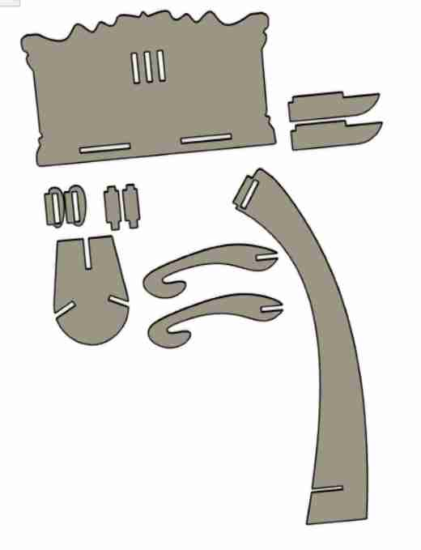

## Testing

Before cutting on expensive wood, it was a good idea to test out a miniature version of the fianl product on the laser cutter. I first made my design in Fusino 360 as a drawing and scaled it down. I eventually ended up scaling it down again just go make the tab widths exatcly 1/8 inch, since that was the thickness of the carboard. Once I had the design, I exported it as a pdf into CorelDraw. Here, I made the outer edges hairline so it would cut through and rearranged the pieces to fit the cardboard without wasting too much. I imported the settings for cardboard cut, and ran it in the laser cutter. 

After putting together my first design, I was happy that it fit together, but I was unhappy with the way it looked. The top was very small compared to the bottom. Also I realized an error in one of my tabs. Because I was sliding two of the connectors for the top into the stand, I would have to cut down the tabs in that portion to half of the thickness of the material. I luckily was able to change this pretty quickly along with the top piece. I ran it again, and I got a slightly better looking product. (In the end, I realized I forgot to implement kerf. Though I don't have to worry about kerf for my cut on the shopbot, this was a reminder to creat kerf in my parametrics for fugture designs)

 *Parameters*

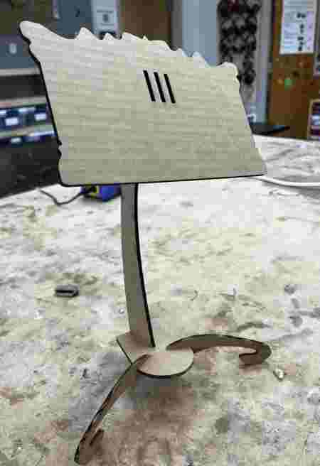 

## Aspire(CAM)

This was a new software for me, but I was able to easily understand the basic process in a short amount of time. First, I went to Fusion 360 and downloaded the drawing as a DXF, not a PDF. This keeps all the dimensions correct, and Aspire can read it. I opened a new file in Aspire, and I opened my DXF file. Before starting anything in Aspire, it allows you to set the XY thickness, Z origin, and a few other inital settings. For our lab's shopbot, the dimensions were 96 inch by 48 inch, so that is what I implemented. 

Once I set up my settings, on the left, it gave me a few options to edit or create vectors. I had all the vectors I wanted, but I did use the edit tools to rearrange my cuts to fit the bed in a more organized fashion. Also, I learned I needed to add dogbone fillets to the inside of the tabs, because this step allows for tabs to fit all the way to the bottom of each other flush. If I don't set this, the CNC is not able to cut a perfect 90 degree angle, so I will not be able to put my pieces together flush. One important item my teacher taught me was to join my vectors all together, or else the machine won't know where to go. 

### 3D model

Once everything was set up, it was time to actually begin the CAM process, which is setting up the process and the rules for the CNC Shopbot to follow through setting it up in a software, in this case, Aspire. This includes the type of bit, the number of passes, the thickenss of each pass, the toolpath it should follow, and ev erything else which would effect the cut. 

Once I had all my 2D designs in Aspire, I navigated over to the toolpaths on the right, and I chose the pocket cut to cut out my pieces. Once I selected this, I had to set up the settings for this toolpath. This included the type of bit(I would be using 1/4 inch end mill bit), the number of passes, option for ramping, and tabs.

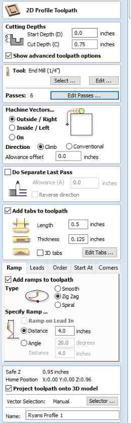

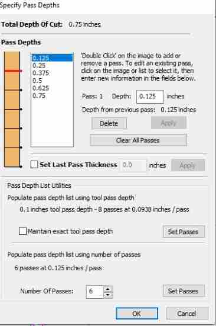

Tabs are important so the pieces don't move around or fly out while being cut. I pressed the option for auto setting tabs, but I didn't like some of the placements, so I removed some and added a couple other in places where I felt like I needed them depending on size and shape of the cut. Once I set these settings, I set a name for this toolpath, and pressed calculate. I could check out the product in the 3D model. I pressed the option to preview the cut, and I saw this. 

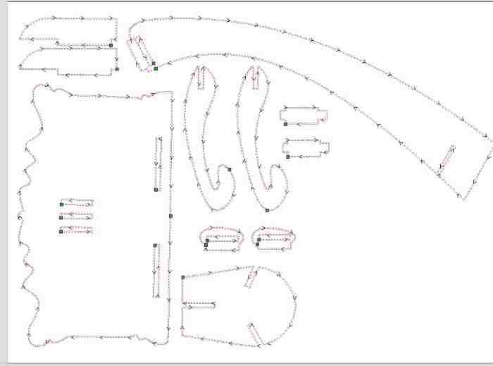

### Board Thickness

I had all my designs set up, but I couldn't cut just yet because I had to redesign the tab thicknesses depending on the actual thickness of the wood. I was using 0.75" wood, but some pieces of wood tend to have slight variations. When I got my piece of wood, I measured it with a caliper and got that it was 0.756". Though this wasn't a huge difference, I still wanted to go and redesign so all the tab lengths were exactly 0.756". Luckily, this didn't take too long since I had utilized parameters in Fusion 360, meaning I could change some lengths without messing up other parts of the design. Once I had the design, I followed the same steps as above and imported the dxf into Aspire, where I set everything up as the same, only changing the Z thickness of the file to exactly 0.756". Every other setting stayed the same. 

### Errors

A couple of errors I ran into was the shape of my components. At the corners for the tabs of the connecting pieces, I had designed it where the curve was slightly over the bottom of the tab. Because it was a curve, I couldn't add any dogbones. Therefore, I went into Fusion and redesigned it so that I had a 90 degree corner, which allowed me to add dogbone fillets. 

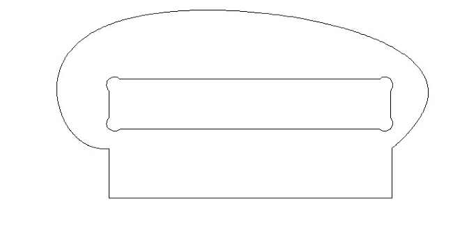

In Aspire, I checked the amount of time the cut would take, and the outcome was around 6 hours, which was definetely not accurate. I tried playing around with some of the options, but the time remained stubbornly long. One of the teachers at our lab, [Mr. Budzichowski](https://fabacademy.org/2023/labs/charlotte/students/zack-budzichowski/about/), checked over my Aspire file, and he pointed out two errors with my file. First, I had not set my feed rate correctly. I had it set at 40 in/min, instead of the recommended 250 in/min. Secondly, I had set the wrong material, for I had it on Acrylic. (I did not know we even had to set material in Aspire!) I changed it to `hardwood`, which redid some of the calculations and changed the number of passes to 10. I went back to the passes and changed it back to 5, and when I checked the time, it shrunk down to 32 minutes, which sounded way more reasonable. 

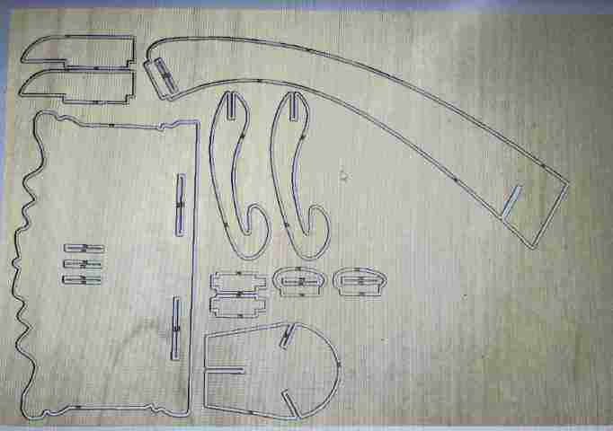
*Final Projected Outcome*

## Milling on the Shopbot

Our lab uses the [Shopbot PRSAlpha](https://www.shopbottools.com/products/alpha) CNC machine. 

### Board Setup

I had my board(0.756 inches) ready, so with the help of [Stuart](https://fabacademy.org/2023/labs/charlotte/students/stuart-christhilf/), I carefully placed the piece of wood onto the bed of the Shopbot, sliding it through in order to not touch or mess up the bit. In order to firmly set it down so that the wood didn't move around while cutting, we used a nail gun to screw in nails. We had to make sure that we were placcing nails in places where the cuts weren't happening. We screwed in around 6 nails, each at the edges of the board, making sure it didn't interfere with the cut. 

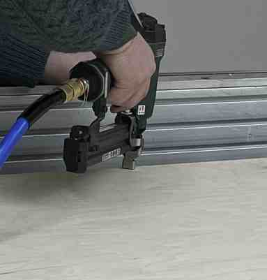

### Machine Setup

At first, I was unfamiliar with the Shopbot command console, but I soon realized it was quite simple. For the sake of time in our lab, our teachers had already zeroed the Z and the XY by the time we had our files ready, but I learned how to do it just in case I needed to use the Shopbot later. The software used the command `C3` in order to zero the X and Y using the proximity endstops. The software used the command `C4` to zero the Z-axis. Before zeroing the Z, we had to place the z-probe plate attached on our machine so that the machine could make an electrical connection. I was confused as to why we used the Z-probe plate, for I thought that would throw the Z-axis zeroing off, but I learned that the Shopbot accounts for the plate, which is exactly one inch. Also, it needs to make an electrical connection. 

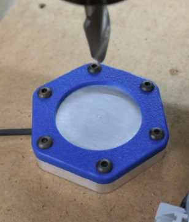

### File Setup

Once I had my file set up, I stored it in my google drive folder so I could pull up the file in the local computer that ran the Shopbot. Once I opened the file up, I soon realized I had made a mistake, for in the original file setup in Aspire, there was an offset on the XY position, and so all my designs were not lined up with the origin. I'm not quite sure how it got like this, but I unchecked the `Use Offset` option, which made the bottom left corner (0,0), so there was no offset for the design. 

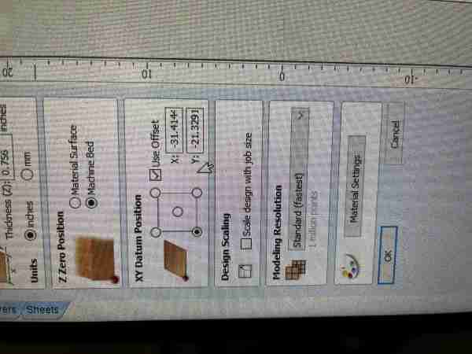

Once I had these, it was time to download the toolpath files, which the Shopbot software could understand and execute the job. I had one toolpath, so I went ahead and downloaded that, but I realized I had another big error here. I was using tabs to connect the big pieces, and I had set everything to cut out by doing `Ouside, Right`. However, for the rectangular holes that needed to be cut out, I realized that I needed to set those toolpaths as a profile cut and as `Inside, Left`, so it would cut the shape out. To do this, I went into my original profile toolpath, deselected all of the holes that required the  `Inside, Left` cut, and made a new toolpath with the same settings and bit setup in Aspire for the holes, but changing the `Machine Vectors` settings to `Inside, Left`. After I fixed this, I had two different toolpaths to run, so I downloaded both of the toolpaths, making sure to name them so that I would know exactly which file to select when setting up the job. 

Once I had my toolpath .sbp files ready to go, I navigated to the Shopbot command console, where I loaded in the file. When loading in a file, a pop up menu will come up, where it had all the settings ready to cut.

### Milling

Before cutting on the wood, my lab recommends to always run an Air Cut, where it follows the paths but not directly on the wood, so that I would know if everything looked right, and nothing unexpected happened. To do this, I selected `3D offset` in the pop up menu. 
Once I checked everything, turned on the fan in the room, opened the dust collectors, and put on eye/ear protection, I pressed the `enter` key on the keyboard, which would start the operation. I clicked the green button to start the spinning of the bit, then pressed `OK` on the computer to start the job. I learned it was very important to start the spinning before starting the job, for if the bit touches the wood while it's not spinning, there was a good chance the bit would break, for they are fragile. It technically didn't matter because I was doing an aircut first, but it was good to go through the process, especailly since this was my first time using the Shopbot. Once I ran the aircut, and checked to see if the toolpath was right, I ran the same process but with `No Offset`, which would mean the bit would actually touch the wood and cut it. 

<video src="../../images/Week 7/CutVid.mp4" controls="controls" style="max-width: 500px;">
</video>

Once I saw that my first toolpath was successful, I ran the second toolpath, following the same steps as above, where I loaded the file, ran a 3D offset aircut, then ran the real cut. 

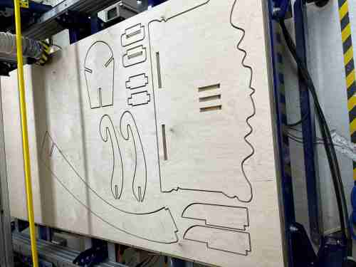

### Post-Processing/Asssembly

Thankfully, the job went smoothly with no issues, which was a relief. I jogged the machine out of the way using the `J2` command so that I would have room to cut off the tabs. For this process, I used the chisel and mallet, carefully aligning it on the tabs so that I could cut the tabs without ruining the wood around them. 

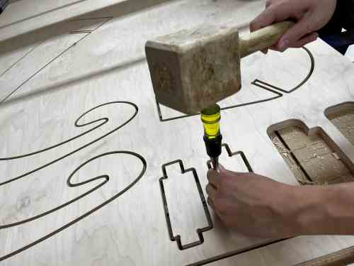

Once I had all my components, I sanded the rough edges down with a sanding machine. 

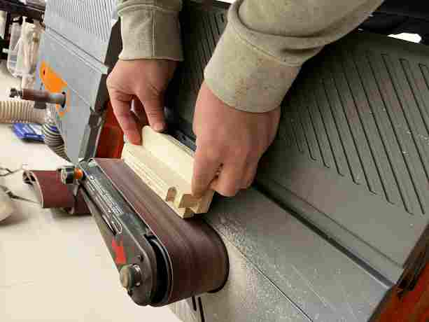

For the surfaces, I smoothed them out using 120 and 200 grit sandpaper. I had to make sure not to take too much off, for that might effect how well they get put together. 

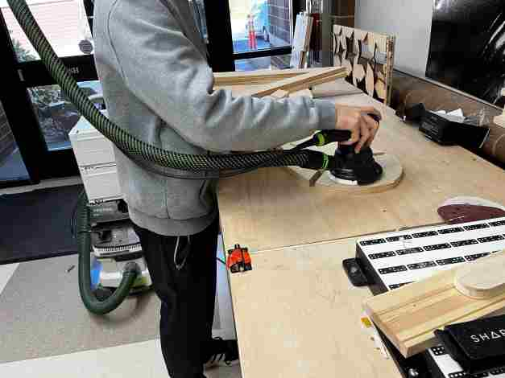

For the assembly, I first put together the legs and the base. They were able to slide in easily for the first half, but I had to hit it with a mallet to get them to fit tightly. I then connected the stand as you can see here. 

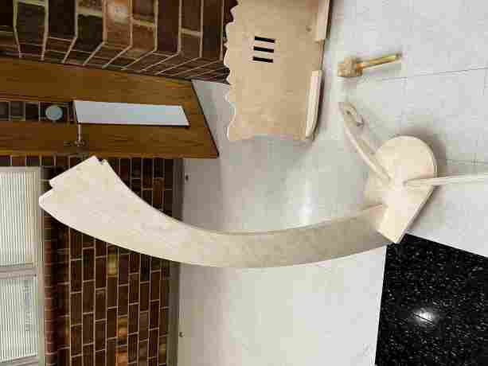

However, I realized it would be hard to get everything together on top, so I decided to remove the stand and connect it to the top portion first. In this image, I put together the stand and the top, then put together the small supporting components.

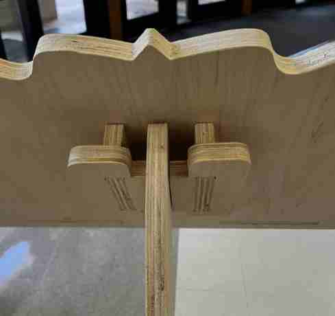

The small componenets were super tight and it was hard to get them in the tabs, so with the recommendation of Dylan, I sanded the tab thickness ever so slightly, then used the mallet to get the component in there. Finally, I put together the stand and the base, and to my relief, it stood up. 

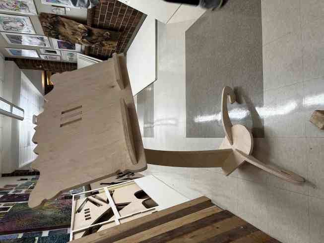

The top part came out a little bigger than I thought, but I didn't want to waste material by cutting a smaller one. 

## Group Work

For this week, my group worked on charactreizing the runout, speeds, feeds, and alignemnt properties of the small desktop Shopbot milling machine. We also learned about the different outcomes of certain toolpaths, and how different bits all effect the outcome, and setting the correct settings is cruicial to certain types of cuts. We also learned to use a certain tool that would help let us know the inaccuracy of the palcement and angle of the bit. All of these concepts are things we learned to take into considertation when designing and machining the Shopbot. Our group documentation can be found [here](https://fabacademy.org/2023/labs/charlotte/assignments/week08a09a/#week-8)

## Reflection

This week was exciting yet nerve-racking. The big Shopbot machine seemed sort of intimidating at first, yet when I learned how to use it, I felt amazed. I learned lots about the saftey features, the Aspire and Shopbot softwares, toolpaths, and the way the Shopbot functions depending on the settings of the design software. 