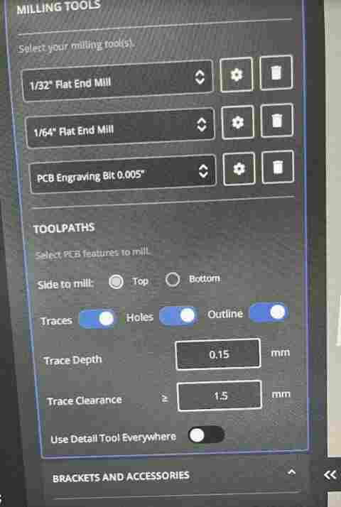
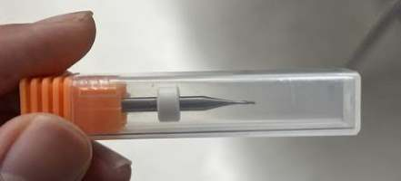
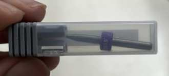
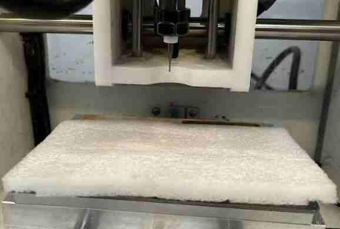
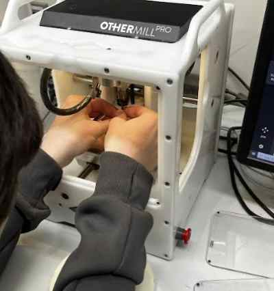
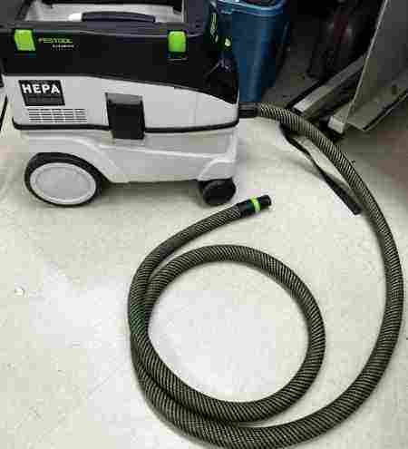
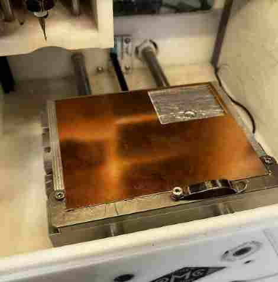
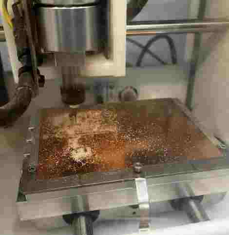
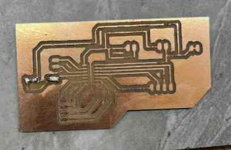
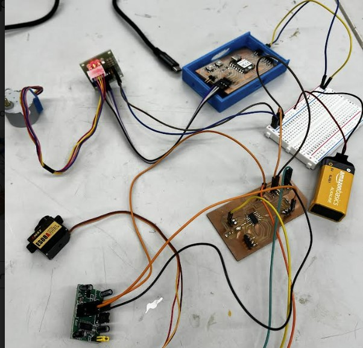

# 8. Electronics Production

Here are my files for this week- [files](../files/Week%208%20Files/Week%208file.zip)

I had my board milled during design week, so first I reviewed over what I did there. Here is the documentation for that.

## Manufacturing with BantamTools and Soldering

I have used the milling machine once before this, but I never really got into it and used it  enough at the point that I was comfortable messing with the settings and cutting the boards on my own. Therefore, I got some tips from [Mr Budzichowski](https://fabacademy.org/2023/labs/charlotte/students/zack-budzichowski/) on properly going through the steps of the Bantam software that controlled the machine. I also milled together with my friend Dylan, who also was trying to mill his custom board. As I started learning the process and going through the steps in the software, I reazlied it was nothing intimidating and was quite easy to use. What made it better was that we were using a newer version of the Bantam software that had a very pleasing navigation and steps, and all I really had to do was follow those steps. 


*You can see the set of instructions that Bantam gives you one by one*


*Here is the option that allows you to jog the position of the bit arouund manually by step or by jog*


*Bantam Tools Software has easy setup of positioning, material setup, thickness calculating, etc. Here is the diplay of options on the software where it give options of such actions*


*Here is the file setup. As you can see, you can select the bits, and it shows the toolpath with the settings underneath. Once you have the toolpath and cut settings(probes, etc. ) setup, you are good to begin the mill*

### Steps Taken
Because these instructions were all we needed to follow, me and Dylan found it way more easier than the previous version of Bantam Software we used. All we had to figure out was the material, the bits we were using, and the location of our cuts. Here is the steps I took in milling out the board. 

1. Download the files from Eagle/KiCad/Any other software as GBR files. There are certain steps taken in this to export all the layers needed in the cuts, it is not just exporting the project as is. 
2. Store these files in Google Drive so you can download them in the computer running the Bantam Milling Machine. I downlaoded all of the layers as a ZIP file, and I extracted it on a file in the computer next to the machine. This way, I could choose the layers I wanted out of all the options, which can be helpful when you only need to run one layer.
3. Open the GBR files in the software, which is in the Initial Setup section in the left. I opened up the `Top Copper` and `Profile` layer, since those were the files with the traces and the outline. Since me and Dylan were both cutting, we both put in our own files. The great thing about this software is that you can run each file on the same cut but set the settings for each one. We were both using the "1/64" inch, "1/32" inch, and the "PCB engraving 0.005 inch" tools, but if we needed to use different bits, we could set that in the settings. I also set the material, which I was using FR1. 



4.Set the offset, which we set as 0.01, and create contact with the clip at the bottom of the machine with the copper. This is how the material probes the z-axis to know the depth of your material. Once you probe the z, remove the metal clip.(Make sure before you probe, you jog the tool to be over the copper, not anywhere else)
5.Error Check: The software tells you if there is any error that might occur with your design and the bits you are using. For example, Dylan originall was only using the 1/64 and 1/32 inch bits, but he had one area in his cut that was too close together. Therefore, he added the 0.005 engraving bit, and the software didn't have any errors. However, I had one area in my design that was too close to cut even with the 0.005 inch bit. I had to go back to my design and fix this, then repeat the process above to get rid of the error. 





*Bits I used, nicely sorted in our lab*



*Styrofoam underneath when changing bit to avoid breaking the bit when it falls*



*Using two wrenches to loosen the collet and insert the needed bit*

6.Once we had no errors, we double checked the settings, made sure we probed the z-axis, and then continued with the job. Another great piece of the Bantam Tools is that it tells you when to change bits. Once it was done cutting with the engraving bit 0.005, it stopped and told us to change bits to the 1/64, which we did. Following these, steps I was able to learn the workflow and setup of milling on the Bantam Tools. I also made sure to leave enough clearance in my design so I didn't have to redo the setup process!
7.Cleanup excess copper with vacuum cleaner/Be careful not to rip off traces



### Testing
Once I had my board, I was so happy that I had produced my first custom designed board, but I then had to test it to see if it worked. I used my surface-mount soldering skills that I had learned before Fab Academy had started, and soldered everything on. 


I was highly uncertain if the board would work, and unsurprisingly, when I connected it with the two motor drivers and uploaded the code to the RP2040, it didn't work. I was worried it might be an issue with the design and I would have to redesign and recut the board, but I then noticed a gap between my 5v pin of the microcontroller and the board. To test if I had connection, I used the multimeter to see if there was continuity betwween that pin and the output pins of the board. Sure enough, I did not have connection. I then got the soldering iron out and resoldered all the pins, double checking to see if they were connected. 

I then wired everything and reuploaded the code through the Arduino IDE, and to my surprise, my board worked! I put it in my 3D printed case to get the final product. 


I realized that the case was not a good idea, since I would need to remove it when pressing the buttons, but I was still able to learn a lot about how to mill and manufacture a custom made board along with making a case to make it more professional. Also, making cases for my electronics are good when I have many of them like when I will make my final project's electronics. 

Here is a video of the motors turning

<video src="../../images/Week 8/TwoStepperMotors.mp4" controls="controls" style="max-width: 340px;">
</video>

## Milling Another Board

### Sensor wiring

Since I had extra time throughout the week, I wanted to see if I could implement a board for a sensor. I knew I would be using some sort of motion sensor, do I decided to use PIR. Before making the board, I first went to this [website](https://www.tutorialspoint.com/arduino/arduino_pir_sensor.htm#:~:text=PIR%20sensors%20allow%20you%20to,or%20%22IR%20motion%22%20sensors) to see if I could get it working with an Arduino. Since I figured I would be doing a deeper dive into the functionality of the sensor during input week, I decided my goal was to make a board for it. I uploaded this code 
```
#define pirPin 2
int calibrationTime = 30;
long unsigned int lowIn;
long unsigned int pause = 5000;
boolean lockLow = true;
boolean takeLowTime;
int PIRValue = 0;

void setup() {
   Serial.begin(9600);
   pinMode(pirPin, INPUT);
}

void loop() {
   PIRSensor();
}

void PIRSensor() {
   if(digitalRead(pirPin) == HIGH) {
      if(lockLow) {
         PIRValue = 1;
         lockLow = false;
         Serial.println("Motion detected.");
         delay(50);
      }
      takeLowTime = true;
   }
   if(digitalRead(pirPin) == LOW) {
      if(takeLowTime){
         lowIn = millis();takeLowTime = false;
      }
      if(!lockLow && millis() - lowIn > pause) {
         PIRValue = 0;
         lockLow = true;
         Serial.println("Motion ended.");
         delay(50);
      }
   }
}
```
to it following the website, and used the serial monitor device to see if it was working. I wired the sensor and the Arduino, set the COM port, and tested it out. The PIR would take a delay before saying “Motion Ended", and if it sensed another motion once it said that, it would say “motion detected”. Once I got this working, I decided to try and use it with a microcontroller. I first thought about using another Seeed XIAO RP2040, like the one I used for my board with motors, but due to the popular use of the Seeed, I decided that using it for all of my input and output breakout boards for my final project would not be very ideal. Therefore, I decided to use an ATTiny1614, which I was comfortable using due to our PreFab prep in the fall with the ATTiny412. The 1614 I figured was a good use because of its number of I/O pins along with its UPDI programming interface, which I had learned to use also during PreFab. 

I first used a breadboard and jumper wires to see if I could get the sensor working. I noticed a nearby mini servo motor, which just has one data pin and functions via PWM, so I grabbed it and hooked it up as an output and wrote this code to make the servo spin if the motion was detected. 
```
#include <avr/io.h>
#include <util/delay.h>
#include <Servo.h>

// Set up the PIR sensor pin
const uint8_t pirPin = 9;

// Set up the servo pin
const uint8_t servoPin = 0;

// Create a Servo object to control the servo
Servo myservo;

void setup() {
  // Set the PIR pin as an input
  PORTA.DIRCLR = 1 << pirPin;
 
  // Attach the servo to the servo pin
  myservo.attach(servoPin);

  // Initialize the serial communication
  Serial.begin(9600);
}

void loop() {
  // Read the PIR sensor value
  uint8_t pirValue = PORTA.IN & (1 << pirPin);

  // If the PIR sensor detects motion, turn the servo 180 degrees
  if (pirValue) {
    Serial.println("Motion detected!");
    myservo.write(180);
    _delay_ms(2000);
    myservo.write(0);
    Serial.println("Servo turned!");
  }
 
  // Wait a little bit before checking the sensor again
  _delay_ms(100);
}
```

### Jtag2UPDI
Before uploading the code, I followed the process of uploading the jtag2updi firmware  to make the Arduino a programmer, and connecting the corresponding UPDI pins via the 1614 pin out. Once I set the programmer as jtag2updi, I uploaded the codes, and the servo started spinning, but the sensor didn’t seem to be working. I realized I had set the wrong pin in the code, and I quickly fixed it and got it working. 

### Design
I used my documentation from Electronics Design week to quickly make a board in Eagle. Because this time, I already knew how to use it, the designing process went much faster, and I made it in about 15 minutes, most of it being looking for the right footprints. I was happy that I noticed my design skills have really grown just through two designs! I noticed that the 1614 pads were quite small, so I made the connections around it smaller just to be on the safe side. I would soon come to realize that soldering the Attiny1614 even with these small traces was a difficult process. 

### Manufacturing on the Bantam Tools Machine

Once I had everything set, I went over to the Bantam Milling Machine, and I went through the workflow one more time. The setup process also took a much shorter time since I had a better idea of what I was doing. I used the 1/64 and 1/32 inch for this board. Running into no errors, I put in the 1/64 inch and z-probed it. One issue I ran into this time was that I noticed my z-thickness was coming out bigger than expected. It came out around 2.03 mm, when it was supposed to be 1.7mm(around). This was quite a big difference, so I looked back and realized I had not set the trace tool as the one I was using to probe. I learned that this process is needed so the bantam tools knows the depth of the bit, and therefore can get an accurate measurement when it probes the material thickness. 

Once I had everything set, I closed the cover and pressed “mill all”, for my profile and traces. Though I had run into one issue regarding the material, this process went by much faster than the previous one. I was happy to see that I was getting more comfortable with the machine, for in the future, I will most likely be milling lots of boards. I changed the bit to the 1/32 when the machine told me to, which it probed on the bed to get an accurate length of the tool. Once the milling process was done, I vacuumed the area and cautiously took the milled board out. 

Here are some images of the process



*We used FR1 Material, making sure it was well placed on the mat*





### Soldering and Troubles with ATtiny1614
I prepared everything I would need; headers, an LED that would check the functionality of the board, a resistor, and the 1614. I first soldered on the LED and resistor with ease. 



Using tweezers in the process I learned is key for stability when soldering. I had trouble with one of the headers, so I used flux to keep it on and solder it. However, I accidentally ripped off one of the pads for one of the pins in this process. Luckily, it wasn’t a pin I was using, but I decided to be more cautious. 

When soldering on the 1614, I had lots of trouble soldering in those little spaces. I used a method where I tinned the soldering tip and dragged it across the legs, melting and applying a connection with the pads and the leg. I was very careful in this process to avoid solder bridges, and I still had some bridges that I had to get rid of. I double-checked under a microscope to check for any bridges. 

### Testing

I connected everything similar to the breadboard test prior to milling, and uploaded the code by following the same programmer process, with UPDI, however it didn't work. I moved pins and change code, however I couldn't get the servo to spin. I checked continuity using a multimeter, and I also knew the code was outputing to the right pins, for I saw 5 volts across the pins I had coded. However, I realized that one of my solder for the headers weren't on quite as well as I would like, so I soldered that on better and retested it, double checking the pins I had, and it worked. 

<video src="../../images/Week 8/VideoBothBoards.mp4" controls="controls" style="max-width: 340px;">
</video>

In the end, I also got both my boards working at the same time with a battery connected to a breadboard. 



## Group Work

For this week's group work, we characterized and tested out the settings for our PCB milling tools. We used a design file that could test out how small of a trace a certin bit could get. We used the 1/64 inch bit on the [Bantam Tools Desktop Milling Machine](https://store.bantamtools.com/products/bantam-tools-desktop-cnc-milling-machine). We also learned about how certain aspects such as bit type and width along with material can effect the outcome of the cut, along with exploring speeds and feeds. Our group documentation site can be found [here](https://fabacademy.org/2023/labs/charlotte/assignments/week08a09a/#week-8)

## Reflection
Throughout this week, I significantly improved in the production process of electronics. I fully learned how to use the Bantam tools milling machine, which before seemed like the most complicated tool, but now I can go through them extremely comfortably. Also, I gained a feel for the process it takes, such as the material probing, bit changing, and use of the software. Also, my surface-mount soldering skills improved as well. Seeing how fast I was able to go through the design and production process the second time, even though the boards I made are not the best of use, I will be able to take these skills to quickly make boards in the future when I will most likely have many iterations of them. 
