# 9. Output Devices

Here are my files for this week- [Files](../files/Week%209%20Files/Week%209%20Files.zip)

## Devices

This week, I decided to try and make progress towards my final project by thinking of the output devices I would need. For this week, I ended up using a variety of output devices including an OLED, neopixels, a speaker, and servo motors. 

### OLED

I first soldered headers onto the OLED so I could connect it more easily.

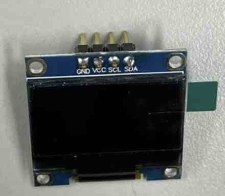

I had never used an OLED before, but luckily, it wasn't as difficult to wire. I first ended up searching for a couple of tutorials. I used the [SSD1306](https://cdn-shop.adafruit.com/datasheets/SSD1306.pdf) OLED device. I followed this [tutorial](https://arduinogetstarted.com/tutorials/arduino-oled) first just to see the basics and upload example codes to get the OLED working. I learned about different tyeps of commands for the OLED, found here. 

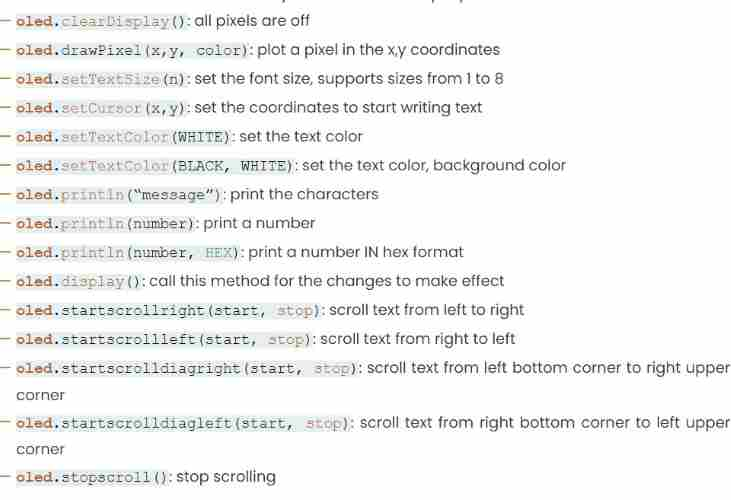

I uploaded the example code from the website, which I used the list of commands to figure out what was going ong. Also, the comments in the example code led me down the right path of figuring it how. Here is the example code setup. The loop function was long so I didn't include it but it can be found on the website I linked. 

```
#include <Adafruit_GFX.h>
#include <Adafruit_SSD1306.h>

#define SCREEN_WIDTH 128 // OLED display width,  in pixels
#define SCREEN_HEIGHT 64 // OLED display height, in pixels

// declare an SSD1306 display object connected to I2C
Adafruit_SSD1306 oled(SCREEN_WIDTH, SCREEN_HEIGHT, &Wire, -1);

void setup() {
  Serial.begin(9600);

  // initialize OLED display with address 0x3C for 128x64
  if (!oled.begin(SSD1306_SWITCHCAPVCC, 0x3C)) {
    Serial.println(F("SSD1306 allocation failed"));
    while (true);
  }
  delay(2000); // wait for initializing
  oled.setCursor(0, 0);
}
```

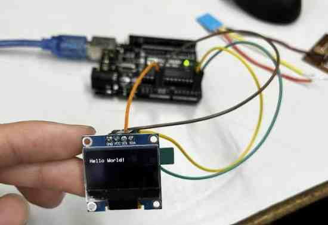

I learned that the OLED uses I2C communication, and therefore I needed to connect the pins for the communication interface, the SDA and SCL pins. I looked at the Arduino's pinout and saw sat it was on pins A4 and A5. Also in the code, I was able to recogrnize how it used the `if (!oled.begin(SSD1306_SWITCHCAPVCC, 0x3C))` code to initialize the address for the OLED, since I2C assigns addresssed to the student devices. The ! stated that if the I2C start was false, then it would print a note stating that there was an error in the serial monitor. However, when I connected it to the Arduino Uno, everyrthing went smoothely, and I was able to get a successful upload to my OLED. I also learned about an I2C scanner which uses the serial monitor to find devices on an I2C bus. 

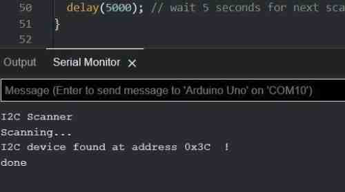

One other thing this website taught me was how to upload bitmaps. I navigated to this [website](https://javl.github.io/image2cpp/) to upload an image and convert it to a bitmap array, which is I learned is what I need to code to upload the bitmap to the OLED. Using the website was really easy, since I didn't need to code the alignment and the size, instead I just had to set the settings on the website, so I highly reccomend to use the tool. I uploaded a png of a simple stop sign, centered it and scaled it to fit a 128x64 size OLED, and copied the bitmap array into my code.
```
#include <Wire.h>
#include <Adafruit_GFX.h>
#include <Adafruit_SSD1306.h>
#define SCREEN_WIDTH 128 // OLED display width,  in pixels
#define SCREEN_HEIGHT 64 // OLED display height, in pixels
Adafruit_SSD1306 oled(SCREEN_WIDTH, SCREEN_HEIGHT, &Wire, -1);

const unsigned char ArduinoIcon [] PROGMEM = {
   (Due to it taking so much space, I decided to omit the bitmap arrays, but below I added an image of what it looked like on the right side of VSCode when I put it in. As you can see, you can see a faint outline and visual of the stop sign)
};

void setup() {
  Serial.begin(9600);
  if (!oled.begin(SSD1306_SWITCHCAPVCC, 0x3C)) {
    Serial.println(F("SSD1306 allocation failed"));
    while (true);
  }

  delay(2000); // wait for initializing
  oled.setCursor(0, 0);
}

void loop() {
  oled.clearDisplay();

  oled.drawBitmap(0, 0, ArduinoIcon, 128, 64, WHITE);
  oled.display();
  delay(2000);

  oled.invertDisplay(1);
  delay(2000);
}
```
I learned that this code uses PROGMEM to store the bitmap in the Arduino's memory then displays it using code from the OLED library. I uploaded the code, an it worked! 

Here is the image of what the bitmap array looked like

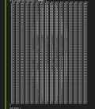

And here it is on my OLED

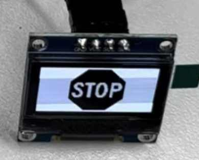

### Neopixels

Another component I will be using are neopixels. I had used neopixels before for a project in my electrical engineering class, so I knew how to get started on this. First I decided to use a strip of 3 neopixels I found lying around, and soldered three wires to the GND,5V+, and data pins. 
I then plugged it in with an Arduino and uploaded a test code using the ADAFRUIT_Neopixel library to get it working, and they lit up. The neopixels use an RGB color model to make it a certain color, which I can set in my code. For example if I set it as (255,255,255), that would be the brightest the neopixels could possibly be, and display a white color. However, the brighter the colors, the more current it takes up, which are aspects that I had to take into consideration. 

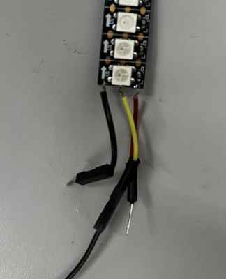

### Speaker

For the speaker, I first soldered on two red wires to the tips. 

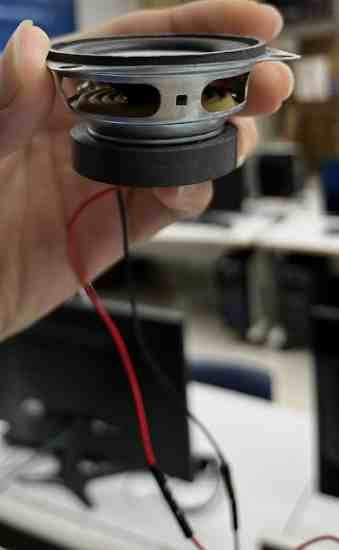

I learned that all I had to do was ground it, which in my case would be to an Arduino, and put the power pin in a pin to code it. I found a [website](https://www.hackster.io/blackpanda856/play-music-using-arduino-uno-and-a-speaker-b94e4a) to learn how to program the speaker. However, I wanted to upload my custom sound. However, our lab didn't have the necessary SD cards currently needed to upload a .wav file, which I learned could be used to upload and program your own sound file, and I searched for more solutions, and I came across one video that got it to work without an SD card that used a certain library, but when I tried to downlaod and upload the library, it claimed it could not upload it. I tried redownloading and extracting, but I could not get it to work. I asked ChatGPT to see if it could make the code for a plane engine noise, but all it did was produce a basic noise. However, I learned from ChatGPT that there was a way of making sound through the pins of the Arduino using the `tone()` function to send a specific frequency and make sound rather than using an external library. For now, I just left the speaker to making basic noises to simulate what it could be like on my final project. 

I set the pin the speaker was connected to as an OUTPUT, and uploaded this code in the Setup, and I got sounds. 
```
tone(speakerPin, 200, 200);
  delay(300);
  noTone(speakerPin);
  delay(100);

  tone(speakerPin, 300, 300);
  delay(500);
  noTone(speakerPin);
  delay(100);
```

## Using All Devices

Though I don't have my inputs yet or a fully planned out PCB sketch in my head, I figured I could wire all of it together to simulate one aspect of my final project. I wanted to use the Seeed XIAO RP2040, since that is newer and a more likely use of my final project breakout boards. I first hooked up everything together, which wasn't hard. I referenced the pinout sheet to get the SDA and SCL pins for the OLED, the an analog pin for the speaker, and one more pin for the Neopixels. I used a breadboard to test, and used the power and ground rails to share the same power and ground. 

Also, I didn't think it was the best use of time to learn how to use a force-sensitive resistor, so to imitate that, I used a potentiometer, which I quickly learned how to integrate and code. 

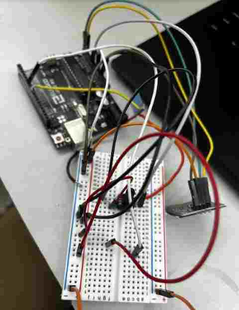

*Here is a setup of a potentiometer with the Arduino Uno*

### Programming with RP2040

Once I had everything setup, I was excited to program it but this is where I ran into lots of frustrations. First, I tried taking all the code I had when I had done each device separately, and combine them, but this didn't work out. I spent a long time late on a school night trying to get the things to work the way I wanted it to, but there were issues such as the potentiometer not working well in the range of 40 neopixels, the OLED not working the way I wanted it to, and wiring issues. 

 For this week, I used a potentiometer. The way I wanted it to be was so that if the potentiometer is turned right, then it increases the nmber of neopixels turned on, the max being 40. (I can always change the max neopixels used) Also, if the number of neopixels is higher than a certain value, then the OLED will display the message "SLOW DOWN". Otherwise, it will display "DRIVE". I had all these working separately, but when I combined the codes for each, I ran into slight issues as mentioned above. For one, some of the code I used above was from example codes, and therefore I ran into variable issues where the names were different and I referred to something that didn't exist. Due to this, I had a long session of debugging and writing correct values. Also, I forgot to set the pins according to the XIAO RP2040 pinout, which was a simply but frustrating fix, since it took me a while to find the error. 

*Variable Error example*


Another issue was the potentiometer code. I had never used this to code before, so I had to do research, in which I learned about the `map` code, which I could use to map the potentiometer values and match them with the number of neopixels turned on. However, the value I set it as effected how much it changed the number of neopixels. Orginally, I had it as `int numPixels = map(potValue, 0, 700, 0, NUM_NEOPIXELS);`, but this caused many spikes and blocky change of neopixels lit. I learned that I needed to increase the 700, and I used ChatGPT to give me the number. I replaced it with this `int numPixels = map(potValue, 0, 1023, 0, NUM_NEOPIXELS);`.

I learned that the first and second numbers, the 0 and 1023, are the values of that are mapped for the input, in this case the potentiometer, and the last two, the 0 and `NUM_NEOPIXELS` map the minimum and maximum for the output, or the neopixels. 

Here is a video of it working. Since I knew it wasn't a good idea to run current for everything plus 40 neopixels, I first used the set of 3 neopixels for code testing purposes. 

<video src="../../images/Week 9/3NeoPixels.mp4" controls="controls" style="max-width: 400px;">
</video>

## Power

Up until now, I had done electronics simply through a USB power supply, but lighting 40 neopixels along with other items I realized would no doubt exceed the safe current pass for the XIAO microcontroller. To avoid damaging or frying my board, I had to use an external power source capable of powering everything along with the XIAO RP2040 which is used to program them. 

I tried thinking through how much current I would need for power. I wanted to keep everything at 5 volts, for we didn't have any voltage regulators that I could plug into my breadboard and test to turn 12 volts into 5 volts, so I had to look for a 5 volt power supply that could also give the amount of amperage needed to power everything. I looked up the usual current consumption of one neopixel at full brightness(255,255,255), and I learned it was around 60 mA for one neopixel. I currently was planning on using 40 neopixels. 40 times 60 mA was around 2.4 amps in total. I was not planning on using this much power, for I was planning on decreasing the light of the neopixels, but for the caluclations, I caluclated it pretending that I was using all 40 neopixels at maximum power to be on the safe side. 

Using this [website](https://bitbanksoftware.blogspot.com/2019/06/how-much-current-do-oled-displays-use.html) to see the current draw for the OLED. At full brightness, for a 128x64 OLED display, it is around 20mA. Again, I did not plan on using it at full brightness, but for the calculations, I took this possibility into consideration. 

The amount of current that the speaker took depended on the frequency. I learned this when I couldn't find my exact speaker and the maximum current draw, so I just used a multimeter to measure current. I realized that it would go from 100 mA to 300 mA, since I changed the frequency on the current.

### Capacitor

One of the teachers at my school, [Adam Durrett](https://fabacademy.org/2023/labs/charlotte/students/adam-durrett/), recommended that I use a capacitor in between ground and power, for using many tools that use power might cause errors and voltage spikes. To avoid this, I would add a capictor in parallel, which stores up charge, and if there is ever an insufficient current supply or voltage drop for any reason, the capaictor could provide the needed current that it has stored. 

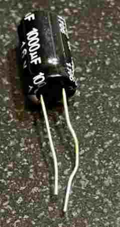

### Adapter

After taking power consumption into consideration, I looked through a couple options, and decided to use a 5 volt 5 amp AC/DC power adapter to take wall power an provide a safe and plentiful current to power my components. Unlike the Arduino, the XIAO does not have a barrel jack connector, so I used a barrel jack adapter so I could plug the power supp ly into my breadboard. It was crucial to share a common ground to avoid any unexpected behavior, and in my case, I could use a common power source, or for the breaboard, one power rail. Once I had everything hooked up, I plugged the power source into the wall, and everything worked with no powering issues. 


*Power Adapter 5 Volts*

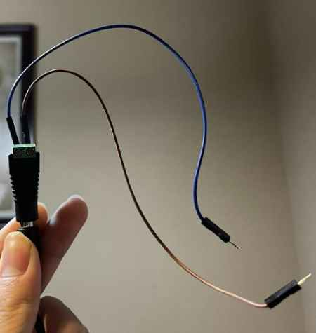

*Barrel jack adapter for breadboard*

<video src="../../images/Week 9/FinalBreadBoard (1).mp4" controls="controls" style="max-width: 340px;">
</video>

I also ended up adding the servo connection, which I had code to reference from Electronics Production work. I made the servo also be controlled by the potentiometer. One error I ran into was it span the opposite way. So I added this code `servoPos = 180 - servoPos;` to invert the position stored in the position, so it would turn the way I turned the potentiometer. 

It is hard to see in the video above, but you can hear the gears of the servo turning as I turn the potentiometer, as well as the speaker playing. 

## Milling

I thought about my final project, and I realized that I could have one board control most of my output devices minus the OLED, which could just be controlled my the main board. My goal was to have a main board, two boards for input devices and one board for most of the outputs. 

Originally, I planned on using the ATTiny1614 board I had made during Electronics Production week to complete this week's assigment of "connecting an output device to a board I developed", but I soon realized that I had not left enough power traces, along with the fact that I had ripped off one of the communication pads, which I will most likely have to use to connect this board to other boards of my project. Also, I learned through the advice of teachers that the Seeed XIAO was newer and better developed, and also it didn't need a programmer. Therefore, in my Eagle design, I used the Seeeduino. 

I quickly put together a board, adding only an LED to indicate power, along with the capaictor between power and ground to help with possible current and voltage spikes. 

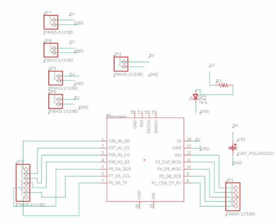

I used my knowledge from Electronics Production week to mill my board. However, I did end up running into an issue. To save copper, I used a board that had already been half cut, thinking I could fit it in. I started milling and it was bigger then anticipated, and it ever so slightly ran off the edge. However, that was enough to make my board not function, therefore I had to remill, which was frustrating since the error came up in the last bit of the cut. I replaced the board, probed the z again, and milled again. 

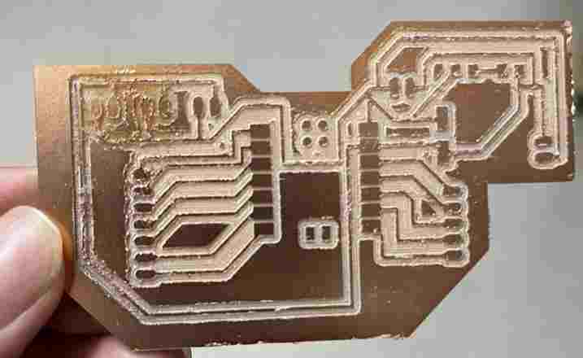

It successfully cut, however, I forgot to change the width of the traces and they were slightly thinner than I would have liked them to have been, and also the top left of the board had a slight error in which it was cut ever so slightly deeper. I am guessing this is due to me doing a poor job of taping and pressing the FR1 board all the way in the BantamTools bed, but the job was done, and for the sake of time, I moved on. 

## Outputs Devlopment Board

Once I soldered the needed components, I went on to connecting all my output devices. Like I mentioned earlier, I am planning on connect the OLED to the main board of my electronics so that it can display generla messages from the inputs more easily, however, to show it worked, I hooked it up to this device just for now. However, this meant I took up one of the power and ground traces meant for something else, so I had to use a breadboard to connect the power and ground of the neopixels. I will NOT be using a breadboard in my final project. 

I took my old code and omitted the code for the potentiometer, and just kept simple code to get every output device working. I connected everything, uploaded the code via Arduino IDE, and it worked. However, I realized one servo was not spinning, yet it was getting quite hot. I checked my power source and power conenctions, and didn't notice an error. I tried switching pins and reuploading code, but the servo refused to spin. Confused, I replaced it with another servo, which ended up spinning well and not turning hot. I figured that the other servo was broken or had some error with the ground. 

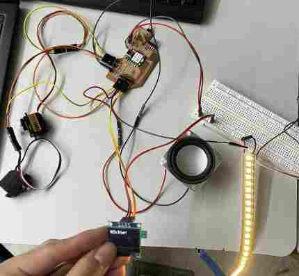

<video src="../../images/Week 9/FINALonMILLED.mp4" controls="controls" style="max-width: 340px;">
</video>

Everything was working, but I realized one problem. The LED I added for power indication was not working! I took a guess thinking that I probably soldered the LED backwards, so I unsoldered, flipped, and resoldered it, and it worked. 

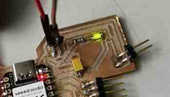

## Group Work

For this week's group work, our group decided to measure the power consumption of a Nema 17 Stepper Motor using an l298a motor driver. Through the group work, I learned also how to use a stepper motor itself, which was good for both machine week and my final project. I learned the basic setup of the coils, magnets, and current effect through the driver. We used the Wamptek DC Power supply to alter voltage and see the effects on power consumption along with the speed of the stepper's turn. Here is our [site](https://fabacademy.org/2023/labs/charlotte/assignments/week10a/) for this week. 

## Reflection

I learned the basics of the OLED, and created a rough outline of some components of my final project. This week helped me learn how to plan out schematics and wiring better, and most importantly, taught me to think carefully about voltage and power consumption. I also with the help of my group, learned how to get a stepper motor working, which I have been wanting to learn for a long time, and attempted it before but didn;t get it to work. 
