# 10. Mechanical Design & Machine Design

Here are my files for this week. -[files](https://drive.google.com/drive/folders/1lmIuPaQsReYIxZHFODg8-3C_JcpK9ngE) All of the separate components can be found on the main Fusion file. THe file is stored in the cloud on Google Drive, because evern through the ZIP file, it was too large. 

My group settled on attempting to make a table cleaning machine. To plan out a rough sketch to attempt to get started, we first gathered around a white board and planned out ideas and a checklist of work we needed to split up and get done. Me, Griffin, and Jed decided to work on CAD design, mechanical aspects, and mounting of our project. Specifically, I would be working on the wheels mounting. I was excited to get started, but I immediately was hit with things I needed to think about such as

- Having an idea of the setup of all the electronics, since we would be using stepper motors to control the wheels
- A way to make the wheels go along the table without falling apart, and having enough support
- Since we planned on having three wheels, one on top of the table, the side, and the bottom, we decided to have a stepper motor that would be attatched to the top wheel, and the middle and bottom wheels would be used for support. However, I figured out that in order to make the middle and bottom wheels turn, I needed to create a part that would attach them and also turn at the same time. I therefore made a quick prototype for it to see if I could get a tight clearence in the 3D print, but still allow it to roll. It worked, so I implemented in the overall design
- I found it hard creating the design without having the full idea planned out, so my team had a group meeting of the specifications, which helped me know where to put everything. 

## CAD

I first started off by measuring the table that we planned to clean, in our school's lunch room. The length didn't matter, only the width and the table thickness, which we found to be around 29.75" and 1.22". 

I loaded up Fusion 360 and began designing. It was best to create new components for each part, so that we can act upon each component separately if needed, along with printing or cutting them. Our basic plan was to have two sets of wheels with two stepper motors, each on one side of the table. They would be connected and held together by a middle piece, which would be a process of both laser cutting and mechanical tool setups, particularly the stepper motor with screws for the z-axis, which we needed to calibrate to the table. 

### Wheels

I drew the table for a reference, and designed the wheels section. The stepper motor would drop the wheels on top, so I had to take the precise measurements hold the wheels in the exactly correct space, so that it could be mounted on the table, but also be super tight so it wouldn't fall and be able to roll without any problems. 

I then created an offset plane in the middle of the table and mirrored the body. I would need to print these separately, for the two designs are reflections of each other, meaning they would only be able to fit on one side. Because the stepper motor needed to be wired, I left a hole in the bottom side for it to be wired more easily.

In a group discussion with the mechanical making people, we decided to use a specific type of small wheel that we normally use for legoes, for the rubber on that would be the best of use in case of something that rolls across a table. Also, this way, I could specify the distance between the wheels rather than using the three wheels normally used for carriages. I measured the diameter of the inside of the wheels, and made an inside part for the wheel that could be connected to the stepper motor. I printed one piece out, and to my surprise, it fit super fit and nicely. I stored this file so I could print one more later, since we had two wheels connected to the motors on top of the table. 

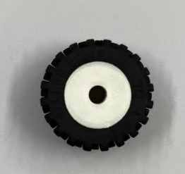
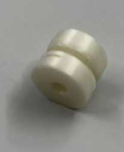

As for the wheels on the side and bottom, I had to figure out a way to make them roll but also not make the wheels come off. Since the rubber part of the wheels are flexible, I figured if I made a part where there were two squares on each side big enough to block the middle part that would go inside the rubber part of the wheels, but also make the squares small enough so I could assemble the rubber part of the wheel on it, then I could make it roll without falling out. I designed a prototype of this, estimating a good clearance between the rolling part and the rod that was connected to the squares. 

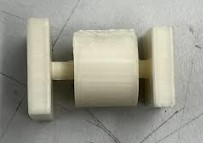

I printed it, and to my surprise, it worked! Previously during 3D printing week, I had printed a similar idea to this, where I had a keychain that was interlinked. Then, I had used tweezers to get the supports out of the small areas that had a clearance from another body that enabled it to move. In that case, it was the middle part that allowed the wheel to turn, and I was able to get the tiny supports out. 

Glad with my success, I began adding these to the actual final body that I would be 3D printing in the end, where it would hold two stepper motors, one for the wheels that went on top of the table, and one for the lead screws that would control the z movement of the cleaning aspect. h

Here is a first print iteration. Through skills I had learned in 3D printing week, I was able to reduce the support and infill time by 1 hour and 22 minutes. 

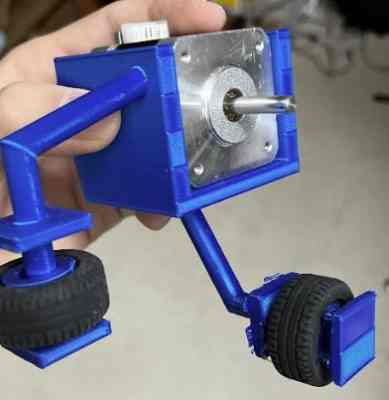

This was the first iteration however, so it had some flaws. Up until now, I had not been thinking of the bigger picture. I realized that since our table was to be mounted onto something, support would be a major factor. The branches I had connecting to the wheels on the side and bottom were pretty thin, and could break easily. I therefore made these connections stronger.

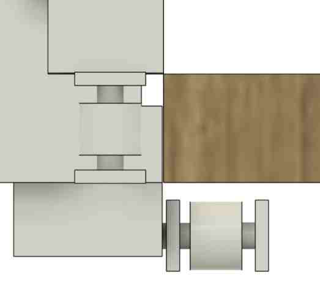

 Also, due to some calculation or measurement error, I realized that the distance between the top and bottom wheel was slightly big, so I adjusted the design to fix this error. As you can tell, measurements were key to making this project work out. 

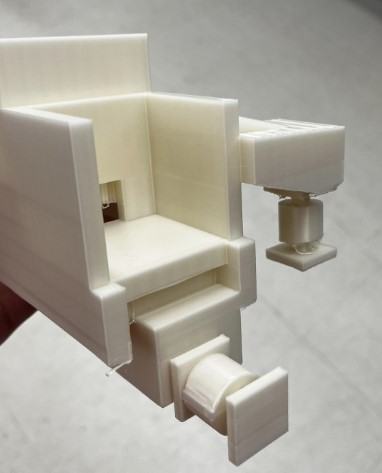

### Laser Cut Pillars

As I mentioned, I created separate components for everything, but I built off the components from other components. In this case, since the pillars housing the z-lead-screw of the stepper motor would have to fit tightly into the wheel case, I decided to create it on the edges of the wheel case, just like it should be in the final product.

For the pillars on each side housing the z-axis controlling motors, we decided to laser cut a box to be housed with the stepper motor in the 3D design mentioned previously. I created tabs and used careful measurments and paramters to get an accurately measured design. I figured it would be best to screw these on along with the stepper motor box along with the wheels, so that it was stronger and didn't fall off. 

Jed first laser cutted this as a test on cardboard, which fit. We then tested it on wood, which also fit. 

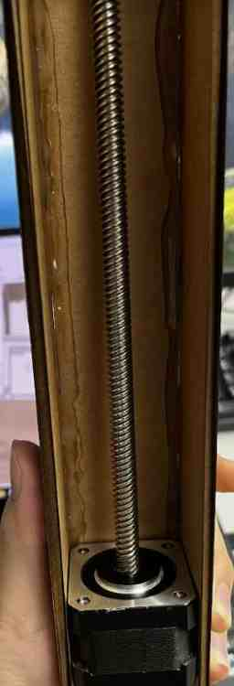

Though it was three simple sketches, this portion might have been the toughest to design out of everything else due to the tabs. There were many other bodies in the way, so I used the `Section Analysis` tool constantly to find where the tabs were to know where to put them and how big to make them. Also, I ended up changing the size many times, first due to a miscommunication on the height of the lead screw, along with me not realizing the lead screw was connected to a motor at the bottom, which would make it even taller. 

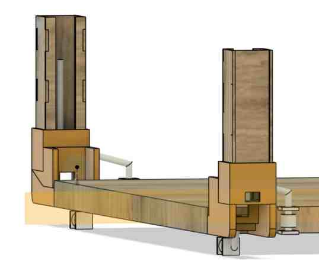

*Here is the first iteration, which is smaller than what it was supposed to be*

### 3D printed connecting joints

To connect the pillars and the horizontal extrusion which would house the electronics, wires, and others, I made a connecting piece to snugly fit the pillars, and an extrusion at the top where I could fit the horizontal beam. I used an extrusion file that [Mr. Budzichowski](https://fabacademy.org/2023/labs/charlotte/students/zack-budzichowski/) provided me. On the extrusion going across the table, I planned on having a couple of extra wheels for stability(at the same level as the squeegee board dragging behind) and maybe a place that can hold a spray bottle. One issue was the more weight I put on the top, the more power it would take for the stepper drivers to turn the wheels, which could be a problem. Therefore, I figured I would need more supports, such as the extra wheels that touch the table and prove stability in the middle, taking pressure off of the sides. 

I created the joints to slide right into the laser cut pillar, then created the t-extrusion. I figured that we would probably screw it onto the horizontal beam for stability. 

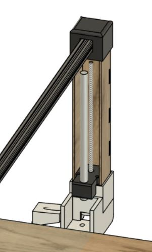

*This also includes other aspects, but at the top, it can be seen how the joint holds in the pillars and t-slot*

### Guide Rails

After a talk with Dr. Fagan, who taught us lots about the use of certain aspects of machines through walking us through what was used on the Prusa Original 3D printer, Shopbot, Othermill Milling Machine, and Laser cutter, we learned that it was necessary to use guide rails. For the horizontal axis, the table would act as the guide rail, since we had the wheel on the side guiding it so the path doesn't accidentally tilt. However, we need it for the z-axis. When thinking about this design, I realized that our z-design was very similar to that of the Prusa Regular 3D printer, with two lead screws on the left and right conected to a guide rail for stability. It was also through this process that I realized a pulley would have been a much longer and less supportive structure for our case, which was what we were originally planning on. 

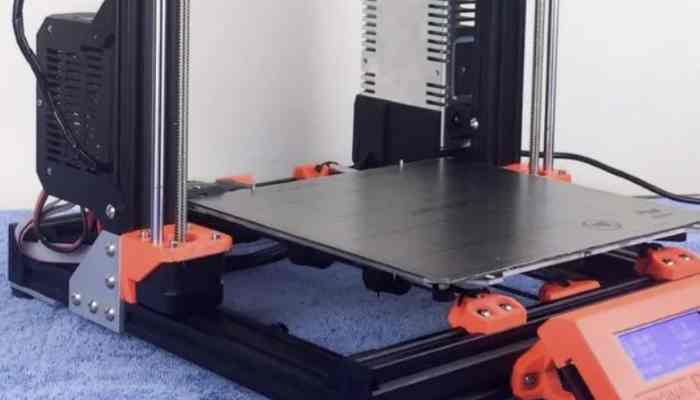

I noticed that on top of the motor controlling the Z-axis, there was a 3D printed piece that was screwed onto the stepper motor and also had a hole for the guide rail. I figuired if I created a similar piece to this, but changed the shape a little for our design, I could do the same idea for the guide rail. 

At first, I simply made a sketch of a rectangle slightly smaller than the size of the stepper motor we would use. At this time, the orders for our specific stepper motor hadn't come to the lab yet, but I learned that the amazon order had a sheet of measurements on it, so I was able to use that to size my design. Looking at the design, the distance between the holes for the screws were around 31-32 mm apart, so I converted that to inces and created construction lines to get the exatc placement of the center of the circles where the screws would go in. I then created a hole in the middle as well as a hole off to the side for the guide rail's fit. 

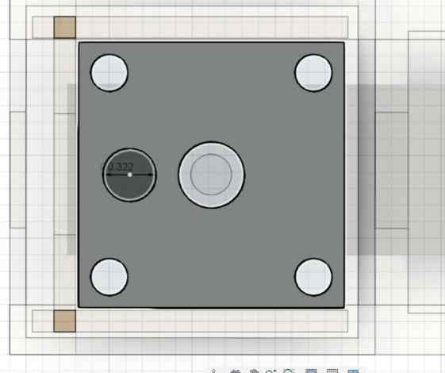

However, I ran into one major issue, which Griffin helped point out to me. For the actual design, we would have a hex nut on the lead screw along with a linear bearing on the guide rail. The way I currently had it, the the two items would run into each other when trying to assemble. I couldn't move the lead screw hole, since that is forever in the middle of the stepper, but I could move the placement of the guide rail. However, we were using super thick guide rails, almost half an inch. No matter how far apart I put them on top of the motor, there was not enough room. I worried that I would have to redesign the entire part holding the motor along with the piller, but then by brainstorming with Griffin, we thought of the idea of extending the piece holding it over to the side a little, where it would hold the linear bearing. Here is an image of what I mean.

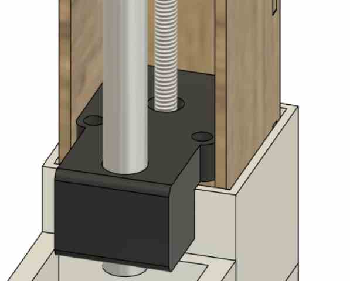

I also realized that the motor beneath would need room to connect the cables to, so I added a bit more clearance between the guide rail holding piece and the top of the stepper motor, where the cables were. 

## Cleaning Aspect

After lots and lots of redefining parameters, remeasuring, resizing, and referencing bodies to make other bodies fit, I finally was able to create a design. My group then learned how to use a shared Fusion 360 folder, so I uploaded the file there, where Griffin could open it and build his design upon there for dimension and assembly purporses. 

## Assembly and Issues

### Redesign Issues

Once I had most of the CAD design, with the help of Jed, I was able to print and laser cut what I needed. Luckily, our lab has a print farm and I could rapidly print the separate designs at once, saving lots of time. Once i had the stepper motor holder/wheels holder printed, I stuck on the rubber wheel casings, testing it on a table to see if it spun smoothly, which it did. I put the laser cut and stepper motor in the casing, which fit snugly, along with the top connecting joint and the motor with the x-axis wheel. 

Here, I ran into another issue. I had made a clumsy mistake of not thinking of the mecahnical aspect of the motor turning the wheel. The wheels were made to fit onto the table, but that would mean that when we mounted it on the table, the stepper motor would come up. I needed to have designed a top piece to hold it down, but I had not taken that into consideration. 

I was frustrated, and tried to think of another way without reprinting the huge print, since that would put a whole lot of filament to waste. I went back into my design and tried to think of any other way, and I came up with the idea of extending the part that went over the stepper motor controlling the Z-axis. If I extended it over, and extruded it down a little, then it could hold the stepper motor. Also, to make it even more secure, I decided to leave holes for screws. After taking the measurements into consideration using a caliper, I extended the part to hold both stepper motors. 

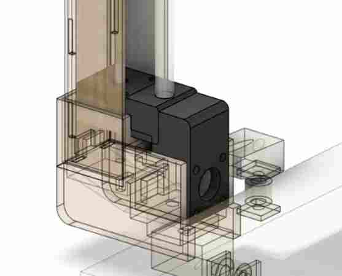

I printed this out on two Prusa Minis, where I was able to reduce the print time in Prusa Slicer to around 2 hours and 48 minutes each. 

Our order for the Nema Stepper motors with the lead screws came in pretty late. When they finally did come in, I came to the frustrating understanding that the lead screw went over the laser cut. I didn't plan on redesigning the laser part, for all I needed to do was create an extrusion in the bottom of the connecting joint that would be used to join the laser cut part and the aluminum extrusion going across. This actually ended up coming out as a good thing for me, for it allowed me to realize a couple of other flaws with my design that I could fix. First, the guide rails were thick and heavy, and therefore just holding it at the bottom could cause some problems. Therefore, along with the extusion for the lead screw, I also created an extrusion at the top where I could tightly fit the guide rail, so the guide rails would be more secure on both sides. 

### Assembly

Jed had used wood glue to glue together the laser cut pillars tightly. 

Taking this, I was able to use it to assemble it along with the Lead Screw Stepper motors we had gotten that day. I first worked with Adam to make sure that the motor was working with the code we had. At first, all it made were vibrations and we all got very worried. In hope of an easy fix, I suggested to switch out the cable, and it surprisingly worked! 

Once I knew the motors were working, I guided the cables for the motor through the hole in the 3D print, and connected it to the motor so that they could all be put in the casing. I then took the piece that held both the motors along with the guide rail, and aligned it along the screw holes in the motor. I used M3 nuts to screw them in with a wrench that fit the size, where I first tried a 6 mm which was too short, then went to the 10 mm, which was perfect. 

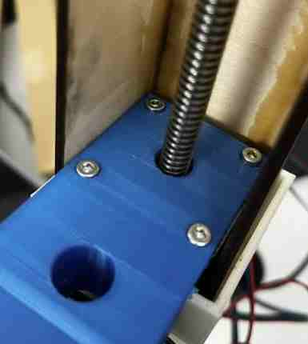

I did the same screwing process with the M3 nuts on the motor controlling the wheel. After that, I put it against the table to see if it did the job. It mostly held in place, but the motor still moved up ever so slightly. In reality, I could work with what I had, but in order to take as much pressure off from the stepper motor to reduce power consumption as possible, I ended up adding some hot glue to the bottom of the casing holding the motor in place to the part holding the wheels. I pressed them together tightly similar to the laser cut pillars, and they held in place tight. Though it worked, this was a note to myself that next time I did something similar, I would be careful to consider all assembly parts and measurements to avoid using hot glue. 

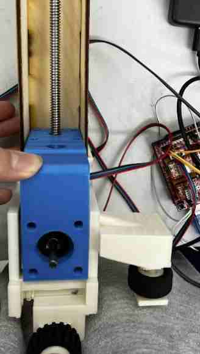

I tested it with a run motor code to see if it would move with me putting pressure on it, simulating the weight of everything else that would need to go on, and it moved. Below is an image of the testing

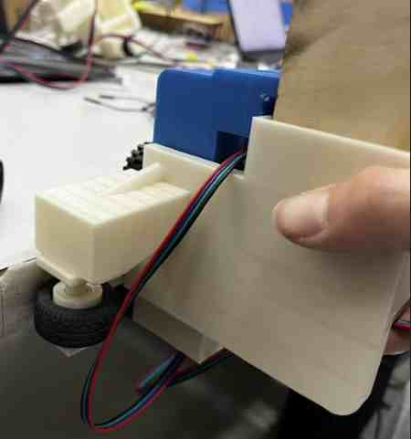

## Design

<iframe width="100%" height="400" src="https://a360.co/3UpnCyQ"></iframe>

### More Designing

After a talk with Dr. Fagan, I learned that we needed a supporting leg that ran on the table, for the machine might tilt if it didn't. I therefore went back to Fusion 360, and used the design that included everything to reference the measuremnts and create a leg that we could laser cut and the part that would hold that laser cut to the t-extrusion. This would extend down to the table, where it would give it support in times when the balance might be off, such as when the squeegee if being lifted up.  

## Cutting and Assembling Guide Rails and Aluminum Extrusion

Once we had everything prototyped, tested, and printed/laser cut, I decided to start assembling. To first just test one side, for the connecting joint on the other side was still in the middle of printing due to multiple failed prints, I headed over to our school's cafeteria to test on the table. To my relief, the distance between the wheels were not only good enough, but it was perfect at the point where it was tight, but had good leeway for comfortable movement. We had to assemble things in a certain way, so I could not attatch the top connecting joint yet. Lots of things were loose, but I just wanted to test to see if it mounted and moved. With the help of Merritt's code, I was able to run the x-axis motors. We mounted it, and it moved! Because of the lack of assembly, we were holding it on the other side, but we simulated weight and it still worked, which was a good sign. 

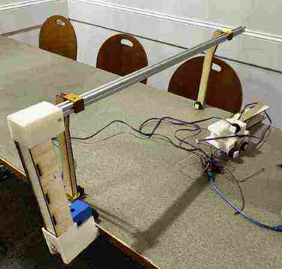

We went bnack to the lab and started preparing our pieces. First I marked the measurments of thwere we needed to cut the Aluminum Extrusion using my Fusion 360 design and checking it by marking where it needed to be. Jed was able to use the metal hack saw to cut through it. 

### Drilling Holes for Aluminum Extrusion

This is probably where we ran into the most frustrating problem of all. We figured out that the metal guide rails we were using were too thick and were pure steel, and could not be cut through. This was another example of us failing to think about these considerations before designing. If we wanted to redesign, it would mean reprinting all of the long prints again, and it was the day before we needed to share, so that was out of the option. Jed, Griffin, and I came to the conclusion that we had no other option then to cut holes through the Aluminum T-Bar Extrusion and the 3D printed piece at the top, so that we could slide the guide rail through and keepy it in place while the extra top part was sticking out. To do this, we used the drill press machine. 

We had lots of trouble getting it right, for the process took up getting clamps on at an odd angle, not moving it, and cutting through Aluminum. We found a bit that was long enough, and probably spent around two hours simply drilling four holes. We kept on drilling, going back, seeing that it didn't line up, then going back to drill again. After a long, frustrating, dirty 2 hours of this process, we finally had holes that lined up and a guide rail that could run through. 

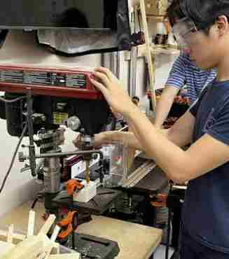

### Final Assembly/ Group Site

After fixing all our errors, getting the final print finished, and thinking about the assembnly order, we began putting our pieces together. I screwed the supporting legs on to the Extrusion, then connected the top connecting joints. We then did the same process to screw the conencting joints with the Extrusion, which was essential to maintaining a good force that would keep the machine mounted on the sides of the table. 

I then helped hold everything together and screw the rest of Griffin and Jed's parts on. More about the assembly process can be found on our [group site](). We ran into a couple of issues with the lead screw and the hex nut, and ended up having to use some hot glue for that issue, since we were running out of time. 

We mounted the machine onto the table, and it stood! 

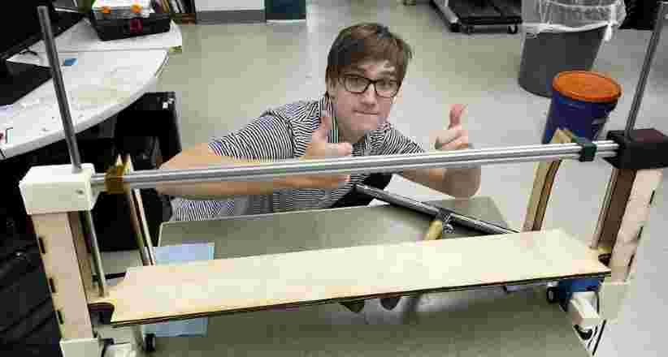

We loaded up the electronics, and after a couple of issues with power connections, we got the z-axis moving. It was quite slow, but it was pretty late and all we were trying to do was get a working moving machine. The speed could be changed in the code. Once the squeegee was on the table, we pressed the button that moved the x-axis and..

it moved!

We put some things in the way of the squeegee, which it sweeped up. We had the sensor hanging off the top, and the moment of truth came when the table neared. When the sensor sensed the edge, it stopped! Our entire group was overcome with joy. 

## Group Site

This week was super imporant on group communication, and I worked hard with all my group mates to make a simple machine. To learn more about how this project came together, navigate to our [group site](https://fabacademy.org/2023/labs/charlotte/assignments/week11a/)

## Reflection

This was an extremely stressful week. At first, we all thought that as long as we communicated and knew the final outcome, this would run smoothly. However, we all eventually came to realize the amount of things that even though we carefully planned everything out in the beginning, we would always run into some issues. The designing went pretty smoothly, and I thought I was on a good track, but there ended up being measurements, components, and assembly issues that I had not thought about, making it a long and frsutrating process to redesign and finally get correct components. Even with all that, we still ran into many issues xsuch as the issue with not being able to cut the guide rails, and lining the holes up to fit those. This week taught me a lot on these components, and though it was frustrating, I learned a lot of great skills on designing, machine assembly, considerations of movement(torque, speed etc. ), how to use NEMA Stepper motors, and most important of all, the importance of expecting and overcoming constant failure. 