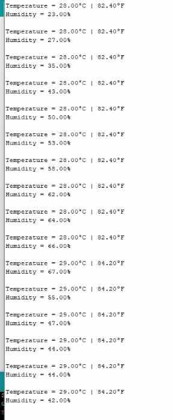
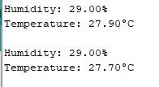
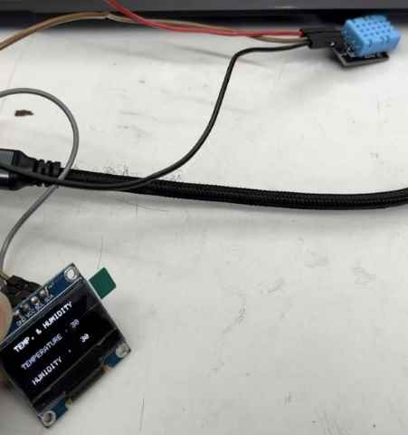
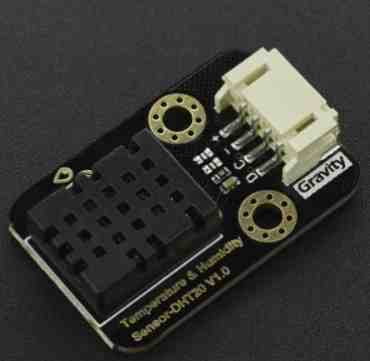
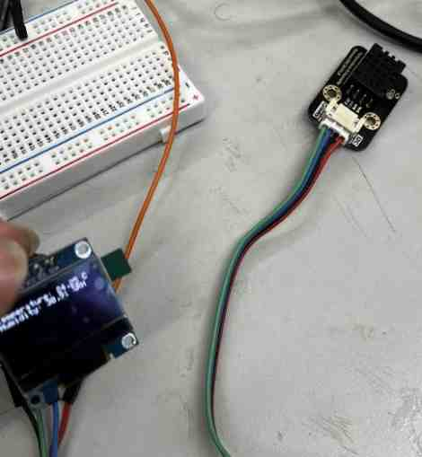
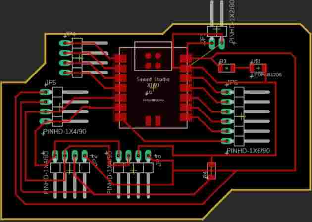

# 11. Input Devices

Here are my code files for this week- [files](../files/Week%2011%20Files/InputWeekFiles.zip)

I was excited for this week, since I found input devices quite fun. Previously, I have used buttons, potentiometers, and the photoresistor, but never really a good sensor. 

When choosing a sensor, I wanted to use something that could be a possibility for my final project. I figured I could display tempertaure and humidity on an OLED. 

## Resarch

I started off by doing research on temp/humidity sensors. I found the `digital humidity and temperature` sensor, or the DHT. There are many varieties of this, but the best one we had in our lab was the DHT 11. Through my initial research, I learned that these sensors have been around for a while, and there are better ones now that have more accurate measurments, such as the DHT 22 or the DHT 20. However, I did not have access to those in the moment, and the DHT 11 got the job done well, so I decided to get that working first. 

I first found this [website](https://www.circuitbasics.com/how-to-set-up-the-dht11-humidity-sensor-on-an-arduino//) that taught me the basics of how it worked. It was unlikely I would be using and Arduino or any alternate board of the Arduino or ATMega328p chip, but I have found that using an arduino to get things working first before designing anything else always helps me undersand the process and the code better. For the DHT 11, it didn't really matter since I was using a module that only needed power, ground, and a signal pin, but I still found it useful to get it working with an Arduino first. 

### Function

I learned simply through the one wbsite that the DHT11 measures relative humidity, the amount of water vapor vs the saturation point. 

For the way it functions I learned that is measures the electrical resistance between two electrodes, which changes on the ions released when moisture is applied to the substance next to the electrodes. 

For the temperature, the DHT 11 uses a mounted NTC temperature sensor. I wasn't familiar with this component, so I researched more. NTC thermistors are made of ceramic material where resistance decreases as temperature increases, in contrast of the PTC thermistor. Those are the basics, but I was able to read more about it [here](https://eepower.com/resistor-guide/resistor-types/ntc-thermistor/#). 

FInally, I learned there was an IC mounted on the back that is responsible for converting resistance measurement and humidity, alogn with data signal transmission to the Arduino or whatever microcontroller one uses. 

## Wiring

Just to see if I could get it working, I used a breadboard and the Arduino. Just like anything else, it has a pin to power it and a pin to ground it. One imporatnt thing to note was the pull-up 10K ohm resistor between the signal line and 5V line to make sure the signal level stays high by default. I know the pullup resistor is used to set something to HIGH when it is not in use, but I couldn't quite understand the point of it being HIGH in this situation. I looked up on the internet, and I didn't find a good explanation, so I used ChatGPT. ChatGPT sort of cleared up the fact that because the wire was bidirectional in both recieving and sending data, it must stay HIGH so that there is no odd signal when the sending/recieving stops/ends. 

Luckily, I was using the breakout board PCB module, which had three pins. The normal sensor has four pins, but one pin is of no use. Also, the module had a surface mounted pull up resistor that was 10K ohms, so I didn't need to solder or plug in an external resistor. 

Following the tutorial, I downloaded the DHTLib library, and used this example code.

```
#include <dht.h>

dht DHT;

#define DHT11_PIN 7

void setup(){
  Serial.begin(9600);
}

void loop(){
  int chk = DHT.read11(DHT11_PIN);
  Serial.print("Temperature = ");
  Serial.println(DHT.temperature);
  Serial.print("Humidity = ");
  Serial.println(DHT.humidity);
  delay(3000);
}
```
I wired everything up, and the serial monitor began communicating and reading data, but it was reading that the the temp and humidity were both 0. I made sure that I had the correct pins, and I rechecked the pinout to make sure evrything was right, which it was. Confused, I tried changing the pins around but no luck. I unplugged and replugged, but still no luck. 

After many tries with no success, I looked up different module types. I noticed that the one I was using looked slightly different from the one in the tutorial, and also I learned through scrolling through images, that they were not the same. It wasn't a big difference, just the pinout was not identical. I found an image of mine, rewired, uploaded, but still no luck! I wondered if the module I was using needed a pull up resistor, so I added that but it still didn't work. After over an hour passed with no luck from writing the most basic reading code, I decided to just use the same module from the tutorial. I swapped it out, referenced the pinout, rewired, and uploaded the code. Finally, I got some readings. I put my finger over the sensor to see if it truly was reading new data every few seconds, and to my happiness, it did. I also tried to get the temperature changing, but it was quite stubborn. I had the idea to touch it to the back of my computer, which was pretty warm, and it changed values by 2 degrees farenheit. 



Now that I got this working, I changed the to the RP2040, and uploaded the code again. However, this time I  got an error saying it couldn't upload to the Pico. Confused, I swapped out the USB and retried, but it didn't work. I was confused, and I checked the board, but I couldn't figure it out. It turns out that I had chosen the wrong RP2040 selection in the Arduino IDE. I had simply selected Raspberry Pi Pico RP2040. This had waorked in the past, since the Seeed XIAO RP2040 uses the same chip, but it wasn't working this time for some reason. I had to specfically set it to the Seeed XIAO RP2940. 


I don't quite know why this happened, but my best guess is that it is due to me using the Serial Monitor. WHen I selected a board, it must fit those pins, but the RX and TX pins on the XIAO doesn't quite match where it is on the Pico. I may have been wrong, but that was my best guess. 

After changing the board, I uploaded everything and it worked. 



I ended up using a different example code that I had pulled up on this [website](https://how2electronics.com/getting-started-with-seeed-xiao-rp2040-with-projects/). 

```
#include "DHT.h"
#define DHTPIN 27     // Digital pin connected to the DHT sensor
 
#define DHTTYPE DHT11   // DHT 11
DHT dht(DHTPIN, DHTTYPE);
 
void setup()
{
  Serial.begin(115200);
  Serial.println(F("DHTxx test!"));
  dht.begin();
  delay(2000);
}
 
void loop()
{
  float h = dht.readHumidity();
  float t = dht.readTemperature();
 
  // Check if any reads failed and exit early (to try again).
  if (isnan(h) || isnan(t))
  {
    Serial.println(F("Failed to read from DHT sensor!"));
    return;
  }
  Serial.print(F("Humidity: "));
  Serial.print(h);
  Serial.println("%");
  Serial.print(F("Temperature: "));
  Serial.print(t);
  Serial.println(F("°C "));
  Serial.println("");
  delay(2000);
}
```

In my final project, I am not quite sure if I will be using this, but if I do, I will be communicating these readings to an OLED. 

I used the OLED during my Outputs Week, and I knew it used I2C. 

At first, I tried merging my two codes, but I always seemed to be missing something, so it was much faster to upload this example code. 

```
 #include <SPI.h>  
 #include <Wire.h>  
 #include <Adafruit_GFX.h>  
 #include <Adafruit_SSD1306.h>  
 #include <SimpleDHT.h>  

 int pinDHT11 = 27;  
 SimpleDHT11 dht11(pinDHT11);  
 #define screen_width 128 
 #define screen_height 64 
 #define OLED_RESET 4  
 Adafruit_SSD1306 display(screen_width, screen_height);  
 void setup ()  
 {  
   Serial.begin(9600);  
   Serial.println("TEMPERATURE AND HUMIDITY");  
  display.begin(SSD1306_SWITCHCAPVCC, 0x3C);  
  display.clearDisplay();  
 }  
 void loop ()  
 {  
  byte temperature = 0;  
  byte humidity = 0;  
  int err = SimpleDHTErrSuccess;  
  if ((err = dht11.read(&temperature, &humidity, NULL)) != SimpleDHTErrSuccess) {  
   Serial.print("Read DHT11 failed, err="); Serial.println(err);delay(1000);  
   return;  
  }  
  Serial.print((int)temperature); Serial.print(" *C, ");   
  Serial.print((int)humidity); Serial.println(" H");  
   display.clearDisplay();  
   display.setTextSize(1);  
   display.setTextColor(SSD1306_WHITE);  
   display.setCursor(0, 0);  
   display.print("  TEMP. & HUMIDITY");  
   display.setCursor(0, 25);  
   display.print(" TEMPERATURE : ");  
   display.setCursor(90, 25);  
   display.print((int)temperature);  
   display.setCursor(0, 50);  
   display.print(" HUMIDITY  : ");  
   display.setCursor(90, 50);  
   display.print((int)humidity);  
   display.display();  
 }
```

I simply changed the pin. However, I did recognize how most of the code went, and for those I didn't such as the `byte` part of the code, I looked it up, and I learned it was a smaller way to use the `int`, and it saves memory. They are set to 0 to have a defined initial value, and then it updates the values by passing their addresses, and it returns to update their values with the time I set. Coding is something I constantly learn in!

I knew all the OLED code, and how it is using I2C. Once I understood the code, I was satisified. I uploaded the code, and it worked. 



## DHT20

For the second input, I used another DHT sensor, but instead of the DHT11, I used the DHT20. This was a slightly upgraded version of the DHT11, and had faster and more accurate reading times. However, the main difference was the DHT20 used i2c. As mentioned before, I had used i2c OLED before, meaning I knew I would have to connect the SDA and SCL pins. I referenced the pinout, but then realized it was written on the module I had. 



This module was great, for not only did it have markings, but it had a cable, meaning I could avoid using jumper wires if I ended up connecting this to a male-pin header on a milled board. 

I did a little bit of research, and I came to realize it was mostly the same as the DHT 11, the only difference being the library. Similar to the OLED, the library that this [website](https://wiki.dfrobot.com/Gravity_I2C_Temperature_Humidity_Sensor_DHT20_SKU_SEN0497) recommended to use had i2c implemented, so rather than using `wire.begin`, I just had to do `dht20.begin`. First, I simple wired the DHT20 alone to the XIAO RP2040, and uploaded the basic read code provided by the same website. 

```
#include <DFRobot_DHT20.h>
/*!
 * @brief Construct the function
 * @param pWire IC bus pointer object and construction device, can both pass or not pass parameters, Wire in default.
 * @param address Chip IIC address, 0x38 in default.
 */
DFRobot_DHT20 dht20;
void setup(){

  Serial.begin(115200);
  //Initialize sensor
  while(dht20.begin()){
    Serial.println("Initialize sensor failed");
    delay(1000);
  }
}

void loop(){
  //Get ambient temperature
  Serial.print("temperature:"); Serial.print(dht20.getTemperature());Serial.print("C");
  //Get relative humidity
  Serial.print("  humidity:"); Serial.print(dht20.getHumidity()*100);Serial.println(" %RH");

  delay(1000);

}
```

I got readings!

The next was to implement the OLED. One big issue I realized was that they both used i2c, and the XIAO only had one i2c bus. I went forward to the internet and found this [website](https://www.robot-electronics.co.uk/i2c-tutorial), in which it taught me that in my code, I would have to use specific addresses and use the `wire.h` library to send the necessary start, stop, and signals that would allow me to reference each address. I got the idea, but I was completely lost on how to implement the code into my own situation. I therefore asked ChatGPT, `How can I code multiple devices on an i2c bus? I am trying to connect and OLED and a DHT20 to display the values, but do not know the necessary code`. From ChatGPT, I learned that the `DHT` library set the sensor to a certain address, so I did not need to define the address. It provided me with this code. 
```
#include <Adafruit_SSD1306.h>
#include <Adafruit_GFX.h>
#include <Adafruit_DHT.h>
#include <Wire.h>

#define OLED_ADDR   0x3C
#define DHTPIN      2
#define DHTTYPE     DHT20

Adafruit_SSD1306 display(128, 32, &Wire, -1);
DHT dht(DHTPIN, DHTTYPE);

void setup() {
  Wire.begin();
  display.begin(SSD1306_SWITCHCAPVCC, OLED_ADDR);
  display.clearDisplay();
  display.display();
  dht.begin();
}

void loop() {
  float humidity = dht.readHumidity();
  float temperature = dht.readTemperature();
  if (isnan(humidity) || isnan(temperature)) {
    display.println("Failed to read data from DHT20");
    display.display();
    delay(2000);
    return;
  }

  display.clearDisplay();
  display.setTextSize(1);
  display.setTextColor(SSD1306_WHITE);
  display.setCursor(0, 0);
  display.println("Temperature: " + String(temperature) + "C");
  display.println("Humidity: " + String(humidity) + "%");
  display.display();
  delay(2000);
}
```

From the code, I was able to see that it began the i2c bus using the `wire.begin`, but didn't need to send any other wire codes, because i2c is implemented in the libraries for both the OLED and sensor. From this code, I learned that it stored the sensings as `float`, and those values were printed using the `display.println` and `display.display`. I uploaded the code, and to my surprise, it worked. 

I felt a little guilty about using ChatGPT for the complex idea of multiple nodes on an I2C, but I decided that I was still able to gain basic knowledge on the functions of I2C, which would greatly help me for Networking week. I had used libraries rather than actual i2c code, but I had gotten it to work, so I was happy. 

Here is an image 



## Custom Board

I used Fusion 360/Eagle to make a board. I left two 4 pin headers for the two i2c devices, along with power and ground. I originally added pull-up resistors, but I realized the XIAO had internal pull-up resistors, so I removed those. I added an LED for power signal.  




I milled the board using my Electronics Production documentation, and I took it home. It was the night before the end of the week, and I accidentally ripped a pad! I had left a big clearance in a certain spot, and poor soldering caused it to come off. 

Stressing, I didn't know what to do. However, I realized that I had a board I had designed and milled out from Output Devices week. I was planning on using that to turn motors in my final project, but for this week, I decided to use it to get the sensor working, since the requirements stated that I connect it to a custom board. One issue was that I had not left multiple places for the necessary i2c pins, meaning I couldn't implement the OLED. Since the sensor was the focus of this week, I decided to just read sensings off the Arduino C Serial Monitor. I connected the pins to where they needed to go, and I uploaded the basic readings code, for I couldn't use an OLED. Luckily, I got good readings on both temp and RH%. 

<video src="../../images/Week 11/DHT20Video.mp4" controls="controls" style="max-width: 400px;">
</video>

## Group Work

This week, our group worked on trying to probe analog and digital signals. This was a great excercise in which we learned more on how to understand where and how to measure signals. I got a button to signal something to an osclliscope. Here is my group [site](https://fabacademy.org/2023/labs/charlotte/assignments/week12a/) for this week. 

## Reflection

I found this a pretty smooth week, and I was satisfied with the jump start I got on the basics of I2C. I learned how to read sensings off I2C, along with learning about the functions and getting readings off both the DHT11 and DHT20 temp/humidity sensors. Everything went smoothely, until suddenly the day before the end of the week, I accidentally broke the board I designed. This taught me that I should be more careful when dealing with milled boards. Luckily, I had a custom board that allowed me to accomplish the requirements, and I was able to get successful results. Other than the last-minute issue, I learned a lot!