# 12. Molding and Casting

Here are my files for this week- [files](../files/Week%2012%20Files/Week%2012.zip)

## Planning

I wanted to learn ways to do a two part mold. I had never used the Fusion 360 CAM tool, so I figured I would have to learn that too. 

At first, I struggled to grasp the steps of what I needed to do. I didn't know if I should be extruding the shape up or down, and I didn't know the exact geometry and heights I would have to set it as to get the perfect mill. Through talking with my labmates, I learned that to cast a hard cast, I needed a soft mold. However, it wouldn't be smart to mill on soft material. We would all most likely be milling on wax, a hard material. Therefore, to get a hard cast, we needed a soft mold. To get a soft mold, I needed to make the mold as the design, in which I would be pouring in soft silicon mold, then precede to casting my design. 

After thinking, I decided to design a 3D car in two-part mold fashion. 

## Design

I loaded up Fusion 360 and began designing. Because I would be making the mold of a mold, I needed the car to be sticking out, therefore when I mold it, it is sticking in, which will allow me to cast it correctly. 

I brought in a canvas of a outline of a simple car, and traced it using the `fit-point-spline` tool in Fusion 360. I decided to have windows, headlights, and the wheels be in different heights so that they stick out from the basic shape. I originally had a door handle, but I realized that would be too small to mill, and having a big door handle would just make it seem odd. 

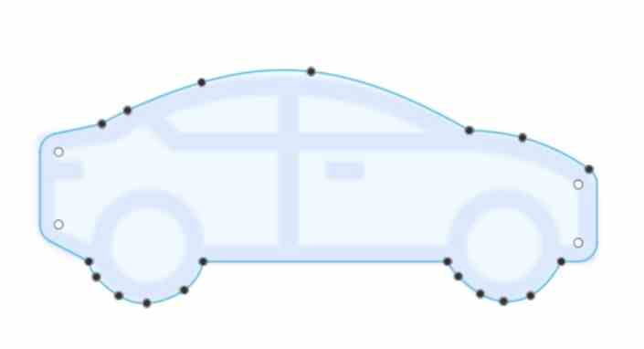

### Stock Material

It was a good idea to create the actual stock as a box in the design part before taking the manufacturing process, because then I can have better reference points as to how it would mill. To do this, I needed to measure the stock I would be using. I found the wax in our lab, and cut it in half using the band saw, for I didn't need it to be too thick. I measured the length, height, and width using a caliper. Taking the measurements, I made a box of that size. I inserted the sketch of the car, and extruded it to the heights in which I liked it. 

I then used the `mirror` tool to mirror the other side of the two part mold. The mirror tool was perfect in this case, because I needed everything to be oriented in reverse, and also they needed to be oriented in the same spot so that the mold can come together. 

One important aspect to consider. was vent holes. I needed vent holes to pour in my cast. To do this, I created a rectangle at the top of each side, and extruded it, so that when I poured mold into it, it would leave a gap in which I could pour in the casting material. 

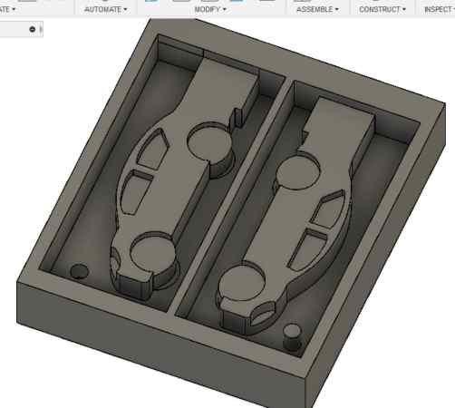

## Fusion 360 CAM

I had never used Fusion 360 toolpaths before and was kind of worried that it would be complicated, but it turned out to be super easy to use. I watched through this [video](), where I was able to gain the basic knowledge of the steps and setup, and I also used this [website]() as a workflow. The two sources gave me great insight and knowledge on how to use the Fusion 360 CAM process. 

First, I created a new setup. In the setup, I was prompted to set settings such as the stock measurments, the origin, in which the measurments would be referenced off of, and the orientation of the mill. 

One key aspect was setting the mill to the top of the stock. To do this, I changed the setting for the z-axis to `offset from the top`, and I set the offset value as 0. This way, it was perfectly aligned with the top. 

### Toolpaths

Before anything, I learned I needed to downlaod the bits from a library. My lab provided a document with resources, and I used that to download it, and I learned how to import it via the website I mentioned.

Once I had the setup and orientation, I moved on to making the toolpaths. I wasn't familiar with any of them, but Fusion 360 explained to me what they were. Since my car was mostly just shapes at different heights, at first, I believed it was the best option to use the 2D toolpaths. I did three differnt tooplaths, `2D adaptive clearing`, `2D pocket`, and `Circular` for the holes I made that would connect the two molds together. For each one, I learned to set the settings such as bit(I would use 1/8 inch ball bit), feeds/speeds, plunge rate, and more. 

My lack of knowlege on these tools caused me to run into one error, which stated that I would have `rapid collision with stock`. I figured this might be the passes or the plunge rate, so I changed those, but I still got errors when simulating. Also, the wheels rendered a little odd. 

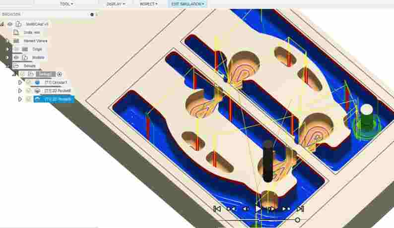

[Stuart Christhilf](https://fabacademy.org/2023/labs/charlotte/students/stuart-christhilf/About/) recommended that I just use the `3D adaptive clearing` tooplath. Most of my labmates seemed to just use this toolpath as the basic roughing toolpath. I used it, and it automaitcally did the toolpath for me, and I didn't run into any errors. The only part I didn't like were the holes, for the bottom wasn't seeming to be cut all the way. Therefore, along with the 3D Adaptive Clearing, I readded the circular toolpath, in which the bit would go around it, and it fixed the error. 

## Milling

Once i had everything set, I exported the gcode and set up the Bantam Desktop Milling Machine. We were reccommended not to use the small Othermill Machines, for people had tried to mill wax on them before, and the material got stuck in the parts of the machine. 

I imported the gcode, installed the tool using the `install tool` option to set the height of the 1/8 inch ball milling bit. 

Previously, when I milled on copper, we had to set the z-axis by doing a probe in which there is an electrical connection. I figured I would have to do that in this scenario, yet I was confused because the wax wouldn't make an electrical touch. Stuart assured me that since the toolpaths were as g-code, and I had set the stock in Fusion 360, the g-code would take into consideration of the height. The only setup i needed to do was set up the measurements of the stock in the Bantam software. I went back to Fusion to get the exact mearuments I had entered, and put it in the Bantam software. 

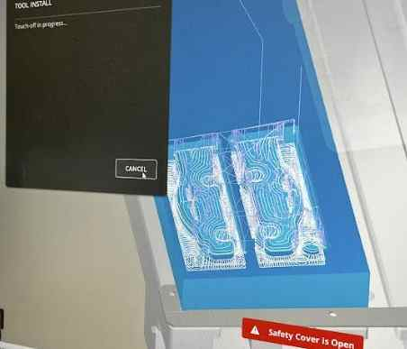

The preview looked good, so I made sure the bit was tight, and I began the job. The job was around 32 minutes. Halfway through, I paused the job to clean it up. 

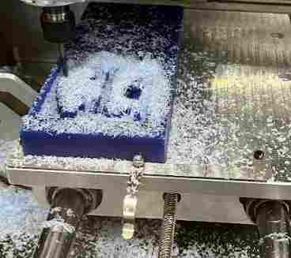

*Not very visible*

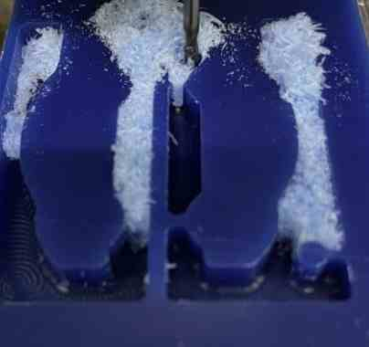

*Visible view of the outline once cleaned*

As we got near the end, I made a minor but truly frustrating mistake. There was one more pass to go, and I paused it to clean up the mess and see if it was going correctly. This turned out to be a dumb mistake by me, for when I pressed `resume job`, it didn't resume. I was so close, all it needed to mill was one part that was connecting the wheel to the end of the wax, along with the hole that I would be using to connect the two part mold. However, Bantam simply froze, and I was unable to complete the job. 

Due to time constraints and other people needing to mill, I had no choice but to use what I had. It had cut most of the important parts, the only issue would be when I connected the two parts, they wouldn't interlock. Instead, I would have to align them the best I could using rubber bands. 

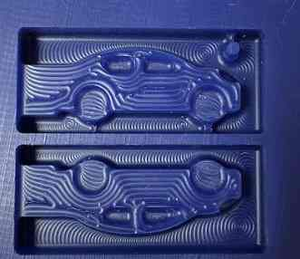

## Molding

Working with what I had, I moved onto molding with silicone. I looked through the options and decided on **Mold Star 16 Fast**, a two part silicone mold that is flexible and hard to rip. I had used this before, but I decided to read through this [article](https://www.smooth-on.com/products/mold-star-16-fast/) about it to learn anything new. I learned that it was heat reseistant up to 450 degrees F when casting things inside. Some other takeaways were the importance of a good ratio(1:1), unifrom flow in a single spot to avoid trapped air, and a curing time of 30 minutes. 

I first set ip a piece of cardboard to avoid getting things dirty, and I brought two measuring cups, one red cup which would be used the mixing, a popsicle stick, and gloves. I then carefully poured them into the two measuring cups and got a 1:1 volume ratio.Once this was done, I carefully poured each into the red cup to avoid trapped air, and I scraped the sides of the cups thoroughly. 

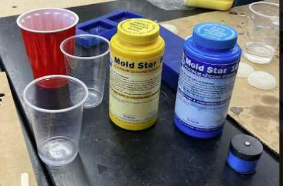

Once both of them were in, I used the stick top mix them. The website said to mix for around 2-3 minutes, so I mixed for around 3. I did it carefully, making sure to mix all around the cup rather than one spot. Once the colors turned light blue, and it looked good to pour, I got my wax and poured the mold star in carefully. I poured in a little at a time, making sure to get all the little spaces. This process went rather smoothely, and I set a time for 30 minutes. 

20 minutes in, it seemed good to go, but I decided to wait just to be sure, since it was the tiniest bit sticky still. It was solid, however, which was a good sign. 

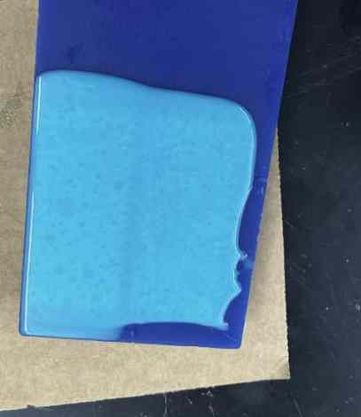

I carefully took the material out of the wax, and I would say it turned out pretty well!

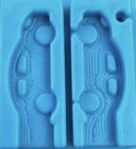

Obviously it is not the best, for I had not run the finishing pass, and as you can see, because the milling job stopped early, it cut a hole on one side but not the other, making that part useless. Also, you can see an opening beteween the wheel and the edge on one side, due to the unfinished job. 

## Finishing Job

I decided in the end that I wanted to do two things: cast with the finishing cut and without. I had the mold for the non-finished cut, so all I had to do was mill the finishing path now. Because my designs were mostly flat, I used the `flat` finishing 3D toolpath in Fusion 360, and selected the geometry of the car, windows, and tires. I could have done the entire thing, but the car was the only part that really mattered so I saved time by omitting that part. 

Once I had the tooplath set up, I followed the same procedure of setting the bit, setting the machine(Othermill), and exporting the gcode. It was key I keep the same stock values, so that the offest wouldn't be off. This was important because I had taken the wax off after the rough cut, and so keeping close measurements and origins were key. 

I imported it into Bantam, set up the material, made sure the toolpath looked good, then began to press mill. This time, I didn't clean it up halfway through, and it was fine since it was just a finishing toolpath. I realized that in this time, I could have also created a toolpath just to get rid of part that didn't finish molding in the previous cut, but to let other people use the machine, I moved along. 

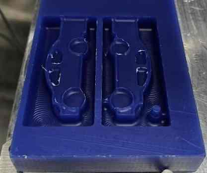

<video src="../../images/Week 12/FinishingVideo.mp4" controls="controls" style="max-width: 400px;">
</video>

## Casting

For casting hard, I used the [Smooth-Cast65D](https://www.smooth-on.com/products/smooth-cast-65d/) casting resin, a semi-rigid urethane that is good for impact resistance. I learned from the website that they are low viscosities for minimal air entrapment. You can also add colors to them with pigments. 

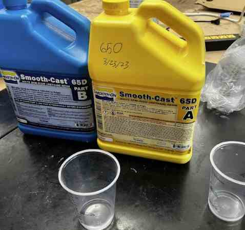

Before doing the casting material, I had to set up my molds for the cast to be casted. I used rubber bands to keep the two firmly and tightly in place, and pressed gently along the edges to make sure there were as least crevices possible. For the part where there was an opening, I covered it with tape. 

Similar to the molding material, it was important to pour in a 1:1 ratio, or else it would be too liquidy. This material only had a pot life of around 3 minutes, so we had to be pretty quick. With the help of [Jed](https://fabacademy.org/2023/labs/charlotte/students/jeffrey-smith/), we poured an equal amount into identical measuring cups, then poured Part A into Part B. Using a popsicle stick, I mixed for around 1 minute.

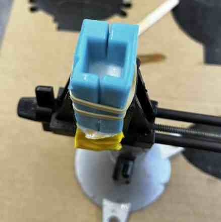

I gently poured the casting material in the vent. However, I did not think about how I would think about where to stop, for the vent was there to pour the material, but was not part of the car. For the first part, sadly, I underestimated, and the back end of the car came out short. 

Learning from this mistake, I decided to do better with the finished mold. I quickly using the same molding procedure as above, made a sof silicone mold for the finished wax. I did this with [Adam](https://fabacademy.org/2023/labs/charlotte/students/adam-stone/), so the process went faster and more smoothely. 

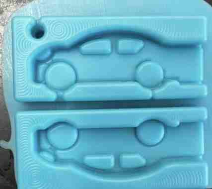

Once I had the mold, I followed the same casting procedure, of carefully getting a 1:1 ratio of the two parts, and pouring it into the vent, this time filling it up way more to the top. 

This one turned out better!

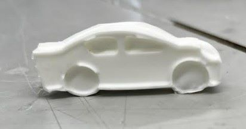

Here is an image of all the outcomes. 

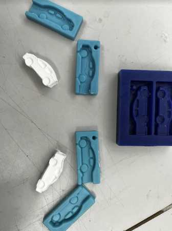

## Update on misunderstanding

UPDATE: After this week was over, I had a discussion with [Dr. Taylor](http://archive.fabacademy.org/fabacademy2016/charlottelatin/students/87/index.html) on bits and toolpaths. The way I had done it this week, I had used a ball-bit for both my roughing and finishing paths. Ball bits are u-shaped and therefore are better for finishing paths. Dr. Taylor reminded me that the whole point of a roughing pass was to cut as much of material off as fast as possible. Therefore, it was reccommended that I use an end mill, which would have done the roughing job quicker. Once I had that, I could use a ball mill to go over it slowly and get a nicer finish. 

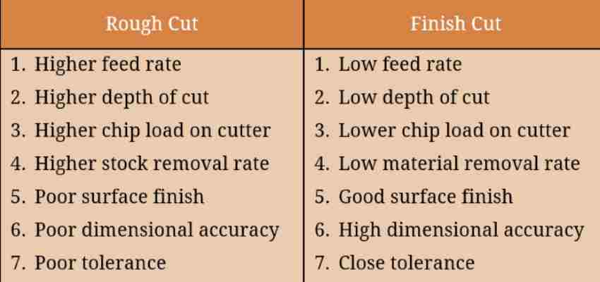

This chart helped clear up some key differences. The key idea is that the finishing path is more accurate and slower to get the nicer product, while the roughing pass helps save time and clear out the bulk of the material quickly. THrough this, I learned that the end mill and ball mill should be used separately for different reasons. I read more about these toolpaths on this [website](https://www.differencebox.com/engineering/difference-between-roughing-and-finishing-in-machining/#:~:text=Objective%20of%20rough%20pass%20is,depth%20of%20cut%20are%20utilized.)

Through this week, I had set up a roughing and finishing pass, but I had not made the most of the use of them. Therefore, I decided to run one more mill using two different bits, rather than the ball mill for both. This way, I could experience and demonstrate the process of milling and optmizing time and use of roughing/finishing toolpaths. 

I first made a simple design of a staircase in Fusion 360. I then used CAM to create, simulate, and export two toolpaths. I made sure to set the 1/8 inch END mill for the roughing pass. I then followed the same process as above in exporting and uploading to the Bantam Software. 

Here you can see a video of the roughing pass. When I saw this, I recognized the difference. Previosuly, I saw more shavings. Here, it is actually taking out chunks. The whole cut was probably around 30 seconds. 

<video src="../../images/Week 12/ROUGHINGagainVideo.mp4" controls="controls" style="max-width: 400px;">
</video>

When I ran the finishing pass with the ball bit, it cleaned it up. 

## Group Work

This week, we ran some tests on certain materials. A key assignment that we needed to do was understnad the safety of each, along with reading the datahseet and understanding more about each material to know how to use each. Through the experience of molding and casting with multiple types of molds and casts, I learned more about using different kinds rather than one type. We molded a star as our test. I read through a couple of datasheets and documented some key points. Here is our group [site](https://fabacademy.org/2023/labs/charlotte/assignments/week13a/) for this week. 

## Reflection

This week was a messy but fun week! Learning about Fusion 360 toolpaths and milling with material other than FR1 were extremely helpful skills. I ran into one error with my mill, but I was still able to get molds and casts. Learning about skills of molding and casting such as vents, air entrapment, and differnet materials used in the process were all interesting to learn about. One of the most important things I learned was optimizing time by using the correct bit to best save time for a roughing pass. 