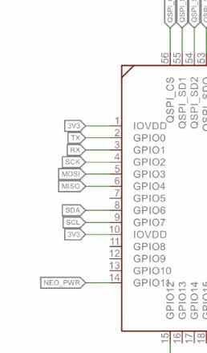
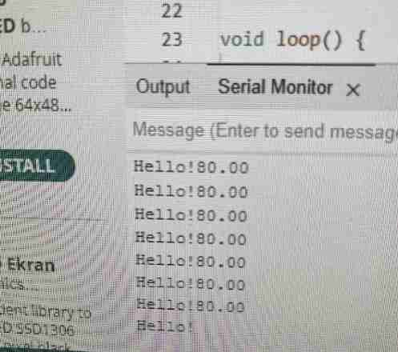
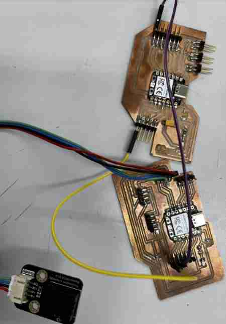
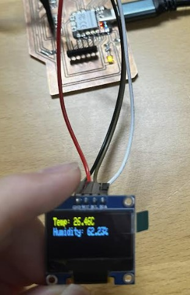
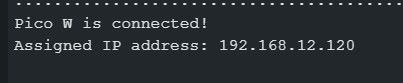
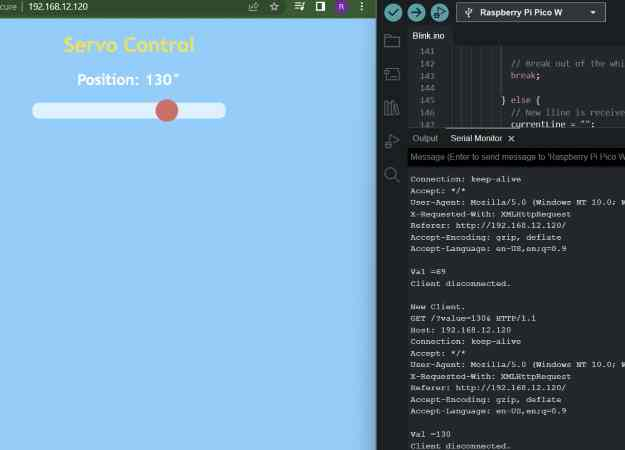

# 13. Networking and communications

Here are my code files for this week- [files](../files/Week%2013%20Files/Week%2013%20Files.zip)

For this week, I decided to accomplish two things: a wired communication between RP2040s, particularly the Seeed XIAO, for that is what I have mostly been using to control my electronics throughout the course of Fab Academy. Then, Tom Dubick supplied us with the Raspberry Pi Pico W, which enables wireless communcation over a local network. There were a couple of good tutorials provided to us on how to do that, so I figured I should start with the more difficult task, which was to communicate two XIAOs with wired protocol. 

The difficult barrier about the RP2040 was that there were very limited resources that told me to how to communcicate between multiple boards. During Molding and Casting week, I was waiting to mill my wax mold, so I tried to get a head start on networking, for I knew the amount of research it would take, and also I had personal matters that would limit my work time during this week. However, when I tried to get a head start and try to get a simple message from one XIAO to another via I2C, the attempts were fruitless and I met no success. However, I was still glad that I attempted this, for I knew that I should come at a different approach as I headed into this week. 

## Serial UART

UART I learned is a simple two-wire basic hardware serial communication method, in which it uses the pins RX and TX to transmit and recieve bytes over a wire. Like I mentioned, there were limited resources on communicating multiple RP2040s, so I first navigated to this [website](https://www.electroniclinic.com/serial-communication-between-two-arduino-boards/) which gave documentation on how to communicate two Arduino Unos via serial. I figured since the RP2040 is compatible with the Arduino C, I could go about this the same way as an Arduino. Next, I learned I needed to connect the RX to the TX of the two boards, and vice versa. The simple example code was as such:

Sender Board:

```
void setup() {
 
    // Begin the Serial at 9600 Baud
 
    Serial.begin(9600);
 
  }
 
  void loop() {
 
    Serial.write(Mymessage,5); //Write the serial data
 
    delay(1000);
  }
```

And Reciever Board:
```
char Mymessage[10]; //Initialized variable to store recieved data
  
  void setup() {
    // Begin the Serial at 9600 Baud
    Serial.begin(9600);
  }
  
  void loop() {
    Serial.readBytes(Mymessage,5); //Read the serial data and store in var
    Serial.println(Mymessage); //Print data on Serial Monitor
    delay(1000);
  }
```

I was working at home, and my computer only had one USB port, and I had no USB extenders, so I couldn't upload the code simultaneously. Therefore, I had to settle on powering one board from the other. The Arduino IDE uploads code to flash memory, so as long as the boards recieve power, it will continue to run code. I first uploaded code to one XIAO as the sender board, and then plugged in the reciever board, since I was reading off the Serial Monitor of the recieving board, and so had to connect that to a COM port. The sender board simply needed to be powered. 

I uploaded the code and navigated to the serial monitor, but not surprisingly, I did not get values. I made sure I had good wiring and power along with a common ground, but I met no success. Now that I knew I couldn't simply go about this the same way I would with an Arduino, I had to figure out another method. I looked up online `communuication between two rp2040 boards`, and didn't find many things that could help me. After about an hour of research and fruitless code change attempts, I somehow came across this youtube [video](https://www.youtube.com/watch?v=oZTeeXk6Aok). It had less than 100 views, but it didn't matter, for because of this video I was able to see the first signs of success. 

The video was communicating two Raspberry Pi Picos, which used the same RP2040 chip, so I figured I could use this as a framework. The video communicated two of the Picos to send messages to each other, and I looked at the code he was using. He was using the typical `write` and `read` functions over serial, but one key difference I noticed was that rather than doing `Serial.begin` he instead did `Serial1.begin(9600, SERIAL_8N1)`. This stood out to because I knew from prior research that the RP2040 has two I2C buses, and it was necessary to set up the specific bus and pins you were using. I figured it must be the same for UART, in which I had to specify the correct UART bus I was using. However, I had to make sure which pins the XIAO board was using, since it is basically a shrunk down Pico. The video was using GPIO pins 0 and 1, and called that `Serial1`. I looked up the schematic of the XIAO to see which pins connected to the RX and TX, and sure enough it was GPIO pins 0 and 1 of the RP2040 chip. 



I went back to my two codes, and I changed them so that the `Serial.begin` became `Serial1.begin(9600, SERIAL_8N1)`. I then changed all the serial reads and writes as Serial1 as well. However, for the serial monitor, I needed to keep the original Serial start. Basically, my setup for the recieiving board was. 

```
Serial.begin(9600);
Serial1.begin(9600, SERIAL_8N1);
```

I made sure the serial baud rate was the same for both boards. I uploaded the code to each, powered it, and...

I got readings!

Knowing that this worked, I decided to implement a sensor from my Input Devices week. I used the DHT20 temp/humidity sensor, and merged the simple read code from there into my serial communication code. I set it up so it uses the `gettemperature` and `gethumidity` functions to store it as a float, then write those over the Serial1 bus to another XIAO, and use the serial monitor to display values. Here is the code for the sender board with the sensor:

```
#include <DFRobot_DHT20.h>
#include <Wire.h>

DFRobot_DHT20 dht20;
void setup(){

 Serial1.begin(9600, SERIAL_8N1);
 Serial.begin(9600);
 while(dht20.begin()){
    Serial.println("Initialize sensor failed");
    delay(1000);
  
}
}

void loop(){
  
 float temperatureC = dht20.getTemperature();
 float temperatureF = (temperatureC * 1.8) + 32;
 float humidity = dht20.getHumidity();

 Serial1.write(temperatureF);
 delay(500);

 Serial.println(temperatureF);
 delay(500);
}
```
For the recieving code, I simply read the value on the wired serial and printed it in the software serial monitor. Here is that code:
```
include <Wire.h>

void setup() {
   Serial1.begin(9600, SERIAL_8N1);
   Serial.begin(9600);
  }
  
void loop() {

  if (Serial1.available()) {    
    float serial1_In = Serial1.read();
  Serial.println(serial1_In);
  Serial.print("Hello!");
  delay(2000);     
  }
  }
```
As you can see, it reads the values and stored it as a variable, then displays those variables along with the string `Hello`. Once I uploaded the code and began the serial monitor for the recieivng board, I saw readings that changed whenever I heated it up with my finger. 




*Readings values through Serial Monitor in Arduino IDE, along with visual drawing of network system*

Here is the setup of my boards. I decided to use boards I had designed and milled during Input and Output Devices Week. 


*Purple and Yellow wires setup as RX and TX to send and recieve data. Temp/Humidity Sensor connected to a breakout of power/ground/SDA/SCL*

### Display over Serial to OLED

I figured in preparation for my final project, I could connect an OLED to my recieving board, and also have the values displayed there. I used my OLED code from Output Devices week, and inserted it into my code. It worked, but one thing I realized was that I didn't have the `oled.clearDisplay();`, so whenever it changed values, it would display it over the previous value. Once I fixed this error, I got readings on my OLED, in which the values changed. 



Here is the code to read the values in both the Serial Monitor and the OLED. 
```
#include <Wire.h>
#include <Adafruit_GFX.h>
#include <Adafruit_SSD1306.h>

#define SCREEN_WIDTH 128 // OLED display width,  in pixels
#define SCREEN_HEIGHT 64 // OLED display height, in pixels

Adafruit_SSD1306 oled(SCREEN_WIDTH, SCREEN_HEIGHT, &Wire, -1);

void setup() {
   Serial1.begin(9600, SERIAL_8N1);
   Serial.begin(9600);
  }

void loop() {

  if (Serial1.available()) {  
    float serial1_In = Serial1.read();
  Serial.println(serial1_In);
  Serial.print("Hello!");
  delay(2000);         
  oled.clearDisplay(); 
  oled.setTextSize(1);          
  oled.setTextColor(WHITE);     
  oled.setCursor(0, 10);        
  oled.println(Serial1.read()); 
  oled.display(); 
  }
  }
```

## Software Serial

I realized that in order to connect more nodes to a single networking group, I needed to do more than just communicate via one path.

### Troubles with I2C

Though I would most likely be using UART for my final project, I wanted to continue to learn how to use I2C. Also, I2C was the better option for connecting multiple nodes to a bus. However, as I continued to try to get I2C to work, it continued to fail. I tried the option of changing and setting the I2C pins in a certain way, but every option ended in failure. I considered that maybe the RP2040's I2C bus was not the best to code in C++, so I moved on to try and get it through Thonny in Micropython. However, no success. It was frustrating, for I knew the I2C bus functioned fine, for I had connected many devices to it which worked, such as the DHT20, Time of flight Sensor, and the OLED. However, the code for a microcontroller to join the bus just didn't seem to work, and I decided to take a break from this and come back to it later. 

### Software Serial

Since I had met success with simple Serial communication for the RP2040s, I decided to expand on serial, in which I learned about the SoftwareSerial option, credit to [Teddy Warner](http://fabacademy.org/2021/labs/charlotte/students/theodore-warner/Assignments/week14/). This way, I can configure the digital pins of a microcontroller to act as RX and TX, or transmitting and recieving interfaces. There were a couple of limitations to this, for it can't recieve and trasnmit data at the same time. Also, if multiple ports are enabled, only one can recieve and parse data at a time. However, for projects including communication over inputs, outputs, and microcontrollers, it was still a great tool to use. 

I learned some basic functions on this [website](https://docs.arduino.cc/learn/built-in-libraries/software-serial), such as how to configure and communicate bytes over the transmitting line. I was using the RP2040, so I set the board in the Arduino IDE as the Raspberry Pi Pico. Using my previous documentation, I made one Pico send data 1,0 continuously, and had the other pico read the data and turn on an LED if the data was 1. I uploaded both codes via COM port, and to my surprise, it worked first try! One thing I had to be sure of was to set the RX and TX of both pins to a digital pin, and conenct RX of one board to the TX of another. 

<video src="../../images/Week 13/LEDSoftwareSerial.mp4" controls="controls" style="max-width: 400px;">
</video>

*Led turns on when value is 1. Value is dysplayed in Serial Monitor*

I next moved onto having multiple ports. Multiple ports can be used for many things, but for testing purposes, I decided to have three ports of the transmitting Pico control three LEDs of the recieving Pico, This way, I could "call upon the independent addresses or ports". Here is my transmitter code. 
```
#include <SoftwareSerial.h>

SoftwareSerial softSerial1(14, 15);  
SoftwareSerial softSerial2(12, 13);  
SoftwareSerial softSerial3(10, 11); 


void setup() {

  softSerial1.begin(9600);
  softSerial2.begin(9600);
  softSerial3.begin(9600);
}

void loop() {

  softSerial1.write('1');
  delay(1000);

  softSerial2.write('1');
  delay(1000);
  
  softSerial3.write('1');
  delay(1000);
  
}
```

Here is my reciever code:
```
#include <SoftwareSerial.h>

// Create three software serial ports
SoftwareSerial softSerial1(26, 27);  // RX, TX
SoftwareSerial softSerial2(29, 28);  // RX, TX
SoftwareSerial softSerial3(7, 6);  // RX, TX

void setup() {

  softSerial1.begin(9600);
  softSerial2.begin(9600);
  softSerial3.begin(9600);
  

  pinMode(0, OUTPUT);
  pinMode(1, OUTPUT);
  pinMode(2, OUTPUT);
}

void loop() {
  if (softSerial1.available()) {
    char c = softSerial1.read();

    if (c == '1') {
      digitalWrite(0, HIGH);
    }
  }

  if (softSerial2.available()) {
    char c = softSerial2.read();
  
    if (c == '1') {
      digitalWrite(1, HIGH);
    }
  }

  if (softSerial3.available()) {
    char c = softSerial3.read();

    if (c == '1') {
      digitalWrite(2, HIGH);
    }
  }
}
```

In simple terms, it sends a value over each serial port, and it calls upon those serial ports using a series of if statements, and if data is coming in the port, then it will set a certain pin to HIGH turning an LED on. 

<video src="../../images/Week 13/3LedsSoftwareSerial.mp4" controls="controls" style="max-width: 400px;">
</video>


## Raspberry Pi Pico W(Wireless Communication)

Having no success with connecting multiple nodes to an I2C bus, I decided to move on to the more fun part of the week, wireless communication over a local network. Obviously, I had not idea how to code something to pull data from a network or client, so I first used a video provided by my instructor [Tom Dubick](http://archive.fabacademy.org/fabacademy2016/charlottelatin/students/999/about.html) to simply get the Pico W connected to the network, and then maybe perform a couple of simple actions through the network. Code can be found on this [site](https://dronebotworkshop.com/picow-arduino/)

I first learned how to connect to wifi, using network credentials, then print the IP address of my Pico W in the Serial Monitor. 



I then walked through the tutorial on how to control the position of a servo motor wirelessly over a web page. I connected a servo to the GPIO pin 2 of the Pico W, and powered it via USB supply from my computer. I then took the example code provided to me and ran it on my Pico W. 
```
#include <WiFi.h>
#include <Servo.h>
Servo myservo;
 
// Servo GPIO pin
static const int servoPin = 2;
 
// Network credentials
const char* ssid     = "YOUR SSID";
const char* password = "YOUR PASSWORD";
 
// Web server on port 80 (http)
WiFiServer server(80);
 
// Variable to store the HTTP request
String header;
 
// Decode HTTP GET value
String valueString = String(5);
int pos1 = 0;
int pos2 = 0;
 
// Current time
unsigned long currentTime = millis();
// Previous time
unsigned long previousTime = 0; 
// Define timeout time in milliseconds (example: 2000ms = 2s)
const long timeoutTime = 2000;
 
void setup() {
   
  // Attach to servo and define minimum and maximum positions
  // Modify as required
  myservo.attach(servoPin, 600, 2400);
  
  // Start serial
  Serial.begin(115200);
  
  // Connect to Wi-Fi network with SSID and password
  WiFi.begin(ssid, password);
  while (WiFi.status() != WL_CONNECTED) {
    delay(500);
    Serial.print(".");
  }
  // Print local IP address and start web server
  Serial.println("");
  Serial.println("Pico W is connected!");
  Serial.print("Assigned IP address: ");
  Serial.println(WiFi.localIP());
  server.begin();
}
 
void loop(){
  WiFiClient client = server.available();   

  if (client) {                             
    // Set timer references
    currentTime = millis();
    previousTime = currentTime;
    
    // Print to serial port
    Serial.println("New Client."); 
    
    // String to hold data from client
    String currentLine = ""; 
    
    // Do while client is connected
    while (client.connected() && currentTime - previousTime <= timeoutTime) { 
      currentTime = millis();
      if (client.available()) {             // if there's bytes to read from the client,
        char c = client.read();             // read a byte, then
        Serial.write(c);                    // print it out the serial monitor
        header += c;
        if (c == '\n') {                    // if the byte is a newline character
          // if the current line is blank, you got two newline characters in a row.
          // that's the end of the client HTTP request, so send a response:
          if (currentLine.length() == 0) {
        
            // HTTP headers always start with a response code (e.g. HTTP/1.1 200 OK) and a content-type
            client.println("HTTP/1.1 200 OK");
            client.println("Content-type:text/html");
            client.println("Connection: close");
            client.println();
 
            // Display the HTML web page
            
            // HTML Header
            client.println("<!DOCTYPE html><html>");
            client.println("<head><meta name=\"viewport\" content=\"width=device-width, initial-scale=1\">");
            client.println("<link rel=\"icon\" href=\"data:,\">");
            
            // CSS - Modify as desired
            client.println("<style>body { text-align: center; font-family: \"Trebuchet MS\", Arial; margin-left:auto; margin-right:auto; }");
            client.println(".slider { -webkit-appearance: none; width: 300px; height: 25px; border-radius: 10px; background: #ffffff; outline: none;  opacity: 0.7;-webkit-transition: .2s;  transition: opacity .2s;}");
            client.println(".slider::-webkit-slider-thumb {-webkit-appearance: none; appearance: none; width: 35px; height: 35px; border-radius: 50%; background: #ff3410; cursor: pointer; }</style>");
            
            // Get JQuery
            client.println("<script src=\"https://ajax.googleapis.com/ajax/libs/jquery/3.3.1/jquery.min.js\"></script>");
                     
            // Page title
            client.println("</head><body style=\"background-color:#70cfff;\"><h1 style=\"color:#f7e00a;\">Servo Control</h1>");
            
            // Position display
            client.println("<h2 style=\"color:#ffffff;\">Position: <span id=\"servoPos\"></span>&#176;</h2>"); 
                     
            // Slider control
            client.println("<input type=\"range\" min=\"0\" max=\"180\" class=\"slider\" id=\"servoSlider\" onchange=\"servo(this.value)\" value=\""+valueString+"\"/>");
            
            // Javascript
            client.println("<script>var slider = document.getElementById(\"servoSlider\");");
            client.println("var servoP = document.getElementById(\"servoPos\"); servoP.innerHTML = slider.value;");
            client.println("slider.oninput = function() { slider.value = this.value; servoP.innerHTML = this.value; }");
            client.println("$.ajaxSetup({timeout:1000}); function servo(pos)  ");
            client.println("$.get(\"/?value=\" + pos + \"&\"); {Connection: close};}</script>");
            
            // End page
            client.println("</body></html>");     
            
            // GET data
            if(header.indexOf("GET /?value=")>=0) {
              pos1 = header.indexOf('=');
              pos2 = header.indexOf('&');
              valueString = header.substring(pos1+1, pos2);
              myservo.write(valueString.toInt());
              Serial.print("Val =");
              Serial.println(valueString); 
            }        
            client.println();
            break;
          
          } else { 
            // New lline is received, clear currentLine
            currentLine = "";
          }
        } else if (c != '\r') {  // if you got anything else but a carriage return character,
          currentLine += c;      // add it to the end of the currentLine
        }
      }
    }
    // Clear the header variable
    header = "";
    // Close the connection
    client.stop();
    Serial.println("Client disconnected.");
    Serial.println("");
  }
}
```

It worked, and I was able to use the slider on the web page to control the servo over a network connection. However, I wanted to do a litte more research to gain an understanding of what was going on. I knew from Dr. Gershenfeld's lecture the basics on how we use TCP and HTTP to gain connection between two devices with an IP address, and it sends data in packets wirelessly using the HTTP protocol. However, there were some questions I had about the code, such as Port 80. 

I first asked it what port 80 was, and ChatGPT responded:

```
Connecting to port 80 typically establishes an HTTP connection to a web server. Port 80 is the default port used by web servers to serve web pages and other web resources using the HTTP protocol. When you type a URL into your web browser, the browser initiates a connection to the web server's IP address on port 80 (or 443 for HTTPS connections), and requests the web page or resource associated with that URL. The web server then responds with the requested web page or resource, which the browser displays to the user.
```

I also learned the process in which the Pico W listens for data coming in from the client, in this case, the web browser, and sends HTTP data using the `HTTP GET` function. It then parses the data provided and moves the servo in that position

Here is a video of controlling ther servo. 

<video src="../../images/Week 13/ServoWebControl.mp4" controls="controls" style="max-width: 400px;">
</video>

Also, the code allows it so that whenever data is being sent, or whenever I change the position, it prints the information about the data, or whenever the client disconnects. 



## Group Work

Here is my group work [site](https://fabacademy.org/2023/labs/charlotte/assignments/Week14-Ryan-Ginny/) for this week. Using our knowledge of addresses, Ginny and I were able to connect our Pico Ws to a local hotspot. First, we setup the server and IP address by using the network credentials. We were able to find code online where it provided the ip address of the server, so were able to upload the code to the client Pico W. We used the IP address of the server so that the client could request data from the server, using the address thorugh the hotspot. In this case, that was the RGB values fluctuating randomly, and we were able to pull that data to make an actual Neopixel flash. 

## Reflection

This was a hard week, but it was worth it. Though it was difficult to get a hang of the wiring and functions of certain concepts at first, it all started making sense, and this skill will be useful in creating more complex electronics in the future. One big lesson I learned from this week was the functions of I2C. Though I got the concept, it turns out the I2C functions for the RP2040s are not straightforward in C, and there is not good sources online that tells exactly how to code it, so this attempt of me using I2C ended up being a rabbit hole. I later learned it was possible in Thonny, though it was a litte odd, so I plan on picking up that skill in the future. Learning Serial and communicating nodes both wired and over the network was super fun to learn, and I am satisfied with the outcome of that attempt. 