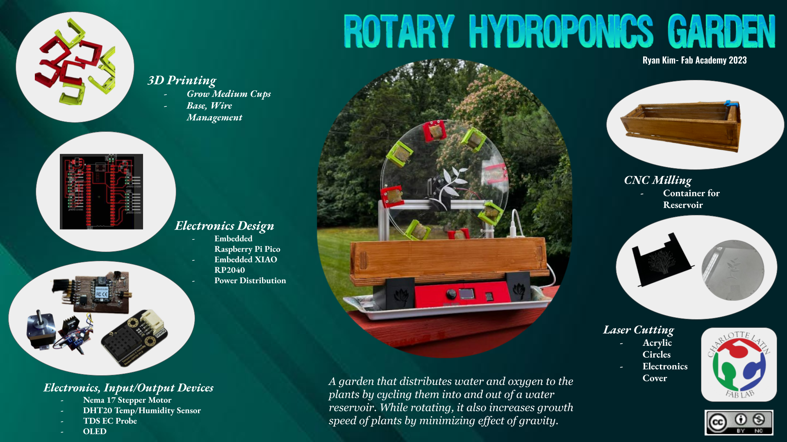

# 17. Invention, intellectual property and income

## Final Project Dissemination Plan

I looked through some of the options for a patent, and the most appealing for me turned out to be the [Creative Commons Attribution- NonCommerical 4.0 Interational License](https://creativecommons.org/licenses/by-nc/4.0/). 

I want to allow the share and expansion on my attempted final project. The icense suggests that the user gives credit to my project if an idea or change was made from my own original product. 

I myself have expanded off of such ideas. I took the "smart" garden type of project and merged it with a more unique garden which I was inspired from by NASA's project of the use of gravity on plants, along with hydroponics. I think that this project can continuouslly be expanded on, and I wish to allow people to use it to expand. 

here is the license icon that I plan to include on the final product. 

Creative License main aspects- 

- Attribution — You must give appropriate credit, provide a link to the license, and indicate if changes were made. You may do so in any reasonable manner, but not in any way that suggests the licensor endorses you or your use.

- NonCommercial — You may not use the material for commercial purposes.

- ShareAlike — You are not obligated to use the same license if you wish to take an idea from my product

Though this license keeps it from being used for commercial purposes, I believe that it is a good source to expand on. I like to keep it open for viewing, and with proper credit, others are able to use it to their own benefit as long as it is not commercial. One other reason I did not want to make this a commerical projec was because this idea is not completely mine and is something that I wanted to build on my own. 

## Slide

I used Google Slides for my project slide. 

## Video

<video src="../../presentation.mp4" controls="controls" style="max-width: 730px;">
</video>