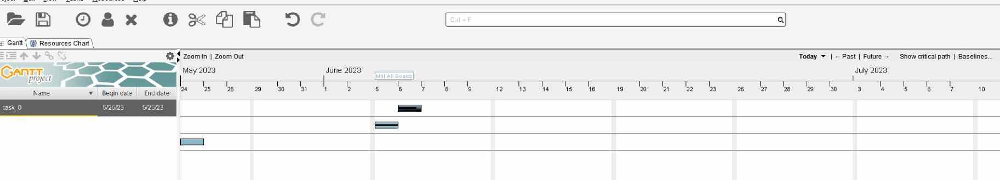
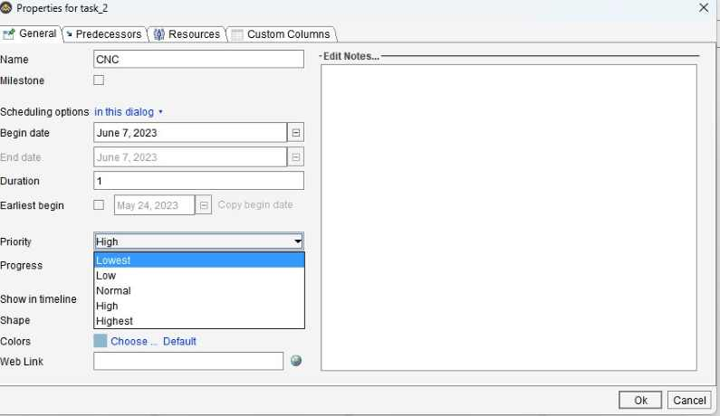

# 18. Project Development

## What tasks have been completed, and what tasks remain? 

Up until June 4th, I have got the electronics system functioning, with all the code ready to go. I have also deesigned all the necessary boards in Eagle, and have them ready to go to mill. However, the main concern is since I have not been in the lab for quite a while due to exams, I was not able to mill out these boards, meaning I have no idea if they will work.

I have also completed most of my CAD designing. I started it all on one project, with the separate components ready to go. There are still a couple of edits I need to make. For example, I plan on integrating my electronics at the bottom, but that might mean I need to make a couple of edits to the case surrounding it. The design I plan to mill is ready to go, and I plan to cut it out on the Shopbot. As for the actual mechanics of the rotation, I have had many iterations but have had to restart due to problems that I didn't take into consideration. In a nutshell, my CAD work is on the brink of finishing. 

Once I have the CAD work done, the only steps left is the testing of the electronics boards, and the production of all necessary parts. This includes the Shopbot, 3D printing, and laser cutting. 

Also, since I am doing a garden, I ordered some rockwool medium and planted some seeds I found in my house. I poured water, left them outside, and to my surprise, I am seeing some sprouts! My goal is that if I am able to grow a sprout by the day before presentation, I will use that to display the functioning product. If it ends up not going well, I plan to move some preplanted sprouts into the cubes to visually show the function. 

## What's working? What's not?

The electronics system and code is working. All that is left is to edit the motor speeds necessary, which I will do once I test with all the mechanics. The "main" thing that hasn't really been working is my planning during CAD designing. I have the base, the water reservoir, but the spinning rockwool holder is still in a little development. One issue I hadn't thought about is that if the roots touch the water and spin up, some water might drip down when they are at the top. This might effect the wiring of the grow lights. If I am not able to figure this out, I plan to just cover the lights with plastic, but until then, I will continuouslly attempt to think of a better design. Once this aspect of the design is done, I am ready to fabircate everything. 

## What questions need to be resolved?

One question I still haven't looked into is the nutrient solution I plan to use while displaying the function. I plan to look into this once I get the bulk of the designing and fabricating done. Another question is how I m going to keep the acrylic water reservoir together. I looked at previous people, and they have mostly used weld-on, so I will check if there is some of that in the lab or if I need to order some more. 

## What will happen when?

The current day is 6/4/2023. I was held back by exams and not going into the lab, but the next week I plan on pushing through on this schedule. I return to the lab tomorrow. 

- 6/5- Mill all the boards I have ready to go, solder, and test
- 6/6- I am playing safely here, so I have set this day for electronics testing too, since I know the high chance of something going wrong. If I do finish, I will finish up my CAD design
- 6/7- Finishing up CAD work and printing out the base, since the base is set to be around an 8 hour print. CNC
- 6/8- Continue printing and Laser Cutting. Chances are that I will have some mechanical issues, so I will set two days for this
- 6/9- Continue printing and Laser Cutting. 
- 6/10-6/11- Finalize system integration and assembly
- 6/12- Finalize any mechanics I have left
- 6/13- Whatever is left

I learned about the Gantt Project Software which helped me order everything into a nicely sorted visual timeline, with adjustable settings such as importance, completion, etc. 

## What have you learned?

Fab Academy has opened a newfound understanding of concepts that seemed very confusing to learn at first. However, throughout the course of constant rapid designing, prototyping, troubleshooting, and lecture listening, I am now not only able to just understand processes behind fabircation techniques, but also am able to make projects rather quickly by putting these skills to use. For me, it wasn't really about getting every concept down to the most complex understanding. It was more about having these ideas introduces in a way that makes sense, and these lessons can be taken further in the future whenever I want to design or make something. Learning these techniques through Fab Academy was a great choice!

Some of the most favorite concepts or practices I gained were using the Shopbot/learning about toolpaths, deeper dive into 3D printing, an extremely deeper dive into CAD and CAM, electronic design, and an expanded knowledge on programming. These are all great skills I was able to learn, and they are yet to be taken further. 