# Rotary Hydroponics Garden


<video src="../../presentation.mp4" controls="controls" style="max-width: 730px;">
</video>

## Idea

I always wanted an interesting garden in my room or in my house, in which it had cool features that could do certain things. I figured I could expand on this through Fab Academy. Through lots of research, inspiration, and changing of minds over and over, I finally came up with an idea I liked: a Rotating Hydroponic Garden. 

### Inspiration

I knew from the beginning that I wanted to make this a unique garden, rather than just a normal garden with watering features or nutrient level displays. I went across the internet and looked at many differnet gardening projects. (Gardening projects are very popular) A couple of inspirations I had were found on these websites. 

- Ari Vuokila [Hydroponic automation for pH and Nutrient Control](https://fabacademy.org/2018/labs/fablaboulu/students/ari-vuokila/finalProject.html)
- Marcel Kellner[Hydroponic Growsystem](http://archive.fabacademy.org/fabacademy2017/fablabbottrophrw/students/64/)

These gave me more ideas to expand on. I gained the idea to make my garden have display values of certain necessary aspectsd of gardening such as temperature and humidity. However, I soon came across a super interesting garden that sparked my interest, the [Rotofarm](https://design-milk.com/the-rotofarm-is-a-nasa-inspired-sculptural-hydroponic-system/). Not only did the project inspired by NASA use a technique without soil, after reading and researching other rotating hydroponics garden, I realized that there were intersting benefits and research done behind in making these. For example, it took advantage of the effects of gravity to speed up the gardening process. This overall idea was what inspired my project. Taking all these ideas together, I decided on a couple of main aspects that would be a part of my project. 

- Rotating Mechanism to circulate amouunt of oxygen and water nutrients, rather than using pumps or an ebb and flow system
- Grow Light Sun that simulates sun light
- Display with sensor readings to assist user in gardening aspects
- Hydroponics Water Nutrient Reservoir(No Soil!)

## Research

Hydroponics is an innovative method of growing plants that eliminates the need for traditional soil-based cultivation. In hydroponic systems, plants are grown in a soilless medium while receiving a nutrient-rich solution directly to their root systems. This technique offers numerous benefits and has gained popularity in both commercial and home gardening settings.

The basic principle behind hydroponics lies in providing plants with optimal conditions for growth and development. By removing the soil from the equation, growers can have greater control over important factors such as nutrient uptake, water availability, and oxygen levels. This precise control allows for faster growth rates, higher yields, and the ability to grow plants in areas with limited space or poor soil quality.

In a hydroponic system, plants are supported by various soilless growing mediums such as perlite, coconut coir, rockwool, or vermiculite. These mediums provide stability and ensure that the plants' roots have access to oxygen. Instead of relying on soil nutrients, plants receive their required minerals and elements from a carefully formulated nutrient solution. This solution, consisting of water and a balance of essential macro and micronutrients, is delivered directly to the roots via a pump or irrigation system.

I was also able to learn more about the whole concept through going through different types of systems. This helped me understand why things are made in such as why when it comes to gardening, helping plan the components that would be added in my final project. 

Here is a [website](https://www.nosoilsolutions.com/6-different-types-hydroponic-systems/) with good explanations. 

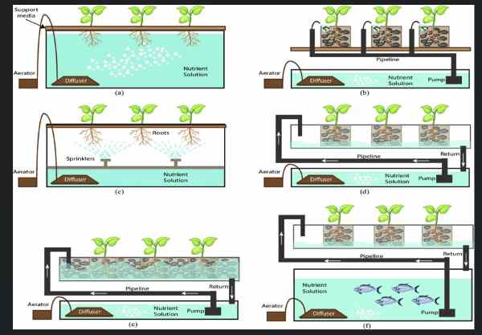

## Bill and List of Materials

**Electronics**

| Amount | Material | Price | Link | Comments |
|----------|----------|----------|----------|----------|
| 1   |     Nema 17 Stepper Motor   |     $12.00        |  [link](https://www.zyltech.com/nema-17-stepper-motor-1-7-a-0-59-nm-84-ozin-1-3-or-5-pack/ )       |    In Lab      |          
| 1 |  l298n Motor Driver    |  $6.99   |   [link](https://www.amazon.com/Qunqi-Controller-Module-Stepper-Arduino/dp/B014KMHSW6)       |   In Lab     |                
| 1 |    OLED    |     $6.99     |    [link](https://www.amazon.com/UCTRONICS-SSD1306-Self-Luminous-Display-Raspberry/dp/B072Q2X2LL/ref=sr_1_3?keywords=SSD1306&qid=1656303943&sr=8-3)      |    In Lab      |          
| 1   |   DHT20 Temp/Humidity Sensor    |    $8.60      |     [link](https://www.amazon.com/DHT20-Module-Temperature-Humidity-Adafruit/dp/B09H1D2NSB)     |  Got During Inputs Week     |                                     
| 1 | EC Probe Sensor |    $16.00      |    [link](https://www.amazon.com/Conductivity-Hydroponics-Waterproof-Monitoring-Detection/dp/B08SQGL728)      |          |    
| 1 | Pico W |    $13.00     |    [link](https://www.amazon.com/Vis-Viva-Raspberry-Wireless-Sticker/dp/B0BHM88FCT/ref=sr_1_5?crid=2WCX2F5TBP1Y8&keywords=raspberry%2Bpi%2Bpico%2Bw&qid=1684355994&s=electronics&sprefix=raspberry%2Bpi%2Bpico%2Bw%2Celectronics%2C92&sr=1-5&th=1)      |    In Lab    |      
|1  |    XIAO RP2040(SEEED)    |    $9.99      |    [link](https://www.amazon.com/Microcontroller-Dual-Core-MicroPython-CircuitPython-Interfaces/dp/B09NNVNW7M/ref=sr_1_1_sspa?crid=24ME3FWO9Y31J&keywords=seeed+xiao+rp2040&qid=1686451861&sprefix=seeed+xiao+r%2Caps%2C114&sr=8-1-spons&psc=1&spLa=ZW5jcnlwdGVkUXVhbGlmaWVyPUEyVkU4OUhCQjEwSTU2JmVuY3J5cHRlZElkPUEwNzA3NTk5M0o3R1VZRDlHUEdHVyZlbmNyeXB0ZWRBZElkPUEwNDI3MDEyM0lOQk1FQlREVkg3RCZ3aWRnZXROYW1lPXNwX2F0ZiZhY3Rpb249Y2xpY2tSZWRpcmVjdCZkb05vdExvZ0NsaWNrPXRydWU=)     |  In Lab     |   
|7 |   1 uf Capacitor  |    $0.70   |    [link](https://www.digikey.com/en/products/detail/murata-electronics/GRM155R61E105KE11J/10705518)     |  In Lab  |       
|2|   10k ohm resistor  |    $0.20   |    [link](https://www.digikey.com/en/products/detail/yageo/RC0805FR-0710KL/727535)     |  In Lab   |  

**Build**

| Amount | Material | Price | Link | Comments |
|----------|----------|----------|----------|----------|
|1 | Prusament PLA Filament|    $29.99  |    [link](https://www.prusa3d.com/product/prusament-pla-lipstick-red-1kg/)      | In Lab |   
|1 | 1/2 inch Plywood(any type)|    $14.99  |    [link](https://www.lowes.com/pd/1-2-in-Birch-Plywood-Application-as-2-x-2/1000066183)      |  In Lab |       
|1 | 1/8 inch Acrylic|    $14.99  |    [link](https://www.amazon.com/Plexiglass-Acrylic-Transparent-Paintings-Engraving/dp/B0BYJBDRTK/ref=sr_1_1_sspa?crid=2Y1OUCDJDDNX5&keywords=1%2F8+inch+acrylic&qid=1686453011&s=office-products&sprefix=1%2F8+inch+acrylic%2Coffice-products%2C120&sr=1-1-spons&psc=1&spLa=ZW5jcnlwdGVkUXVhbGlmaWVyPUExNkFYWlZaVjhXUVNVJmVuY3J5cHRlZElkPUEwNTI3NzA3MVdCR0NBTEsxWUVNMyZlbmNyeXB0ZWRBZElkPUEwMjM0OTIzMkpaSDJCVE9QNFYwVSZ3aWRnZXROYW1lPXNwX2F0ZiZhY3Rpb249Y2xpY2tSZWRpcmVjdCZkb05vdExvZ0NsaWNrPXRydWU=)      |  In Lab |       
|1  |   T-Slot Aluminum Extrusion |    $26.00    |    [link](https://www.walmart.com/ip/Aluminum-T-Slot-Quad-Track/2248807609?wmlspartner=wlpa&selectedSellerId=101297719&irgwc=1&sourceid=imp_ylrwx3SAvxyNWLdQi2TCPwbqUkAX75SB1XJ2yI0&veh=aff&wmlspartner=imp_27795&clickid=ylrwx3SAvxyNWLdQi2TCPwbqUkAX75SB1XJ2yI0&sharedid=6080654&affiliates_ad_id=612734&campaign_id=9383)     |       |   
|1  |   T-Slot Nuts and Screws |    $10.49  |    [link](https://www.amazon.com/KOOTANS-Assembly-Fastener-Aluminum-Extrusion/dp/B07PNV8TY8/ref=sr_1_1_sspa?crid=3NHH29VSA5E76&keywords=t%2Bslot%2B2020%2Baluminum%2Bextrusion%2Bscrews%2Bnuts&qid=1686082075&sprefix=screw%2Bnuts%2Bfor%2Baluminum%2Bextrusion%2Caps%2C94&sr=8-1-spons&spLa=ZW5jcnlwdGVkUXVhbGlmaWVyPUEzRUhWUFY0SU1CTFJVJmVuY3J5cHRlZElkPUEwNzYzNDYzM1NXNE5BTFQ4VTQ4TCZlbmNyeXB0ZWRBZElkPUEwMTkwOTk1OUROT0g1RElQU1pWJndpZGdldE5hbWU9c3BfYXRmJmFjdGlvbj1jbGlja1JlZGlyZWN0JmRvTm90TG9nQ2xpY2s9dHJ1ZQ&th=1)     |       |   

**Others**

| Amount | Material | Price | Link | Comments |
|----------|----------|----------|----------|----------|
| 1 | RockWool Grow Cubes |    $15.00   |    [link](https://www.amazon.com/Stonewool-Cultivation-Seedlings-Hydroponics-Germination/dp/B0B88JZPC4/ref=sr_1_1_sspa?crid=1ZGVSD3U0IO8A&keywords=rockwool%2Bcubes%2Bfor%2Bhydroponics&qid=1685084461&sprefix=rockwool%2B%2Caps%2C112&sr=8-1-spons&spLa=ZW5jcnlwdGVkUXVhbGlmaWVyPUFPNlVXMTVQSkpCQzQmZW5jcnlwdGVkSWQ9QTAyNjY2MTMxVDY2NFc3TEk4UVhFJmVuY3J5cHRlZEFkSWQ9QTA3MzYxNjAyOEtUTUVVNzdRRTJUJndpZGdldE5hbWU9c3BfYXRmJmFjdGlvbj1jbGlja1JlZGlyZWN0JmRvTm90TG9nQ2xpY2s9dHJ1ZQ&th=1)      |   |     
|1  |    LED Grow Lights      |    $18.99      |    [link](https://www.amazon.com/Plant-OUEVA-16-4ft-Waterproof-Spectrum/dp/B06XCM28Q8/ref=pd_di_sccai_7?pd_rd_w=rnnYR&pf_rd_p=c9443270-b914-4430-a90b-72e3e7e784e0&pf_rd_r=7G17WNVAM63M69YCB5BW&pd_rd_r=d1fca20a-252d-4c1a-b08a-33cf42dec282&pd_rd_wg=nWsQq&pd_rd_i=B06XCM28Q8&th=1)     |       |  

**Total Cost(Estimate) = $210.00**

## What processes will be used?

| Week | Contribution |
| --------------- | --------------- |
| Computer-Aided Design  | Design Skills |
| Computer Controlled Cutting  | Acrylic Circles, Electronics Storage Protection |
| Embedded Programming  | Programming with Arduino IDE/ RP2040 |
| 3D Printing| Net Medium Cups, Electronics Integration Storage, Side Supports|
| Electronics Design | Eagle Schematic and PCB Designing |
| Computer Controlled Machining  | Reservoir Container |
| Electronics Production  | PCB Fabrication |
| Input Devices  | temperature/humidity sensor(i2C) , EC Probe |
| Output Devices | Stepper Motor, OLED |

Note: Since there are many things to think about, I decided to not include application programming, but in the future, I am planning on coming back to this post Fab Academy and designing a web-based applicaton where people can control the system through wifi wirelessly. That is why I am implementing a Pico W rather than a normal Pico

## License


[Creative Commons Attribution-NonCommerical 4.0 International License](https://creativecommons.org/licenses/by-nc/4.0/)

## CAD

The design ended up being pushed due to some things I had to change in the last week. However, I had planned out most of it so it turned out to be a smooth process.

### Base Reservoir

I created a press fit base in the bottom holding the acrylic water safe reservoir. (I ended up not using an acrylic reservoir) I knew from Machining week that user parameters were vital so that I didn't have to redesign everything when it came to manfacturing. 

I originally had created a base reservoir for an acrylic casing, but this ended up being changed due to the fact that I had not planned out the process that was involved in getting a water tight acrylic casing. The connecting weld itself was time consuming, and on top of that, I learned that to keep it water tight I needed water safe silicone. Even with these efforts, the chance of it leaking was somewhat high. Therefore, I found a water-safe plastic container long enough to fit my needs, and redesigned around the measurements of such. 

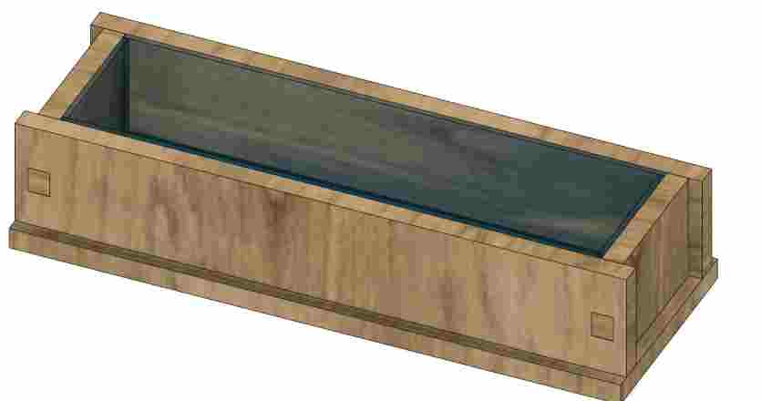

### Bottom Casing

I planned on holding the stepper motor in the back, and to hold the bars necessary, I decided to 3D print a base. I left a little wiggle room. I didn't make any connections, for I planned on making the base removable to have easier access to the electronics, but if this turned out bad I could always use some glue in non visible spots. I grabbed the bars that I was provided with during machine design and extruded them out. The base was built around that. 

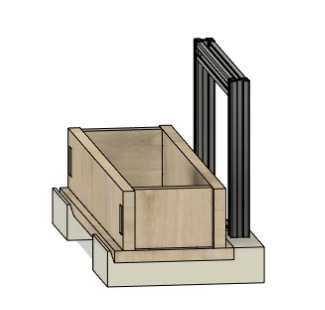

### Circular Holders

From my research, I knew that the roots were meant to gain nutrients from the water. The size of the roots vary, but the rockwool cubes do not. Also, I had to maintain a single rockwool cube. I knew that to save space, I could plant more than one seed in each cube, and that is always an option, but the size must remain the same. 

Keeping this in mind, I first sketched out a circle. I orginally was going to press fit with some additional screws, but I quickly realized that acrylic is pretty fragile, and I wanted to avoid cracks when mounting the plants. I navigated to the front view and created a tangent between the circle and the box. I did also realize that the water level could vary, but to keep a high amount of nutrient, filling the container almost to the top would be better. 

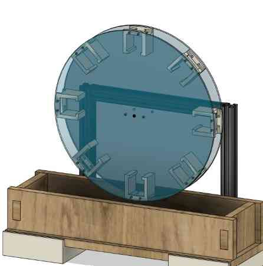

I added some appearance to make it look nice. 

Also, since this was an edit to how it would be attatched, I had to resize the back holding frame. 

### Cube Holder Design

I reference the circlles to match up the sizing of what I needed. The cubes I bought were 1 inch by 1 inch, so I also sized it around that. I matched it up with screw holed, created a holder at the top so it wouldn't fall while the plants are rotating, and also gave leeway so that the roots could move around. I wanted it tight but ont too squeezing, or else it would mess up the strucutre of the cubes. I learned myself they are also extremely breakable. 

I used the circular pattern tool to create eight of them around, matched up to the shape of the circle. This would help me plan out the assembly process by giving me a visual look. 

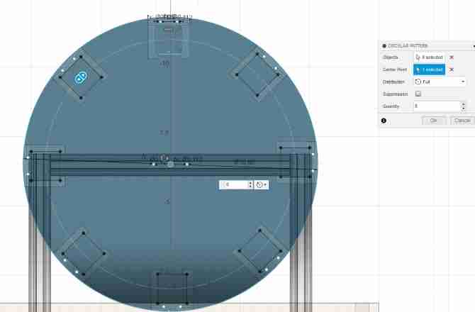

### Assembly of Motor and wheels

Finally, I created the holders of the motor and what would screw onto the circles. This way, the circles would spin with the motion of the motor. 

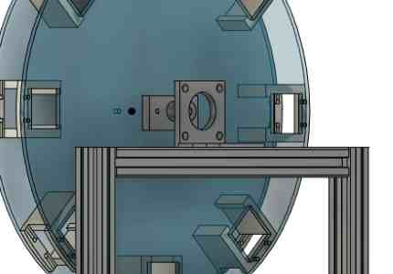

This process required special measurments with the caliper so that they would match up in the end.

### CAD Render

<iframe width="100%" height="400" src="https://a360.co/42qajk7"></iframe>

[Final Project Design Fusion 360 File](../files/FinalProject%20Files/Hydroponic%20Final%20Thing%20CAD%20v15.zip)

## Assembly Testing

I first tested out at home the sizing of the cube holder. I set the infill as low for some more flexibility at the top. 

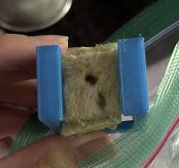

I attatched the cube, and it fit perfectly!

I then printed out the rest on two different printers to save time.
I decreased the number of paramteres since I felt it was unnecessary in Prusa Slicer which I had learned how to do during 3D Printing Week. The 3D print proved to be strong enough. 

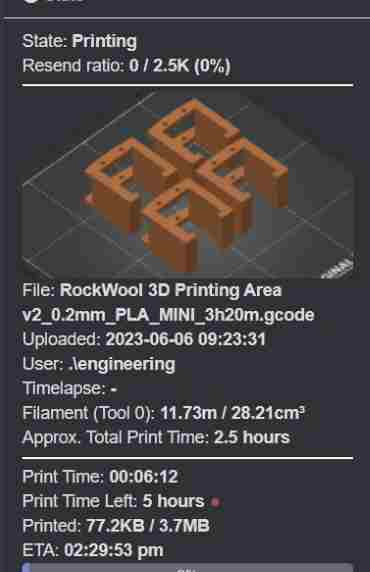
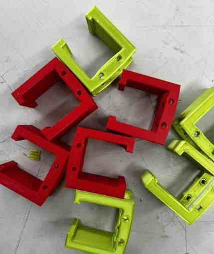

I attatched it to a test laser cut I performed. 

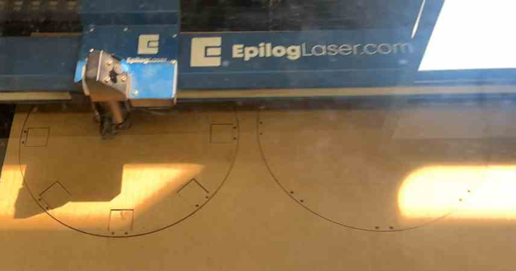

The scres tightened it, and it fit weel. I realized that on acrylic, the screws might bind more so in my CAD design, I changed the user parameter `screws` which I had created to a slight increase. Without paramters, this process would have taken 10 minutes compared to two seconds. 


## Electronics / Programming

Before production, I found it easier to test some things on a breadboard so I could easily rewire or move things around, since I was using things I wasn't quite familar with such as the EC sensor. Also, I decided to embed a Raspberry Pi Pico W rather than an ATTiny or the XIAO board, for a future goal I had was to create a wireless web-based interface for the garden hosted on the Pi Pico W. 

### Inputs/Outputs

#### Temp/Humidity Sensor

One obvious sensor needed for a garden, and one I saw basically every garden projeect use was the Temp/humidity Sensor. These are healpful readings that help the user in knowing how to manage a garden. When choosing a sensor(I had done this during Input Week though my project wasn't quite the same back then), I origianlly planned on using the DHT11 sensor, an easily usable temp/humidity sensor that was widely available in our lab. However, in attemting to learn during the assingments, our lab had resorted to using I2C sensors to learn and incorporate knowledge on I2C. Because of this, I ended up using the DHT20. Though it isn't as accurate as the DHT22, which was also another I had thought of using, it was more accurate than the DHT11. Since we had it in the lab, I decided it was best if I just use it. 

I did a little bit of research, and I came to realize it was mostly the same as the DHT 11, the only difference being the library. Similar to the OLED, the library that this [website](https://wiki.dfrobot.com/Gravity_I2C_Temperature_Humidity_Sensor_DHT20_SKU_SEN0497) recommended to use had i2c implemented, so rather than using `wire.begin`, I just had to do `dht20.begin`. First, I simple wired the DHT20 alone to the XIAO RP2040, and uploaded the basic read code provided by the same website. 

```
#include <DFRobot_DHT20.h>
/*!
 * @brief Construct the function
 * @param pWire IC bus pointer object and construction device, can both pass or not pass parameters, Wire in default.
 * @param address Chip IIC address, 0x38 in default.
 */
DFRobot_DHT20 dht20;
void setup(){

  Serial.begin(115200);
  while(dht20.begin()){
    Serial.println("Initialize sensor failed");
    delay(1000);
  }
}

void loop(){
 
  Serial.print("temperature:"); Serial.print(dht20.getTemperature());Serial.print("C");
  //Get relative humidity
  Serial.print("  humidity:"); Serial.print(dht20.getHumidity()*100);Serial.println(" %RH");

  delay(1000);
}
```

I got readings!

I milled a board for this during inputs week, but since I was moving to the Pico W, I ended up not using the other board. Also, it was unnecessary to set up a communication bus. 

#### OLED

Once I had the sensor readings, I revisited Input Week once more to remember how to display the values on the OLED. I was able to remember that using the library, I called upon each I2C address, and then I could update readings in the `Void Loop`. The code ended up being altered a little bit since I was on the Pi Pico. (I used a normal Pico for testing on breadboard to avoid soldering the Pico W) I ran into some trouble with the I2C bus on the Pico. I knew that there was a way to set the I2c bus since the RP2040 has two of them. Referncing the pinout and some online research on the I2C buses on the pico, I was eventually able to ifigure out the setting of the OLEd pins and the addresses. Here is the code I ran to communicate the temp/hudmidity values to the OLED. Also, I orignally planned on communicating these values from another microcontroller and communicated it with Serial data, but I eventually got rid of this in moving to the Pico. 

```
#include <DFRobot_DHT20.h>
#include <Wire.h>
#include <Adafruit_GFX.h>
#include <Adafruit_SSD1306.h>
#define OLED_ADDR 0x3C  
#define OLED_SDA 4     
#define OLED_SCL 5      
#define OLED_RST 16     
Adafruit_SSD1306 display(OLED_RST);
DFRobot_DHT20 dht20;

void setup() {
  Serial.begin(115200);
  display.begin(SSD1306_SWITCHCAPVCC, OLED_ADDR);
  display.clearDisplay();
  display.setTextColor(WHITE);
  display.setTextSize(1);
  display.setCursor(0, 0);

  while (dht20.begin()) {
    Serial.println("Initialize sensor failed");
    delay(1000);
  }
}

void loop() {
  float temperature = dht20.getTemperature();
  float humidity = dht20.getHumidity() * 100;

  Serial.print("Temperature: ");
  Serial.print(temperature);
  Serial.print("°C");

  Serial.print("  Humidity: ");
  Serial.print(humidity);
  Serial.println("%RH");
  display.clearDisplay();
  display.setCursor(0, 0);
  display.print("Temperature: ");
  display.print(temperature);
  display.println(" C");
  display.print("Humidity: ");
  display.print(humidity);
  display.println(" %RH");
  display.display();

  delay(1000);
}
```

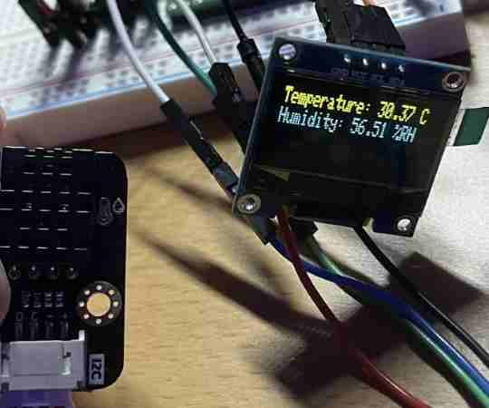

#### Electrical Conductivity TDS Sensor

TDS stands for Total Dissolved Solids. This type of sensor is often used in a hydroponics system to display the total nutrient solution in the water, which allows the user to add more nutrients if necessary for the plants. 

I had to reference [this website](https://randomnerdtutorials.com/arduino-tds-water-quality-sensor/) for a beginning spot on the code. It used an analog pin on the microcontroller, parsing the voltage levels in an average to display the ppm, which is what measures the water quality. Referencing the pinout once more, I connected it to ADC2 of the Pico, since this would allow me to take tha analog values and parse them.

I took the example code given and uploaded to see if it worked. It was successful. However, from here, I ran into some frustrations. There was not much great documentation on the sensor. I found one other website that used a certain library for the code, but that ended up being a dead end, for I continuouslly got an overflow reading. i found one website that used micropython, but being so deep into Arduino already, I didn't think it was smart to restart the code. The micropyton code also ended up being a rabbit hole anyways. Therefore, I only had one code to base my code off of. However, since this code was using a timing and median formula to calculate the average, I painfully learned that it was important to not run datat alongside the sensor. In otherwords, writing code and adding in delays or extra steps messed up the median calulcations, and I was getting super inaccurate readings. This was important because there were other parts I needed, such as the temp/humidity update system. 


<video src="../../images/FP/ProbeTesting.mp4" controls="controls" style="max-width: 400px;">
</video>

*ppm values read successful, but median and parsing was messed up when other components were added*

As much as I was trying to write my own code, this struggle ended up dragging on for days. Therefore, I resorted to ChatGPT for help. I didn't expect much, but somehow, ChatGPT was able to alter the code so that the two systems and timings were isolated! This was pretty surprising due to the frustratios I have been having with ChatGPT for the past few weeks. I decided to trust ChatGPT a little more again. 

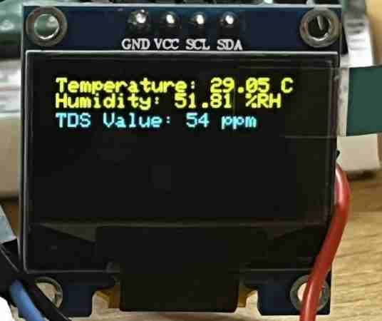

*All values updating correctly!*

Now that I had the correct system functioning, and having all readings displayed on the OLED, I ended up adding some bitmaps to display if the values were reading certain things. I had already done some research on hydroponics, but I decided to do a little more to make sure to get optimal values. I found this [website](https://growace.com/blogs/learning-center/ph-and-ppm-knowing-what-your-plants-are-eating-and-how-much-they-can-handle) which told me that a ppm of 700 should be good for a hydropnics system. I decided to play it safe and go around 750. I added the code to put in the function that would display a bitmap of a bottle, signifying that there is a lack of nutrients in the reservoir. 

```
      if (tdsValue < 750) {
    display.drawBitmap(0,30,NUTRIENT, 128, 64, WHITE);
  }
```

I ended up doing the same for temperature. 

```
    if (temperature < 18) {
    display.drawBitmap(40,30,COLD, 128, 64, WHITE);
  }
    display.display();
```

I played around with the positioning, and I tested out to see if it worked. The temperature in my room was well above 18 degrees celsius, so I altered the code for testing purposes to see if it would come up, and it worked!

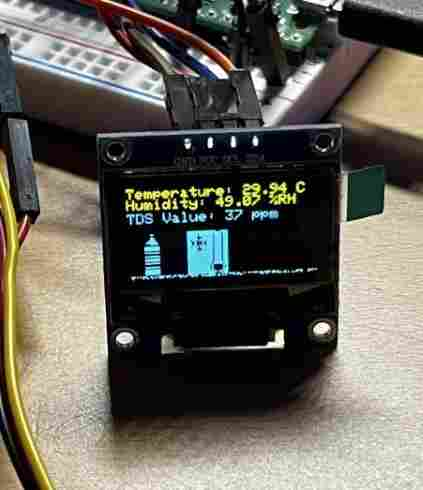

Here is the final code. 

```

// Ryan Kim, Fab Academy 2023
June 14, 2023
//


#include <Wire.h>
#include <Adafruit_GFX.h>
#include <Adafruit_SSD1306.h>
#include <Adafruit_SSD1306.h>
#include <DFRobot_DHT20.h>
#define SCREEN_WIDTH 128 
#define SCREEN_HEIGHT 64 
#define OLED_ADDR 0x3C  
#define OLED_SDA 4    
#define OLED_SCL 5      
#define OLED_RST 16
#define TdsSensorPin 28
#define VREF 5.0         
#define SCOUNT  30          

int analogBuffer[SCOUNT];     
int analogBufferTemp[SCOUNT];
int analogBufferIndex = 0;
int copyIndex = 0;
float averageVoltage = 0;
float tdsValue = 0;
float temperature = 16;     

unsigned long analogSampleTimepoint = 0;
unsigned long printTimepoint = 0;

Adafruit_SSD1306 display(SCREEN_WIDTH, SCREEN_HEIGHT, &Wire, -1);
DFRobot_DHT20 dht20;

const unsigned char NUTRIENT [] PROGMEM = {
BITMAP1
};

const unsigned char COLD [] PROGMEM = {
BITMAP2
};
int getMedianNum(int bArray[], int iFilterLen){
  int bTab[iFilterLen];
  for (byte i = 0; i < iFilterLen; i++)
    bTab[i] = bArray[i];
  
  int i, j, bTemp;
  for (j = 0; j < iFilterLen - 1; j++) {
    for (i = 0; i < iFilterLen - j - 1; i++) {
      if (bTab[i] > bTab[i + 1]) {
        bTemp = bTab[i];
        bTab[i] = bTab[i + 1];
        bTab[i + 1] = bTemp;
      }
    }
  }
  if ((iFilterLen & 1) > 0){
    bTemp = bTab[(iFilterLen - 1) / 2];
  }
  else {
    bTemp = (bTab[iFilterLen / 2] + bTab[iFilterLen / 2 - 1]) / 2;
  }
  return bTemp;
}

void setup(){
  Serial.begin(115200);
  pinMode(TdsSensorPin, INPUT);
  display.begin(SSD1306_SWITCHCAPVCC, OLED_ADDR);
  display.clearDisplay();
  display.setTextColor(WHITE);
  display.setTextSize(1);
  display.setCursor(0, 0);

    while (dht20.begin()) {
    Serial.println("Initialize sensor failed");
    }
}

void loop(){
  if (millis() - analogSampleTimepoint > 40U) {
    analogSampleTimepoint = millis();
    analogBuffer[analogBufferIndex] = analogRead(TdsSensorPin);
    analogBufferIndex++;
    if (analogBufferIndex == SCOUNT) {
      analogBufferIndex = 0;
    }
  }   
 
  if (millis() - printTimepoint > 800U) {
    printTimepoint = millis();
    for (copyIndex = 0; copyIndex < SCOUNT; copyIndex++) {
      analogBufferTemp[copyIndex] = analogBuffer[copyIndex];
    }
    averageVoltage = getMedianNum(analogBufferTemp, SCOUNT) * (float)VREF / 1024.0;

    fFinalResult(25^C) = fFinalResult(current) / (1.0 + 0.02 * (fTP - 25.0))
    float compensationCoefficient = 1.0 + 0.02 * (temperature - 25.0);
    float compensationVoltage = averageVoltage / compensationCoefficient;
    float temperature = dht20.getTemperature();
    float humidity = dht20.getHumidity() * 100;
    tdsValue = (133.42 * compensationVoltage * compensationVoltage * compensationVoltage - 255.86 * compensationVoltage * compensationVoltage + 857.39 * compensationVoltage) * 0.5;
    display.clearDisplay();
    display.setCursor(0, 0);
    display.print("Temperature: ");
    display.print(temperature);
    display.println(" C");
    display.print("Humidity: ");
    display.print(humidity);
    display.println(" %RH");
    display.print("TDS Value: ");
    display.print(tdsValue, 0);
    display.println(" ppm");
      if (tdsValue < 800) {
    display.drawBitmap(0,30,NUTRIENT, 128, 64, WHITE);
  }
    if (temperature < 18) {
    display.drawBitmap(40,30,COLD, 128, 64, WHITE);
  }
    display.display();
  }
}
```
I didn't include the bitmaps because it took up too much room, but they can be found in the code file. To get the bitmaps, I navigated back to this [online tool](https://javl.github.io/image2cpp/) I found during Outputs week. 

[Code Files](../files/FinalProject%20Files/FinalCODEfiles.zip)

#### Stepper Motor/ Grow Lights

While testing at home, I did not yet have the grow lights so I couldn't test them out, but I knew I would be using a MOSFET to trigger them, since from the amazon link, I learned that they took 12 volts, meaning I could wire it directly to the main power source, along with Ground. When wiring up the setup for the motor and the light timing system, I decided to use a separate XIAO board, since I didn't need as many pins. Also, I wanted to minimize interfering with what I already had on the Pico. It is possible that I oculd wire everything up to the Pico, due to its great processing power and logic, but I didn't want to run into more trouble with the sensors. Finally, knowing I might want to add IOT features in the future, I figured it would be simplest if I minimized the code running on it, as well as space for additional sensors I might add, such as a PH sensor. 

Luckily, during both Outputs and Machine Design Week, I had plenty of experience with wiring up the motor. However, when I first tested it, I ran a simple turn and stop code, but it was drawing more than 2 amps, and the motor driver was burning up. This is because I didn't set the pins idle, meaning setting the pins LOW during rest. This reduced the loud noise of the rotors, along with reducing the current flow. 

I am using an l298N motor driver, for I only need one motor. 

I simulated the grow lights with an LED and a resistor. I initally had some trouble due to a mixup of the drain and source, but looking at some videos online I was eventually able to wire the mosfet correctly. 

When I first hooked up the two devices, I met success. However, I realized one problem. The code I was running would toggle the mosfet at the interval I set it to, but while that went on, the motor would not spin at all due to the delay functions. However, the delay functions were necessary due to the current draw of the motor, along with giving the light a timing system to follow. Therefore, I had to alter the code so that it followeed an interval in which the timing ran at. The loop looked like this. 

```
void loop() {
  unsigned long currentMillis = millis();
  if (currentMillis - motorTimer >= motorInterval) {
    motorTimer = currentMillis;
    myStepper.step(stepsPerRevolution);
    setStepperIdle();
  }
  if (currentMillis - lightTimer >= lightInterval) {
    lightTimer = currentMillis;
    toggleLights();
  }
}
```
 the Toggle lights function was defined separately. In this way, the motor and mosfet timing was isolated, and therefore they could run at the same time. the timing could be altered in the code, so when I made the finishing product, the mosfet would be toggle every 12 hours or so to simulate daylight. 

<video src="../../images/FP/TimingWorking.mp4" controls="controls" style="max-width: 400px;">
</video>

 Finally, I added an input button to the system so that it wuld change the motor speed in steps. This was necessary to the project itself because from my research I learned that the cycle and schedule of the water and oxygen needed for different plants differed. Therefore, the total speed of the spinning needed to be changed if necessary. Due to this, I was prompted to add the following. 

```
 void changeSpeed() {
  currentSpeed = (currentSpeed % numSpeeds) + 1;
  switch (currentSpeed) {
    case 1:
      myStepper.setSpeed(300);
      break;
    case 2:
      myStepper.setSpeed(400);
      break;
    case 3:
      myStepper.setSpeed(460);
      break;
  }
}
```

This would change the speed to whatever I set it whenever the button was pressed, running through each case and if the value is true, it changes to the next case. this wasn't the final code, but this is the outline of what the system looked like. The final number of cases and set speeds can be found in the code file. Here is the code I ran along with a video showing the basic function. 

```
#include <Stepper.h>

const int stepsPerRevolution = 50;
Stepper myStepper(stepsPerRevolution, 26, 27, 28, 29);

unsigned long motorTimer = 0;
const unsigned long motorInterval = 2000; 

unsigned long lightTimer = 0;
const unsigned long lightInterval = 3000;  

bool lightState = false;
int currentSpeed = 1;
const int numSpeeds = 3;
const int buttonPin = 2;
bool buttonPressed = false;
bool buttonState = false;
bool lastButtonState = false;
unsigned long lastDebounceTime = 0;

void setup() {
  myStepper.setSpeed(300);
  pinMode(6, OUTPUT);
  pinMode(buttonPin, INPUT); 
}

void setStepperIdle() {
  digitalWrite(26, LOW);
  digitalWrite(27, LOW);
  digitalWrite(28, LOW);
  digitalWrite(29, LOW);
}

void toggleLights() {
  if (lightState) {
    digitalWrite(6, LOW); 
    lightState = false;
  } else {
    digitalWrite(6, HIGH);
    lightState = true;
  }
}

void changeSpeed() {
  currentSpeed = (currentSpeed % numSpeeds) + 1; 
  switch (currentSpeed) {
    case 1:
      myStepper.setSpeed(300);
      break;
    case 2:
      myStepper.setSpeed(400);
      break;
    case 3:
      myStepper.setSpeed(460);
      break;
  }
}

void loop() {
  unsigned long currentMillis = millis();
  if (currentMillis - motorTimer >= motorInterval) {
    motorTimer = currentMillis;
    myStepper.step(stepsPerRevolution);
    setStepperIdle();
  }
  if (currentMillis - lightTimer >= lightInterval) {
    lightTimer = currentMillis;
    toggleLights();
  }
  buttonState = digitalRead(buttonPin);

  if (buttonState != lastButtonState) {
    if (buttonState == HIGH && millis() - lastDebounceTime > 200) {
      buttonPressed = true;
      lastDebounceTime = millis();
    }
  }
  lastButtonState = buttonState;
  if (buttonPressed) {
    buttonPressed = false;
    changeSpeed();
  }
}
```

#### Duty Cycle Testing

The point of my final project was to spin the plants into and out of the nutrients on a timed manner, and I realized I didn't want to just make the motor spin. In my research on this project, I realized the duty cycle of the spinning effects the plants. The most professional ones spin a motor and make it spin  1 time in 24 hours. Mine is obviously much smaller, and frankly the stepper motor I am using does not have the ability to spin that slowly constantly, or at least not without making lots of loud noise and burning up the motor driver. (It draws more power the slower the motor goes) Therefore, I took an alternative to this. I wanted to implement so that each cube submerged the roots for one second, then it rotated to the next. This way, I could make the motor move faster but in shorter intervals, giving the driver more idle time, reducing the amouunt of power consumed along with the heat on the motor driver. 

I uploaded the basic stepper motor code and began playing around with the speed. At first, I played around with the `  myStepper.setSpeed(300);` part of the code reducing it to around 40. However, this cause an insane amount of noise of the rotors in the motor, and drew almost up to 3 amps constantly, burning the motor driver up. I tried reducing the amount of steps, but this still made the motor driver hotter than what is safe. I tried playing with a different example code in general, but this didn't spin my motor at all. 

Struggling to fix this, [Stuart](https://fabacademy.org/2023/labs/charlotte/students/stuart-christhilf/FinalProject/) came over to help me, since he was implementing stepper motors in his project as well. He told me that I didn't have to change the speed that much, but I could simple change the steps direclty in the `.step` function. I changed the steps from 200 to 40 at 60 rpm, with half a second of rest, and too my happiness, it turned slowly but surely without overheating the driver. However, it still jolted nd made an excess amount of vibration, since we were spinning it fast for a short amount of time. However, this wasn't a problem because I could edit the rest time to a lot, but make it step little, so that it fit the duty cycle I wanted it to fit. This process was simply trial and error, finding the right amount of rest and steps so that it rotated to one plant each time. At first, I thought I could just calculate the amount of steps and divide it by eight, but this didn't work because the motor was moving fast, so even after it went idle, the wheel still slightly moved from its position. I reduced the speed to arouund 250, modified the steps, and eventually got a pretty consistent cycle. 

Once I had the right amount, I played around with some other cycles, such as trning it almost half but then resting for ten seconds. I decided to implement a button to change between these two duty cycles. If I want to add more, I can always add another one in the code and run a `case` system where it goes through each one. For now, I left it at these two cycles since I liked it the best. 

Here is the modified code in Arduino:

```
// Ryan Kim, Fab Academy 2023
June 14, 2023
//


#include <Stepper.h>
const int stepsPerRevolution = 200;
Stepper myStepper(stepsPerRevolution, 26, 27, 28, 29);
const int buttonPin = 2;
int buttonState = HIGH;
int previousButtonState = HIGH;

enum StepperMode {
  MODE_1,
  MODE_2
};

StepperMode currentMode = MODE_1;

// Control pin 6 timing variables
const unsigned long pin6OnTime = 43200000;  
const unsigned long pin6OffTime = 43200000; 
unsigned long pin6PreviousTime = 0;     

void setup() {

  pinMode(buttonPin, INPUT);

  myStepper.setSpeed(20);

  pinMode(6, OUTPUT);
}

void setStepperIdle() {
  digitalWrite(26, LOW);
  digitalWrite(27, LOW);
  digitalWrite(28, LOW);
  digitalWrite(29, LOW);
}

void loop() {
  buttonState = digitalRead(buttonPin);

  if (buttonState != previousButtonState) {
    if (buttonState == LOW) {
      if (currentMode == MODE_1) {
        currentMode = MODE_2;
      } else {
        currentMode = MODE_1;
      }
    }
    delay(50);
  }

  previousButtonState = buttonState;

  switch (currentMode) {
    case MODE_1:
      myStepper.step(100);
      setStepperIdle();
      delay(10000);
      break;
    case MODE_2:
      myStepper.step(15);
      setStepperIdle();
      delay(1600);
      break;
  }

  unsigned long currentTime = millis();
  if (currentTime - pin6PreviousTime >= pin6OnTime + pin6OffTime) {
    pin6PreviousTime = currentTime;
  }

  // Check if pin 6 should be ON
  if (currentTime - pin6PreviousTime < pin6OnTime) {
    digitalWrite(6, HIGH);
  } else {
    digitalWrite(6, LOW);
  }
}

```

I embedded the light timing as well, as seen in the HIGH and LOW of pin 6 connected to the MOSFET. 

Here are examples of me testing the spin system. 

<video src="../../images/FP/CYCLEtest1.mp4" controls="controls" style="max-width: 400px;">
</video>

<video src="../../images/FP/CYCLEtest2.mp4" controls="controls" style="max-width: 400px;">
</video>

### Board Design/ PCB Fabrication

[Adam Stone](https://fabacademy.org/2023/labs/charlotte/students/adam-stone/) shared a github link to the Raspberry Pi Pico footprint for Eagle/Fusion 360. I referenced my Electronics Design week to remember how to import libraries, since I hadn't done it in a while. Every other component I needed was already in use with the other libraries, so I opened up Fusion 360, creating three different schematic designs. 

#### Sensor/Embedded Pico W Board

I first started off with a board containing access for the OLED, DHT20, and TDS Meter. With a breadboard, I had tested with the 5v regulator that the TDS meter will read inaccurate readings unless sharing a common power with the microcontroller. I am not too sure why this is, since when I probed the output of the regulator, it was set at exactly 5 volts. My best guess is since it is using the analog values, it must be referenced by the voltage set by the Pico W, since I had included a code line that set the voltage regulation. 

I included a voltage regulator on the Pico board itself so it would be easier to navigate the power and ground lines. I created two breakouts to the i2c bus, since I could just use the same bus. I had attempted to use the different buses of the Pico, but this ended up not working out well. Instead I just used the libraries to call the address, and it worked fine. I was able to minimize to one jumper 0 ohm resistor. I also added a smoothing capacitor between the set power lines, so that the excess voltage or lack of voltage might not cause any funny voltage spikes. I created a 3 pin header for extra ground along with RX and TX pins just in case I want to incoporate anything else in the future, then created a breakout to the analog pin so that the TDS meter could be controleld directly. I also connected the power of the TDS meter to the power of the pico to share a common power and ground. It was vital that when I created the breakout for the power input, that I share a common ground between everything. 

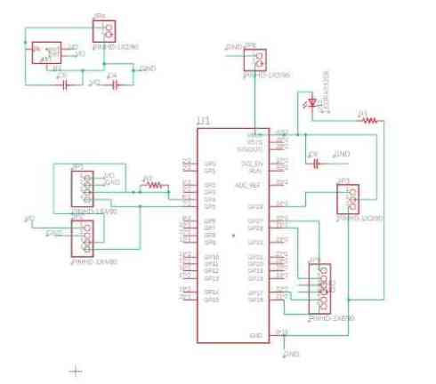

I shrunk the profile down as much as I could then pushed it to a 3D model. I imported the design into my CAD week to create a box for it later. 

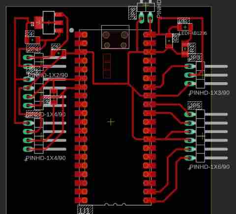

I exported the gerber file, using Top Copper and Profile. I set the trace width to around 20 mm, and the clearance to a low 0.2 mm. This was lower than what I usually used, bu with the current, I figured it was best to play it safe. 

Here is a video of the production process. Since the Pico W has some debugging feature along with extra traces on the back, I used tape to isolate any electrical connections that might mess up the voltage or ground. 

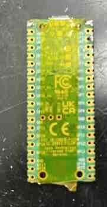

<video src="../../images/FP/Milling.mp4" controls="controls" style="max-width: 400px;">
</video>

When I had it all assembled finally, I painfully realized that the EC sensor was not reading properly, for it was flucutating between 200 and 205 ppm randomly with it probing nothing. At first, I thought it was an error with the power connection since it runs off a voltage threshold. However, when I unplugged the sensor, the OLED would display 200 ppm still. I knew this was odd because when testing with a breadboard, I had realized that if I unplugged with the power or the signal line, it would move up to weird values, since it was taking in no analog signal. This prompeted me to look at the connection of the signal line. At first, I thought it was an error with the ground line, and that it asn't propery connected, so I hardwired a wire between the two ground pins, and I thought I fixed it, but now the value wasn't changing at all. It turns out I had read the pinout wrong, and the signal pin was originally right, but I had just flipped the three wires. This worked, and I read accurate readings once more when testing with lemon juice. 

[Board File](../files/FinalProject%20Files/PicoBoard.zip)

#### Motor/Light Board

The motor needed a 4 pin channel to the I/O pins of the XIAO to properly function the H-Bridge, which I learned how to function during Machine Week. I first embedded the XIAO and the 4 pin header to the pins I had coded it to be. The motor could be powered directly from the power board, so the only power input I included was for the XIAO and the lights. Due to the XIAOs high processing power, I was able to incorporate the timing circuit inside the XIAO itself. I brought in a MOSFET along with a pull up resistor between the source and the drain, so the logic level was stable. I created a 3 pin header for the power input of 12 volts for the lights, a power line for the light itself, and the ground, which would be connected ot the MOSFET for the timing circuit. I added another capcitor, since the voltage regulation might cause a voltage spike, since there are multiple of them connected in parallel. 

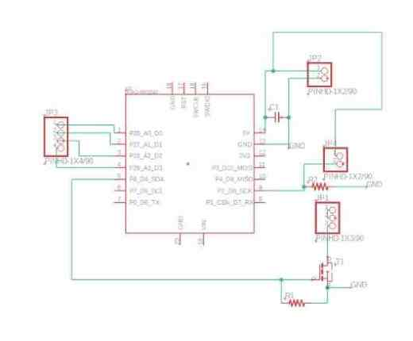

I exported the file into the Bantam Tools. It promted me to use a PCB engraving bit, for there was a tight spot with the edge of the profile along with the mosfet.

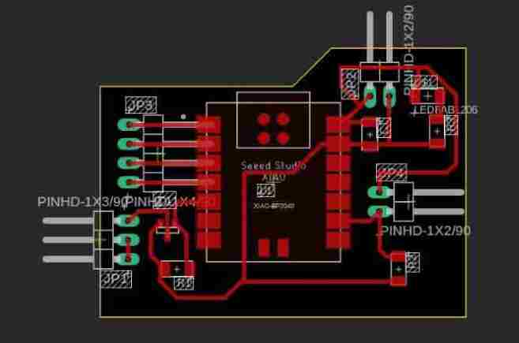

I milled the board with this outcome. The continutiy checked out fine, but since I had designed this before returning to the lab, I realized an annoying error, in which I had chosen the wrong mosfet footprint. Luckily, when I changed this in the schematic, the labels of the pinout stayed the same, and Eagle points out where evrything is connected in the footprints, so the rewiring wasn't too hard. I had to circle the ground line a little bit. 

I then milled the board a second time:

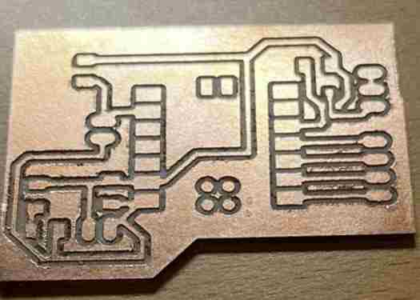

Everything seemed to be fine, but then I ran into some issues. I soldered everything on, but when I went to test it out with the motor, the breakout to the 4 pin header ran into an error. The motor itself was making a loud noise, but it didn't turn. I proved the 12 volt, and the power seemed to be fine, so I knew it was an error in the logic connection. I checked to see, and there was continuity between the 4 pins. I tried to scrape off and see how. The solder was isolated, and no matter how much I scraped off the copper traces, there was still continuity. Therefore, I decided I must have soldered on the XIAO wrong. Unfortunately, unsoldering the XIAO is a painful process, and in doing so, I ripped off the copper traces. 

I milled a third time. 

This time, I checked to see the continuity, and everything turned out great. I soldered on the XIAO, but when I plugged it in for the programming process, it wouldn't turn on. I checked continuity again, but noticed no errors. I figured that this was an error in the wiring or connection of power and ground, for when I unsoldered it and plugged it in, it turned on. This might have been the most frustrating part of the process yet, because I ripped another trace. 

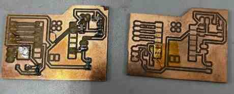

*Failed Boards*

On the fourth mill, I realized I was using some dying bits, so I replaced the 1/64 with a better one. The milling process went smoothely, and since I practically knew by heart where all the components went, I was able to solder quickly. However, I made sure to test continuity and voltage every time I soldered to make sure there were no odd connections or flakes. 

I crossed my fingers and plugged in the USB, and the XIAO turned on, which was relieving. I uploaded the code, and the timing light worked fine, but the motor was again making loud noises. There was no continuity in the board, and I made sure I had proper soldering. I sat there trying to figure out the code, and everything was correct. In total frustration I simply decided to try replacing the motor driver completely, and it worked! This was super relieving yet frustrating, knowing that the problem didn't lie in my board but the motor driver. The new motor driver provided smooth connections and signals to the motor, and it turned cleanly. 

[Board File](../files/FinalProject%20Files/MOTOboard.zip)

#### Power Board

For the power board, taking Aaron Logan's advice in his documentation, I connected the power lines in parallel isolated, so that I might avoid even a minute voltage drop. I had one voltage reagulator already soldered onto the Pico Board, so I just made a breakout from the 12 volt and grouund line to a 2 pin header for the power connction. I went thorugh and checked whate else was left. The XIAO would need an input of 5 volts for its logic along with a 12 volt for the grow light to turn on. Also, the motor driver could run off 12 volts for optimal performance. I created a breakout for this, with a common ground connection. Finally, i used two voltage regulators, one for the XIAO and one for the Pico. 

I milled this out with a 1/64 and 1/32 inch bit. 

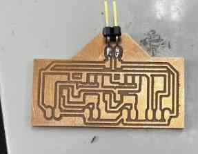
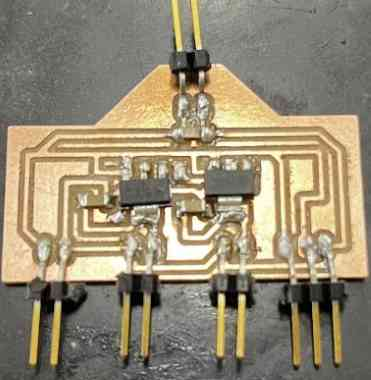

I soldered on the necessary components. I plugged in 12 volts with a male to female, and touched the regulators. They didn't seem to turn hot. I probed the output of the regulators connected, and each outputed 5 volts!

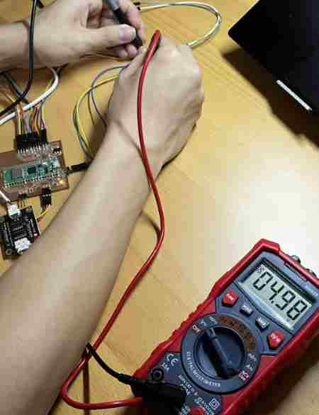

The 12 volt line provided a solid 12 volts. I found it better to use the capacitors for both the input and output power breakouts. 

With the motor board having failed, and I was at my hosue, I decided to take the time to test if the power breakout could power the Pico board. I flashed the code onto the Pico. I originally ran into an error with the sensor readings not displaying on the OLED. I had flipped the SDA and SCL. However, it still didn't work. I tested for solder bridges or error connections, but everythng seemed fine. I soon came to the realization that the DHT 20 must be powered when everything is booted into the Pico, or else the values don;t show up at all for some reason. Since I was powering USB for testing, I connected the Pico power input line to a breadboard and just used a breadboard to power everything and see if the board itself worked. When I tried this, everything showed up!

Now that I had the code working, I wired everything up to the power breakout. I double checked to make sure ground was connected correcty. I plugged in the barrel jack adapter everything functioned beautifully. 

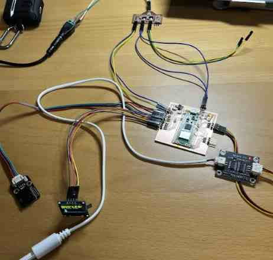

Once I had the motor board fixed, I hooked the system up, and here is the outcome

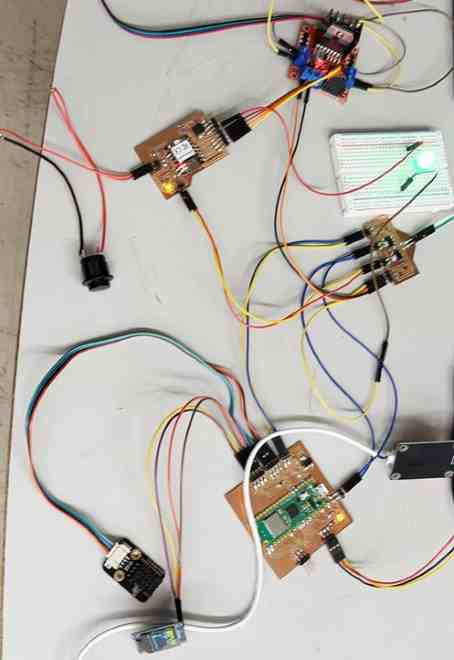

*Final Electronics Working on Boards*

[Board File](../files/FinalProject%20Files/PowerBreakoutBoard.zip)


### Electronics Integration Plan

Since I needed a spot to display my OLED, as well as a button, I decided to design the bottom casing. My original plan was to laser cut the system integration box, but I decided that with 3D printing, it would be much more organized and remove the need for glue. The only downside of this was it was a huge print, and so I removed some perimeters and changed the infill to 10% to minimize used filament. In the end, I was able to shrink it from 21 hours to around 19 hours.

I started off by importing the boards into my current design. I then used the `section analysis tool` to visualize the shape. It would be connected to the back part of the aluminum extrusion with an extra screw. I liked this idea because it meant that I would have easy access to my electronics even after it is put. 

I minimized the size, but it still ended up being pretty big. I designed the squares with easy access to wiring. 

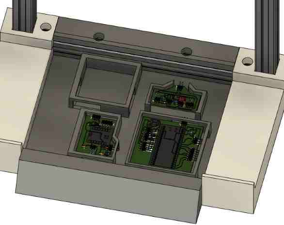

One thing I had not thought about until now was how I was going to get the wires to their necessary spots. For the boards themselves, I moved around and fixed it the best way I could, but the DHT 20 needed to be outside of the box. Therefore, I created a hole for it next to the OLED. It would have been better to put it closer to the water for more accurate humidity readings, but I figured that room temeprature and humidity would still be accurate enough. The EC probe was a little bit more tough. The design of the box had taken a long time for measurement reasons as well as constant changing to make sure the boards go where they need to. Therefore, I didn't have a spot for the probe's breakout board. I thought about gluing it to the side with a laser cut piece, but decided against it bcause this would mean I would have trouble removing the electronics when I wanted to. I finally decided on simply making a hole in the base next to it, and it would lie in there. This way, the probe could be assembled and placed into the water. 

Finally I left a little room in the back for the motor cables and lights.

## Reservoir Holder- Shopbot CNC Milling

As I mentioned while designing, I decided against using an acrylic water reservoir. However, a plastics container would look bad on its own so I decided to make a case for it that would look better. I designed a parametric press fit box. 

Only having used the big Shopbot a couple times before, I was careful in entering the process. My labmate [Griffin](https://fabacademy.org/2023/labs/charlotte/students/griffin-orsinger/) was milling something as well, which ended up being great timing, for we could mill together to save time as well as help each other just in case we make mistakes. 

I first exported the design as a drawing:

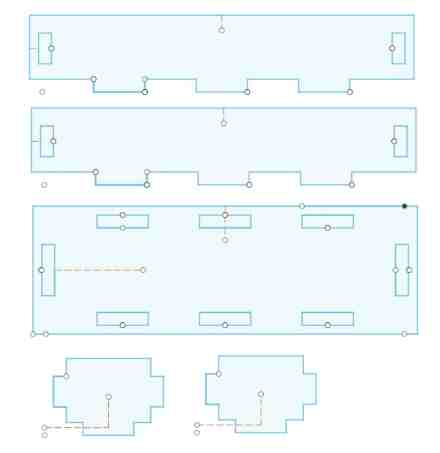

We took the measurements of the wood we were using, which turned out to be 0.46 inches, which was pretty big, since the sizing of my box was important. Also, I measured the plastic container I would be using, and edited the placement of the tabs so that the final product remained the same distance.

### Aspire

I shard the link with Griffin, and we loaded up Aspire to discuss the toolpaths we needed. I read through my documentation from Computer Controlled Machining week. This helped me remember all the steps I used in creating a 2d vector toolpath. We decided on a 1/4 inch bit for all of them. My design ended up having two toolpaths. One mistake I had made during Machining Week was deciding where the bits cut. When I had the tabs, the bit went on the inside, and when I was cutting the outline, it had to be on the outside. The entired file had 3 toolpaths, for Griffin needed a pocket toolpath for his. I remembered to close all the vectors to create the necessary steps for the Shopbot to mill. I also added dogbones to my corners, so that they could press together nicely. We set 3 passes, since the wood wasn't that thick. We saved the toolpath, but we got an error saying that it would cut through the material. We looked back over, and our zero was set in the correct X,Y, and Z place, so we were slightly confused. We then quickly realized that the start depth was not where it starts, but was instead an offset from our zero position. We had set this setting to 0.46 inches, but it was meant ot be zero. After this, we quickly ran a simulation, checked the spindle settings, and exported as an Aspire file to load into the computer connected to the Shopbot. Another necessary item we remembered was to add tabs. 

### Milling

We loaded up the file, and I read back through my Machinign documentation just in case I missed anything. Griffin had warmed up the spindle, so we loaded the wood on, and with the help of the pressurized nail gun, we set it down tightly, making sure it didn't interfere with our cut. The Aspire software gave us a nice preview. 


*Here are my parts. Below we fit Griffin's cut to save some space*

We then zeroed everything out, using the z-probing tool along with the proximity endstops. The Shopbot software has an eassy display of all these command lines. Finally, we were ready to mill. We imported all the files together, and began running a 3d offset. Here, we ran into a quick problem. The spindle suddenly began the cut in some odd place at the end. We realized we had not homed the machine. We zeroed everything out to be sure, and ran the 3d offset again. This time, it stayed in spot, and I watched it cut for a couple of minutes. I saw that it movd to the profile toolpath, and saw it was cutting correctly, I stopped the cut, this time running the actual job. I deselected 3D offset, homed the machine, and pressed the start button for the spindle. I knew from before that we had to start the bit before it cut the material. I pressed the enter key, and it smoothely began the job. 

Griffin and I took turns watching, just in case something went wrong. Luckily, the positiong and homing were all set, and everything ran smoothely. 

### PostProcessing

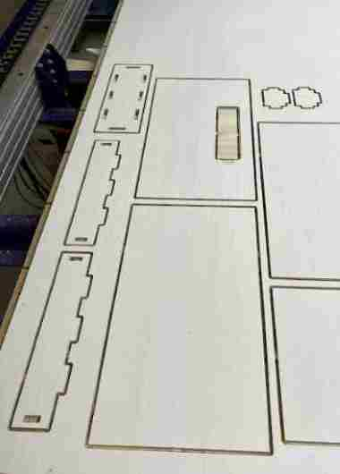

The outcome came out pretty nice, and I used the small chisel and mallet to cut the tabs off, since some of my corners with small. I realized after I had made a mistake in including tabs in the inside profile tooplath. 

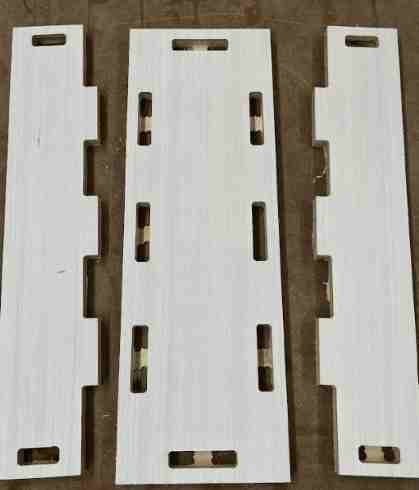

Luckily, it was nothing that the chisel couldn't fix. 

I sanded everything down from an 80 grit sandpaper all the way to 220, making sure not the ruin the shape of the press-ft tabs. I did accidentally rouund one of them, but the mallet was able to tightly fit the piece in. The walls fit perfectly and tightly, but I had some trouble with the base. For whatever reason the dogbones didn't do their jobs well on the wall, which was odd, since it looked bigger in the preview toolpath. Whatever the reason,, there was a slight curve in the wall and it barely misssed the size of the holes in the bottom. With the help of [Dylan Ferro](https://fabacademy.org/2023/labs/charlotte/students/dylan-ferro/), it eventually fit inside. I noted this as a reminder to add more clearance and double check the dog-bones next time. However, everything fit together, and with some sanding, it looked pretty nice. 

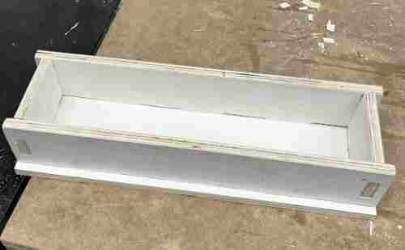

I decided to stain the wood to give it a more deep color. 

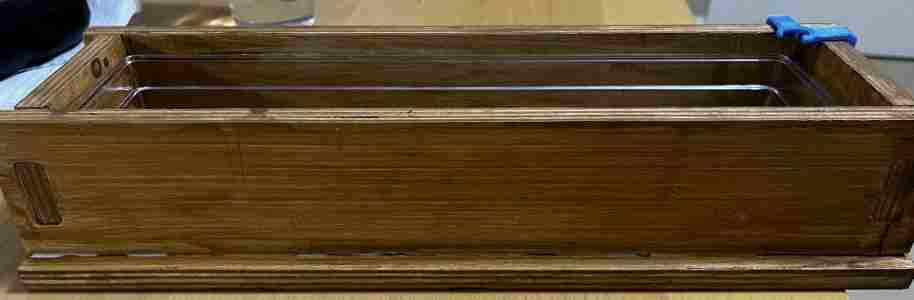

It didn't look as well as I would have liked, I didn't realize that there were certain brush strokes to avoid he streaks and weird blotches, but I fixed it up as best as I could, and I preffered it over no stain. 

[Aspire/Vector Pdf Files](../files/FinalProject%20Files/FinalProjectAspireFile.zip)

## Acrylic Circles- Laser Cutting

I tested out the circles with some cardboard, but it was time to cut with acrylic. i used acrylic because it looked nice to see the plants, and also, it is water safe. This was vital because when the pants were spinning while absorbing nutrients from the water, the wet roots wiill spill some water, and the enclosement must be water-safe. 

I had the design in Fusion 360 originally, but I used CorelDraw to add an image of a plant. I set the cuts to hairline, and traced a bitmap of a simple plant I found online. I made the holes slightly bigger to give the screws more clearance. 

I imported the Corel Draw file into the Laser Cutter, and pressed print, sending me to the job manager. I imported the preset settings for laser engraving and vectoring on 1/8 inch acrylic. I fouund a scrap piece of Acrylic and used the camera to line it up. This was a simple and easy process, removing the process of me having to set the settings. Once I had everything set, I made sure I had both rastering and vectoring option on, and I pressed send. 

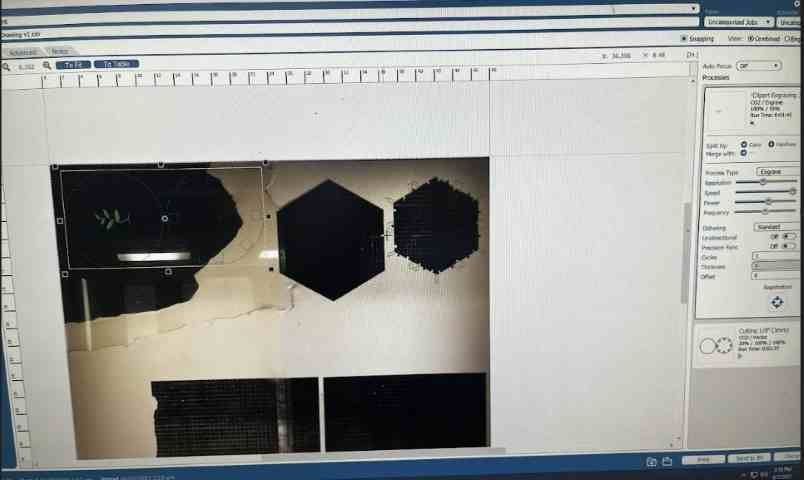

The cut went well, but after everything was finished I realized that the laser had not cut all the way through. Normally, I could just press print again, but I had slightly moved the acrylic accidentally. This was annoying, for when I tried replacing it the best I could, the holes were ever so slightly off, but I knew that it would look bad in the end. I therefore decided to recut, but I did attempt to remove the acrylic. Amazingly, I was able to remove one that had the plant on it without cracking the acrylic. Unfortunately, the other circle cracked. 

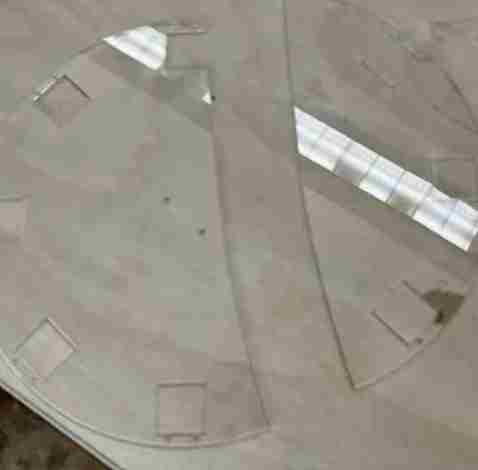

I had to cut again, but this time I just had to cut one circle, and I didn't have to engrave anything. I realized from before that I had forgotten to focus the laser! I set the vector settings, focused the laser, and recut. I checked the cut without removing it, but it cut through, so I took it out. 

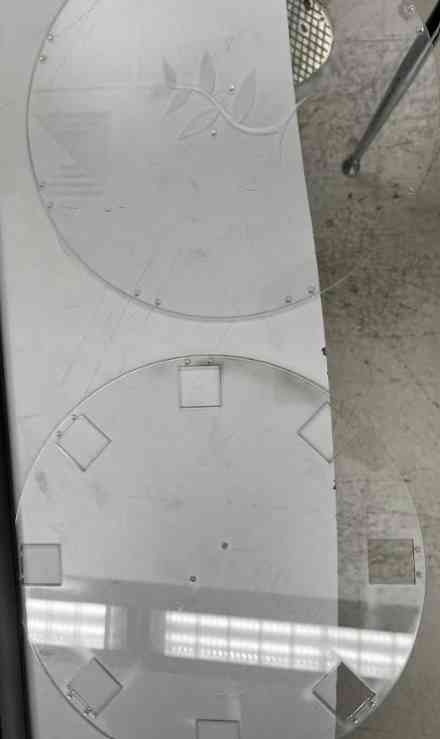

I didn't quite assmble everything yet, but I screwed the 3d printed holders to the acrylic, and everything fit nicely and looked pretty well. The screws took a while, so I only put on one side just in case I ran into problems in the final assembly. 

[Corel Draw Laser Cutting File](../files/FinalProject%20Files/Wheel_Ryan_LaserCutting.zip)

## Base, Electronics Storage, and Motor Assembly- 3D Printing

The base was too big for the Prusa Mini, so I started a print on the bigger [Prusa i3 MK3S+](https://www.prusa3d.com/category/original-prusa-i3-mk3s/). However, the 3D printer had some troubles, for it would begin the print but would shut down and display an "Emergency Stop" message. I went back into my design and split it into four parts, to speed up the process in our lab's print farm. I learned how to use the `Split Body` tool, which I could simply split and edit two different bodies. I first set an offset plane where I wanted to reference the place of the split. 

#### Electronics Storage Structure

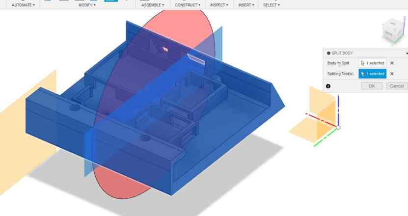

I exported each separately as an STL, and used Prusa Slicer. I swithched to `Grid` infill, since it took less time. 


#### Side Base

I printed the sides, which were used for supports. 

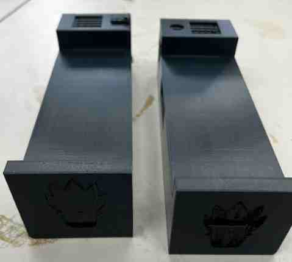

I rested the container on top to check the clearance. It fit pretty well. I could have made it slightly smaller, but I had played it safe. 

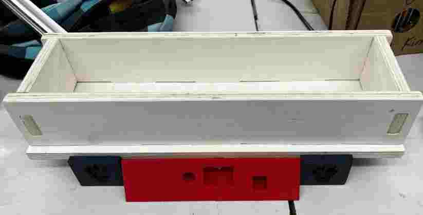

Here I tested if the screw assembly in the back would stay. 

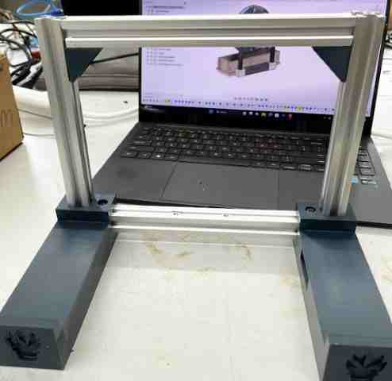

#### Motor Holder/ Assmebly Pieces

I couldn't find any online designs for the Nema 17 motor, so I took measurements and designed one. 

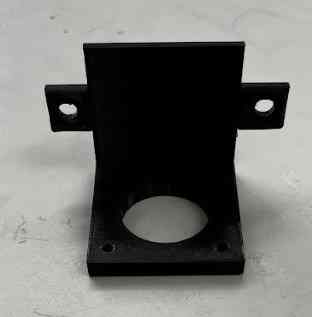

After assembling, I realized that this holder was too weak, and the motor would tilt over slightly, ausing the edge of the acrylic to scrape against my wood. I redesigned a more stable structure, which fit nicely. I had to use one extra screw however. 

Finally, I 3D printed the some assembly pieces necessary to hold the back structure in place. [Dan Stone](https://fabacademy.org/2023/labs/charlotte/students/dan-stone/) helped me find a design for these. I designed the motor piece. 

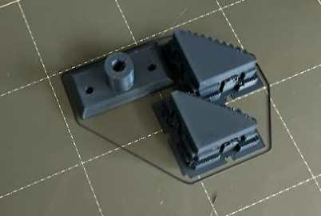

[Stl Files](../files/FinalProject%20Files/3dPrintComponents.zip)

## Electronics Management

Though I was pretty proud of my integration design, I soon realized that since I had isolated my motor and sensor board along with a power distribution board, I had a couple of more jumper wires than I would have liked. The OLED had to stand up straight, so I couldn't solder it directly on a through hole board, and the DHT 20 and the EC sensor both came with their own commericial boards. I was already using a custom H-Bridge. Therefore I ran into some trouble with the wiring. 

In getting the wires to fit in and move around, I had to unsolder and resolder some vertical headers for connections. One terrible moment was when I ripped the power input pad on my Pico breakout. I saved time by cutting some wires and soldering directly on the power and ground pad, which was an idea given by [Mrs. Dhiman](https://fabacademy.org/2022/labs/charlotte/students/nidhie-dhiman/). 

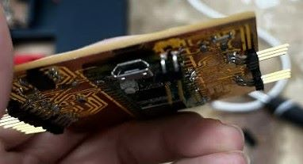

*Ripped pad*

Though it took a while, I eventually got all the boards in. One of my measurements was off, so I used the bandsaw to cut off a slight bit where the wires fit through. It is not a good idea to use the bandsaw with filament, but mine had a clearance of 1 cm, so I figured it would be fine. 

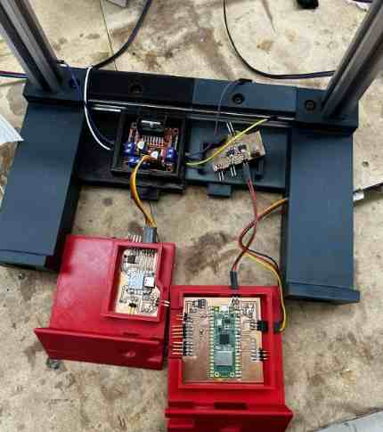
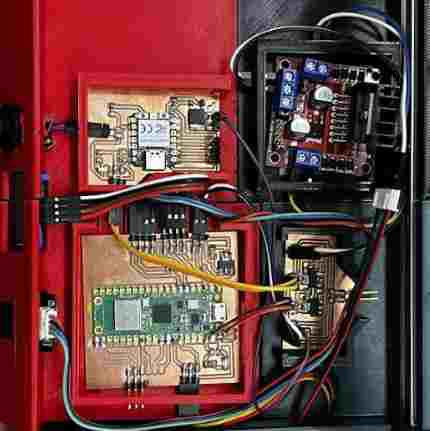

I didn't really like how I wired, so I rearranged some. I realized that the vertical distribution from the power board was making it look bad, but everything else was organized. I also saw where the power was distributed, which was a huge help when testing without frying any components. 

I was reccommended to cove the electronics, for though I already have many layers of protection, there could be an accident where the wheel or something else falls off causing a splill in water into the electronics storage box. Also, the front part had a tiny gap so I wanted to cover that as well. I designed a case to fit inside, but I left a gap near the motor driver, because I didn't want the heat sink to touch the case. I decided to implement a cool looking tree made from traces online to add some visuals. I cut on cardboard to test sizing, then I cut on acrylic. 

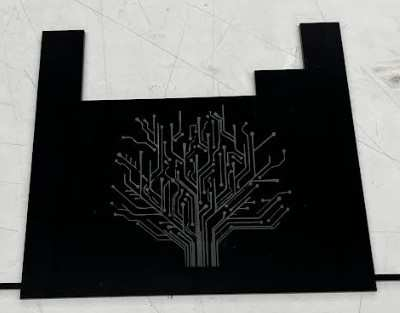
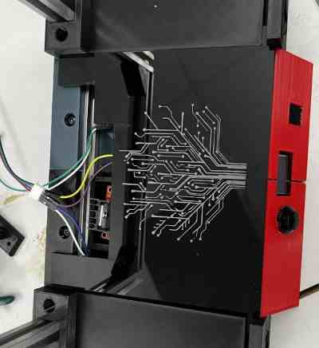

*Final Electronics Touches*

[Casing File](../files/FinalProject%20Files/Laser%20Cut%20Electronics%20Protection%20Drawing%20v1.zip)

## Final Assembly

I made a clamp for the probe and 3d printed it. 

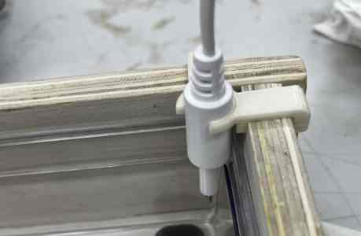

I then screwed in the motor tightly. The back frame fit in tighlty with everything. 

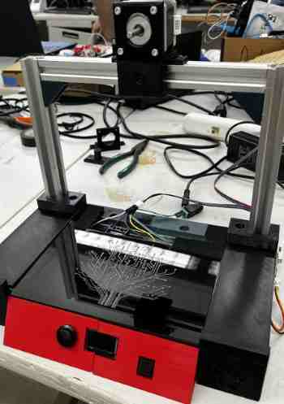

I realized I didn't need many screws for the front, so I went every other box. It firt tighly and nicely. I didn't screw it too tighly though to not crack the acrylic. I made sure that the connector was tighly fit in with the motor. 

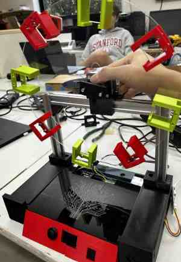

Lastly, I assembled the sensors, casing, and reservoir. The reservoir was easily removable without having to undo the circles.

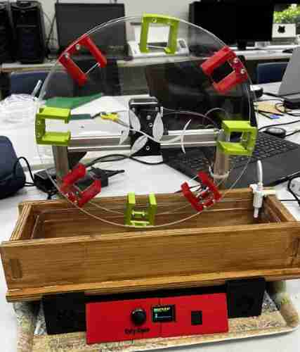

Below are some plants that I attempted to grow with the rockwool cubes. Though they successfully sprouted, they weren't fully ready to be transported my garden. However, I ran out of time and assembled what I had to show the function

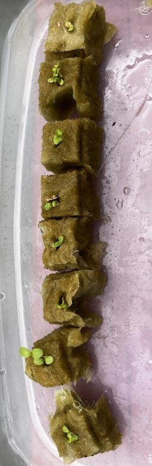
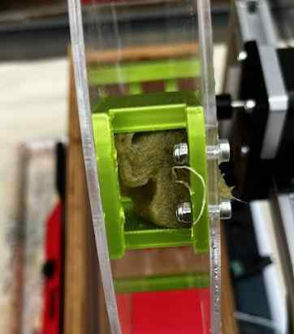

*Here you can see roots coming through the bottom. It is not fully grown, but once it is fully grown, the roots will come into contact with the water as it spins.*

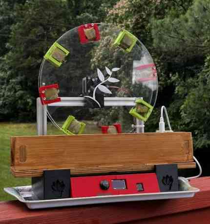


## Final Product- Working Garden

<video src="../../images/FP/WorkingVideo.mp4" controls="controls" style="max-width: 400px;">
</video>

I booted everything up, and it worked. I was relived. The video walks through all the functions of my garden: rotating the roots in and out of the nutrient to cycle the amount of water and oxygen recieved, an EC probe working, an OLED to display the EC, temperature, and humidity values, and a button to change the duty cycle of the rotating job. 

### What worked? What didn't/ Future Improvements to build Upon

The system worked well, and the display and the sensors all interfaced great, constantly updating the user on necessary values needed to maintain the hydroponics system. The assembly went greate and everything held in place with no worrisome attatchements. I was able to spend time to make the visuals look better than what I originally planned to do. The duty cycle is changeable and rotates the plants well. 

I was not able to install lights necessary to grow the plants. The plants can use the sun to grow, but having an indoor garden was my plan from the start, and I would like to keep this in my room. Also, though it funictions the way I wanted, I don't think it will be able to properly handle heavier or bigger plants. I can use it to grow small sprouts, but to grow bigger things, I may need to install a gear system to handle bigger amounts without messng up the steps or the duty cycle. 

The lights, bigger sizing, and wireless interfacing are all possible future improvements that I may attempt to tackle. 

### How was it evaluated?

It is an interesting and very unique system to go about when gardening, but it came together well, and the assembly and packagin were all great. It is able to maintain its basic job of rotating and keeping the plants fed with nutrients and oxygen, along with assisting the user, and overall, I was happy with the outcome. 